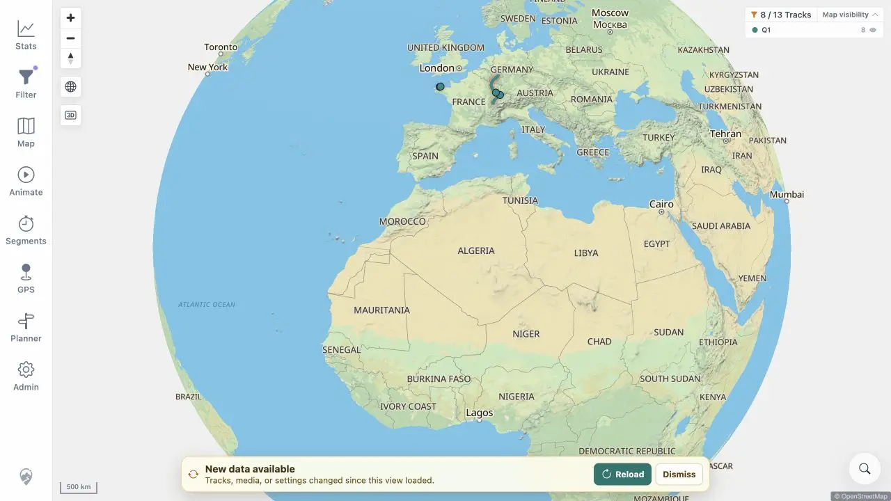

# Packet: SYN_01

## Scope

- Coverage source: [coverage-plan.md](../coverage-plan.md).
- Coverage ID or run packet: SYN_01.
- In scope: automatic freshness notification after a server-side change.

## Prerequisites

- Required previous coverage IDs or run packets: ADM_12.
- Required app/data state: browser cached 13 tracks; exact disposable upload may be removed.
- Required browser context: signed-in desktop map.

## Allowed Mutations

- Allowed: remove the exact disposable ADM_02 GPX.
- Not allowed: manually refresh before banner evidence.

## Actions And Results

| Coverage ID | Action | Expected result | Actual result | Status | Evidence |
|---|---|---|---|---|---|
| SYN_01 | Removed the exact synthetic upload server-side, waited for watcher deletion and the next client poll without navigating. | A data-freshness banner appears after server-side data changes. | The watcher deleted #100019, then the existing map displayed `New data available` with Reload and Dismiss while its stale 13-track count remained visible. | PASS | [banner](../assets/SYN_01-banner.webp), [sequence](../assets/SYN_01-banner.txt) |

## Issues

No issue found.

## Evidence Files

| File | Purpose |
|---|---|
| [assets/SYN_01-banner.webp](../assets/SYN_01-banner.webp) | Freshness banner over stale cached map. |
| [assets/SYN_01-banner.txt](../assets/SYN_01-banner.txt) | Watcher/poll sequence and stale count. |

## Screenshot Evidence

## Timings

| Step | Timing |
|---|---:|
| Watcher delete completion | 8.0 s |
| Banner at next polling cycle | 18 s after delete completion |

## Handoff Notes

- Completed: SYN_01 is terminal `PASS`.
- Remaining unfinished coverage: SYN_02 onward.
- Blocked or not applicable: none in this packet.
- State left for the next packet: freshness banner visible; cached map still 13 tracks.

