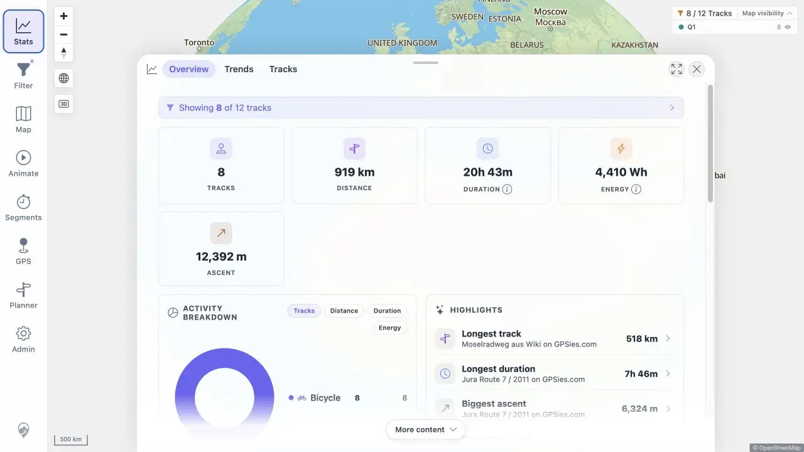

# Packet: SYN_02

## Scope

- Coverage source: [coverage-plan.md](../coverage-plan.md).
- Coverage ID or run packet: SYN_02.
- In scope: freshness Reload updating cached map tracks and Statistics.

## Prerequisites

- Required previous coverage IDs or run packets: SYN_01.
- Required app/data state: freshness banner visible over stale 13-track cache.
- Required browser context: desktop map and Statistics.

## Allowed Mutations

- Allowed: select banner Reload and open Statistics.
- Not allowed: hard browser reload.

## Actions And Results

| Coverage ID | Action | Expected result | Actual result | Status | Evidence |
|---|---|---|---|---|---|
| SYN_02 | Used banner Reload, checked the map count, then opened Statistics Overview. | Banner reload refreshes cached tracks and stats. | The map changed 8/13 to 8/12 with `Fresh data loaded`; Statistics immediately showed `Showing 8 of 12 tracks` and populated totals without a hard refresh. | PASS | [Statistics](../assets/SYN_02-stats.webp), [before/after](../assets/SYN_02-reload.txt) |

## Issues

No issue found.

## Evidence Files

| File | Purpose |
|---|---|
| [assets/SYN_02-stats.webp](../assets/SYN_02-stats.webp) | Statistics cache after freshness Reload. |
| [assets/SYN_02-reload.txt](../assets/SYN_02-reload.txt) | Map and Statistics before/after values. |

## Screenshot Evidence

## Timings

| Step | Timing |
|---|---:|
| Freshness Reload | < 1.2 s |
| Open Statistics | < 0.5 s |

## Handoff Notes

- Completed: SYN_02 is terminal `PASS`.
- Remaining unfinished coverage: SYN_03 onward.
- Blocked or not applicable: none in this packet.
- State left for the next packet: Statistics Overview with Q1 8/12 after synthetic cleanup.

