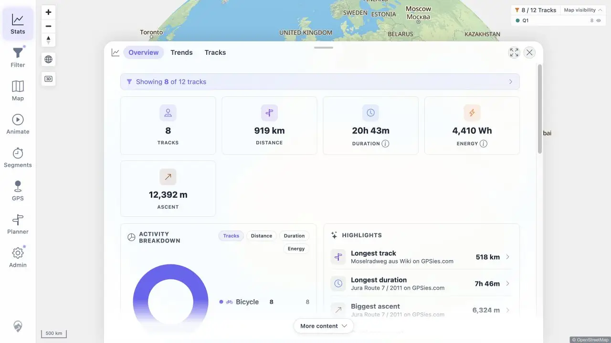
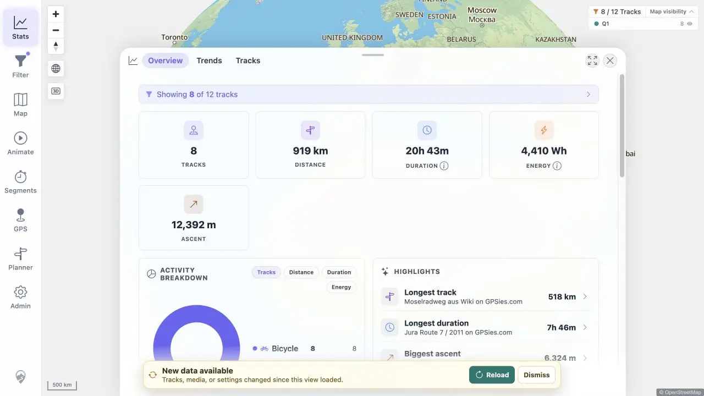

# Packet: SYN_05

## Scope

- Coverage source: [coverage-plan.md](../coverage-plan.md).
- Coverage ID or run packet: SYN_05.
- In scope: Dismiss snooze across token changes, polling, and five-minute expiry.

## Prerequisites

- Required previous coverage IDs or run packets: SYN_04.
- Required app/data state: 12-track synchronized cache; synthetic GPX available for create/delete changes.
- Required browser context: signed-in Statistics view.

## Allowed Mutations

- Allowed: create and remove one exact synthetic GPX, then leave the client stale.
- Not allowed: reload or navigate during the snooze interval.

## Actions And Results

| Coverage ID | Action | Expected result | Actual result | Status | Evidence |
|---|---|---|---|---|---|
| SYN_05 | Triggered a banner, selected Dismiss, removed the synthetic source to change the token again, observed the next poll, held the stale client for five minutes, then observed the post-expiry poll. | Banner stays hidden through polling and token changes for five minutes, then may reappear while stale. | It hid immediately, stayed hidden after deletion and the 00:00:05 poll, and reappeared by 00:04:48 after the 00:04:27 boundary. | PASS | [dismissed](../assets/SYN_05-dismissed.webp), [reappeared](../assets/SYN_05-reappeared.webp), [timeline](../assets/SYN_05-snooze.txt) |

## Issues

No issue found.

## Evidence Files

| File | Purpose |
|---|---|
| [assets/SYN_05-dismissed.webp](../assets/SYN_05-dismissed.webp) | Banner absent during snooze. |
| [assets/SYN_05-reappeared.webp](../assets/SYN_05-reappeared.webp) | Banner restored after expiry. |
| [assets/SYN_05-snooze.txt](../assets/SYN_05-snooze.txt) | Exact token/poll/boundary timeline. |

## Screenshot Evidence

## Timings

| Step | Timing |
|---|---:|
| Snooze interval | 5 min |
| Post-expiry observation | 21 s after boundary |

## Handoff Notes

- Completed: SYN_05 is terminal `PASS`.
- Remaining unfinished coverage: SYN_06 onward.
- Blocked or not applicable: none in this packet.
- State left for the next packet: Statistics still stale by revision with banner visible; track count source and cache are both 12.

