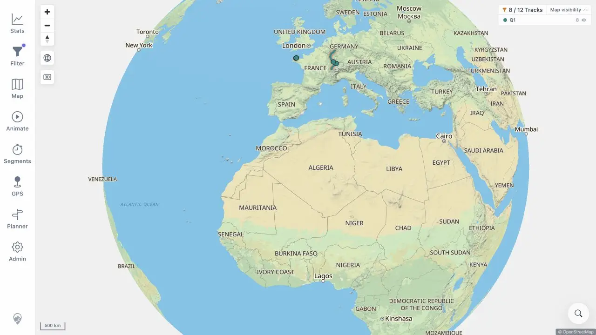

# Packet: SYN_06

## Scope

- Coverage source: [coverage-plan.md](../coverage-plan.md).
- Coverage ID or run packet: SYN_06.
- In scope: automatic data refresh stability across credentials-only logout/login.

## Prerequisites

- Required previous coverage IDs or run packets: SYN_05.
- Required app/data state: server source restored to 12 tracks; stale revision before logout.
- Required browser context: signed-in Statistics, login, and map.

## Allowed Mutations

- Allowed: credentials-only sign-out and sign-in.
- Not allowed: manual Reload after login.

## Actions And Results

| Coverage ID | Action | Expected result | Actual result | Status | Evidence |
|---|---|---|---|---|---|
| SYN_06 | Signed out, signed in, observed the initial map load, waited through the next freshness poll, and correlated first-party track requests. | Login does not repeatedly trigger automatic data refresh. | The initial load issued two expected simplified-track requests. The next poll issued no further track fetch; the UI remained stable at 8/12 with no refresh toast or banner. | PASS | [stable map](../assets/SYN_06-stable.webp), [request sequence](../assets/SYN_06-login.txt) |

## Issues

No issue found.

## Evidence Files

| File | Purpose |
|---|---|
| [assets/SYN_06-stable.webp](../assets/SYN_06-stable.webp) | Stable post-login map after polling. |
| [assets/SYN_06-login.txt](../assets/SYN_06-login.txt) | Login session and first-party request sequence. |

## Screenshot Evidence

## Timings

| Step | Timing |
|---|---:|
| Sign-in to settled map | < 1.7 s |
| Observation through freshness poll | 32 s |

## Handoff Notes

- Completed: SYN_06 is terminal `PASS`.
- Remaining unfinished coverage: SYN_07 onward.
- Blocked or not applicable: none in this packet.
- State left for the next packet: signed-in map, Q1 8/12, no freshness banner.

