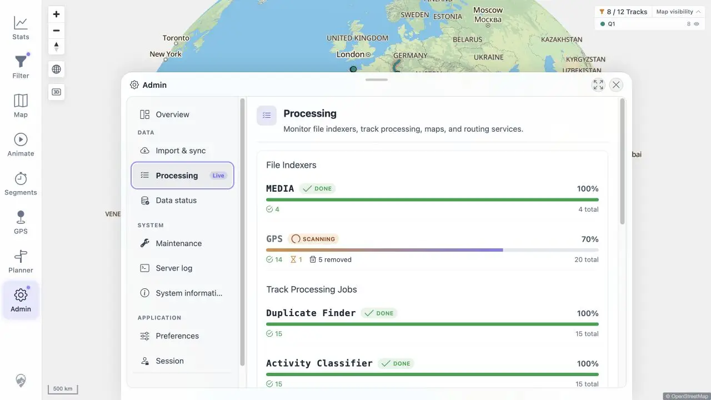

# Packet: SYN_07

## Scope

- Coverage source: [coverage-plan.md](../coverage-plan.md).
- Coverage ID or run packet: SYN_07.
- In scope: indexer-running badge and concurrent map usability.

## Prerequisites

- Required previous coverage IDs or run packets: SYN_06 and DAT_04.
- Required app/data state: settled baseline; public GPX available for a disposable copy.
- Required browser context: Admin Processing and desktop map.

## Allowed Mutations

- Allowed: copy and later remove one public GPX under a unique disposable name.
- Not allowed: alter the original staged/public source.

## Actions And Results

| Coverage ID | Action | Expected result | Actual result | Status | Evidence |
|---|---|---|---|---|---|
| SYN_07 | Added a public disposable GPX, observed Admin during scanning, closed Admin while live, and zoomed the map. | Running state surfaces as a badge and does not block map interaction. | Processing showed a `Live` badge and GPS `SCANNING` at 70% with one running item. Closing Admin and Zoom In immediately changed map scale 500 km to 300 km. | PASS | [live status](../assets/SYN_07-live.webp), [sequence](../assets/SYN_07-live.txt) |

## Issues

No issue found.

## Evidence Files

| File | Purpose |
|---|---|
| [assets/SYN_07-live.webp](../assets/SYN_07-live.webp) | Processing Live and GPS Scanning badges. |
| [assets/SYN_07-live.txt](../assets/SYN_07-live.txt) | Scan values, map action, and cleanup. |

## Screenshot Evidence

## Timings

| Step | Timing |
|---|---:|
| Live-state detection | < 1.5 s after scan began |
| Close and map zoom | < 0.4 s |

## Handoff Notes

- Completed: SYN_07 is terminal `PASS`.
- Remaining unfinished coverage: APP_01 onward.
- Blocked or not applicable: none in this packet.
- State left for the next packet: signed-in map, Q1 8/12; exact disposable public copy removed and pending watcher cleanup.

