> **RESULT: FAIL - Quick install and cleanup passed, but four P1 defects were observed in the tested beta.**

> **FOLLOW-UP: All 11 reported findings are fixed in the workspace and verified on a combined candidate deployed to the original test host. See [Regression Fix Verification](fix-verification.md).**

# MTL Explorer Quick-Install Full Regression

## Goal

Validate one fresh README quick install of the required beta image, execute every ID in the frozen end-user regression plan, preserve one packet per ID, enforce the finalization gate, assemble this report from packets, and remove the disposable environment.

## Outcome

| Measure | Result |
|---|---:|
| Frozen coverage IDs | 193 |
| PASS | 164 |
| FAIL | 13 |
| BLOCKED | 8 |
| NOT APPLICABLE | 8 |
| RUN_SETUP | PASS |
| Finalization gate | PASS — 193 terminal IDs |
| RUN_CLEANUP | PASS |

The quick install, broad core flows, three-journey UX budget, and cleanup passed. The release result is `FAIL` because the tested image exposed four distinct P1 defects. DEL-03-P1 has separate local-fix evidence, but the required beta image still reproduced it.

## Scope And Environment

| Field | Value |
|---|---|
| Target | `91.99.12.14`, Debian GNU/Linux 13, amd64 |
| Install source | README and Compose from GitHub `main` |
| Required image | `wauwau0977/mytraillog:beta` |
| Resolved image | `sha256:e3ccb3a856d377a9931ed0d395c01eacbc24c066f37c496c4d2fe4a093daa1a8` |
| Reported app/image | `0.0.1-SNAPSHOT`; image `1.331` |
| App/image build | `2026-08-13T18:08:25.595Z`; `2026-08-13T18:08:12Z` |
| Docker / Compose | 29.7.2 / v5.4.0 |
| Browser | Codex in-app browser; warmed 1280×720 desktop and 390×844 mobile viewport |
| Origin | Remote plain HTTP, normal browser display mode |
| Frozen plan | [coverage-plan.md](coverage-plan.md), 193 IDs |
| Durable state | [run-state.md](run-state.md) |

The run used five public real-track GPX files, one public Garmin GPS-bearing FIT file, eight additional supported format samples, and fully synthetic shared-zone, boundary, upload, and media fixtures. No private local GPX track was used.

## README Quick-Install Facts

- Docker Engine and the Docker Compose plugin are required.
- The quick start downloads `docker-compose.yml`, runs `docker compose up -d`, opens `http://localhost:18080/mtl/`, and watches `./data/gpx/` for imports.
- `MTL_APP_IMAGE=wauwau0977/mytraillog:beta` was written before the first start and used for later Compose operations.
- The documented local login credentials were used. Password values are not repeated in this report.
- Compose and the running container matched the requested image and digest.

See [RUN_SETUP](packets/RUN_SETUP.md) and [setup evidence](assets/RUN_SETUP-setup-summary.txt).

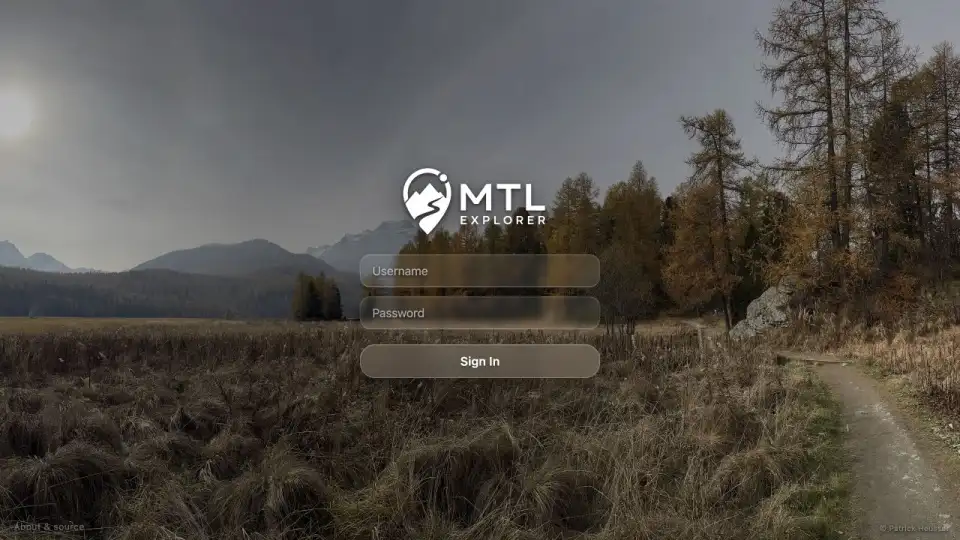

## Timings

| Phase or action | Timing | Source |
|---|---:|---|
| Docker prerequisite setup | 11 s | [RUN_SETUP](packets/RUN_SETUP.md) |
| Quick-install pull/create/start | 41 s | [RUN_SETUP](packets/RUN_SETUP.md) |
| App HTTP readiness | 41 s | [RUN_SETUP](packets/RUN_SETUP.md) |
| Five-GPX automatic ingest | 18.171 s | [IMP_03](packets/IMP_03.md) |
| Two-record automatic deletion | 8.309 s | [DEL_02](packets/DEL_02.md) |
| Full run wall-clock envelope | 6h 53m | [RUN_CLEANUP](packets/RUN_CLEANUP.md) |
| Desktop/data packet envelope | 5h 56m | [RUN_CLEANUP](packets/RUN_CLEANUP.md) |
| Mobile MOB_01–MOB_06 packet span | 13m 03s | [RUN_CLEANUP](packets/RUN_CLEANUP.md) |
| Network/offline NET_01–NET_04 packet span | 6m 34s | [RUN_CLEANUP](packets/RUN_CLEANUP.md) |
| Error/final UX packet span | 21m 02s | [RUN_CLEANUP](packets/RUN_CLEANUP.md) |
| UXP worst visible feedback / probe gap | 150 ms / 150 ms | [UXP_01](packets/UXP_01.md) |
| UXP worst first-party API response | 478 ms | [UXP_01](packets/UXP_01.md) |
| Compose down | 11 s | [RUN_CLEANUP](packets/RUN_CLEANUP.md) |

Packet-envelope values are wall-clock spans between saved packet completions; exact action timings remain in each packet.

## Coverage-ID Matrix

This matrix is generated from each packet's `Actions And Results` row in frozen-plan order.

| Coverage ID | Status | Packet |
|---|---|---|
| ACC_01 | PASS | [packet](packets/ACC_01.md) |
| ACC_02 | PASS | [packet](packets/ACC_02.md) |
| ACC_03 | PASS | [packet](packets/ACC_03.md) |
| ACC_04 | PASS | [packet](packets/ACC_04.md) |
| ACC_05 | PASS | [packet](packets/ACC_05.md) |
| DAT_01 | PASS | [packet](packets/DAT_01.md) |
| DAT_02 | PASS | [packet](packets/DAT_02.md) |
| DAT_03 | PASS | [packet](packets/DAT_03.md) |
| DAT_04 | PASS | [packet](packets/DAT_04.md) |
| DAT_05 | PASS | [packet](packets/DAT_05.md) |
| DAT_06 | PASS | [packet](packets/DAT_06.md) |
| DAT_07 | PASS | [packet](packets/DAT_07.md) |
| IMP_01 | PASS | [packet](packets/IMP_01.md) |
| IMP_02 | PASS | [packet](packets/IMP_02.md) |
| IMP_03 | PASS | [packet](packets/IMP_03.md) |
| IMP_04 | PASS | [packet](packets/IMP_04.md) |
| IMP_05 | FAIL | [packet](packets/IMP_05.md) |
| IMP_06 | PASS | [packet](packets/IMP_06.md) |
| IMP_07 | PASS | [packet](packets/IMP_07.md) |
| IMP_08 | PASS | [packet](packets/IMP_08.md) |
| IMP_09 | PASS | [packet](packets/IMP_09.md) |
| DEL_01 | PASS | [packet](packets/DEL_01.md) |
| DEL_02 | PASS | [packet](packets/DEL_02.md) |
| DEL_03 | FAIL | [packet](packets/DEL_03.md) |
| DEL_04 | PASS | [packet](packets/DEL_04.md) |
| DEL_05 | PASS | [packet](packets/DEL_05.md) |
| FIT_01 | PASS | [packet](packets/FIT_01.md) |
| FIT_02 | PASS | [packet](packets/FIT_02.md) |
| FIT_03 | PASS | [packet](packets/FIT_03.md) |
| FIT_04 | PASS | [packet](packets/FIT_04.md) |
| FIT_05 | PASS | [packet](packets/FIT_05.md) |
| FIT_06 | NOT APPLICABLE | [packet](packets/FIT_06.md) |
| FMT_01 | PASS | [packet](packets/FMT_01.md) |
| FMT_02 | PASS | [packet](packets/FMT_02.md) |
| SGN_01 | PASS | [packet](packets/SGN_01.md) |
| SGN_02 | PASS | [packet](packets/SGN_02.md) |
| SGN_03 | PASS | [packet](packets/SGN_03.md) |
| SGN_04 | NOT APPLICABLE | [packet](packets/SGN_04.md) |
| SGN_05 | PASS | [packet](packets/SGN_05.md) |
| SGN_06 | PASS | [packet](packets/SGN_06.md) |
| SGN_07 | BLOCKED | [packet](packets/SGN_07.md) |
| SGN_08 | PASS | [packet](packets/SGN_08.md) |
| SGN_09 | PASS | [packet](packets/SGN_09.md) |
| MAP_01 | PASS | [packet](packets/MAP_01.md) |
| MAP_02 | PASS | [packet](packets/MAP_02.md) |
| MAP_03 | PASS | [packet](packets/MAP_03.md) |
| MAP_04 | PASS | [packet](packets/MAP_04.md) |
| MAP_05 | PASS | [packet](packets/MAP_05.md) |
| MAP_06 | PASS | [packet](packets/MAP_06.md) |
| MAP_07 | PASS | [packet](packets/MAP_07.md) |
| MAP_08 | PASS | [packet](packets/MAP_08.md) |
| MAP_09 | PASS | [packet](packets/MAP_09.md) |
| MAP_10 | PASS | [packet](packets/MAP_10.md) |
| MAP_11 | PASS | [packet](packets/MAP_11.md) |
| MAP_12 | PASS | [packet](packets/MAP_12.md) |
| MAP_13 | PASS | [packet](packets/MAP_13.md) |
| MAP_14 | BLOCKED | [packet](packets/MAP_14.md) |
| MAP_15 | PASS | [packet](packets/MAP_15.md) |
| TRD_01 | PASS | [packet](packets/TRD_01.md) |
| TRD_02 | PASS | [packet](packets/TRD_02.md) |
| TRD_03 | PASS | [packet](packets/TRD_03.md) |
| TRD_04 | PASS | [packet](packets/TRD_04.md) |
| TRD_05 | PASS | [packet](packets/TRD_05.md) |
| TRD_06 | PASS | [packet](packets/TRD_06.md) |
| TRD_07 | PASS | [packet](packets/TRD_07.md) |
| TRD_08 | PASS | [packet](packets/TRD_08.md) |
| TRD_09 | PASS | [packet](packets/TRD_09.md) |
| TRD_10 | PASS | [packet](packets/TRD_10.md) |
| TRD_11 | PASS | [packet](packets/TRD_11.md) |
| TRD_12 | PASS | [packet](packets/TRD_12.md) |
| TRD_13 | PASS | [packet](packets/TRD_13.md) |
| TRD_14 | PASS | [packet](packets/TRD_14.md) |
| TRD_15 | FAIL | [packet](packets/TRD_15.md) |
| FLT_01 | PASS | [packet](packets/FLT_01.md) |
| FLT_02 | PASS | [packet](packets/FLT_02.md) |
| FLT_03 | FAIL | [packet](packets/FLT_03.md) |
| FLT_04 | PASS | [packet](packets/FLT_04.md) |
| FLT_05 | PASS | [packet](packets/FLT_05.md) |
| FLT_06 | PASS | [packet](packets/FLT_06.md) |
| FLT_07 | PASS | [packet](packets/FLT_07.md) |
| FLT_08 | PASS | [packet](packets/FLT_08.md) |
| FLT_09 | PASS | [packet](packets/FLT_09.md) |
| FLT_10 | FAIL | [packet](packets/FLT_10.md) |
| FLT_11 | PASS | [packet](packets/FLT_11.md) |
| FLT_12 | FAIL | [packet](packets/FLT_12.md) |
| FLT_13 | PASS | [packet](packets/FLT_13.md) |
| FLT_14 | PASS | [packet](packets/FLT_14.md) |
| FLT_15 | PASS | [packet](packets/FLT_15.md) |
| FLT_16 | FAIL | [packet](packets/FLT_16.md) |
| FLT_17 | PASS | [packet](packets/FLT_17.md) |
| FLT_18 | PASS | [packet](packets/FLT_18.md) |
| FLT_19 | PASS | [packet](packets/FLT_19.md) |
| FLT_20 | PASS | [packet](packets/FLT_20.md) |
| FLT_21 | PASS | [packet](packets/FLT_21.md) |
| TBS_01 | PASS | [packet](packets/TBS_01.md) |
| TBS_02 | PASS | [packet](packets/TBS_02.md) |
| TBS_03 | PASS | [packet](packets/TBS_03.md) |
| TBS_04 | PASS | [packet](packets/TBS_04.md) |
| TBS_05 | PASS | [packet](packets/TBS_05.md) |
| TBS_06 | PASS | [packet](packets/TBS_06.md) |
| TBS_07 | PASS | [packet](packets/TBS_07.md) |
| TBS_08 | FAIL | [packet](packets/TBS_08.md) |
| TBS_09 | PASS | [packet](packets/TBS_09.md) |
| TBS_10 | PASS | [packet](packets/TBS_10.md) |
| TBS_11 | FAIL | [packet](packets/TBS_11.md) |
| TBS_12 | PASS | [packet](packets/TBS_12.md) |
| TBS_13 | BLOCKED | [packet](packets/TBS_13.md) |
| PLN_01 | PASS | [packet](packets/PLN_01.md) |
| PLN_02 | PASS | [packet](packets/PLN_02.md) |
| PLN_03 | PASS | [packet](packets/PLN_03.md) |
| PLN_04 | PASS | [packet](packets/PLN_04.md) |
| PLN_05 | PASS | [packet](packets/PLN_05.md) |
| PLN_06 | PASS | [packet](packets/PLN_06.md) |
| PLN_07 | PASS | [packet](packets/PLN_07.md) |
| PLN_08 | PASS | [packet](packets/PLN_08.md) |
| PLN_09 | PASS | [packet](packets/PLN_09.md) |
| PLN_10 | PASS | [packet](packets/PLN_10.md) |
| PLN_11 | BLOCKED | [packet](packets/PLN_11.md) |
| MCT_01 | PASS | [packet](packets/MCT_01.md) |
| MCT_02 | PASS | [packet](packets/MCT_02.md) |
| MCT_03 | PASS | [packet](packets/MCT_03.md) |
| MCT_04 | PASS | [packet](packets/MCT_04.md) |
| MCT_05 | FAIL | [packet](packets/MCT_05.md) |
| MCT_06 | PASS | [packet](packets/MCT_06.md) |
| AVR_01 | PASS | [packet](packets/AVR_01.md) |
| AVR_02 | PASS | [packet](packets/AVR_02.md) |
| AVR_03 | PASS | [packet](packets/AVR_03.md) |
| AVR_04 | PASS | [packet](packets/AVR_04.md) |
| MED_01 | PASS | [packet](packets/MED_01.md) |
| MED_02 | PASS | [packet](packets/MED_02.md) |
| MED_03 | PASS | [packet](packets/MED_03.md) |
| MED_04 | PASS | [packet](packets/MED_04.md) |
| MED_05 | PASS | [packet](packets/MED_05.md) |
| HMO_01 | PASS | [packet](packets/HMO_01.md) |
| HMO_02 | PASS | [packet](packets/HMO_02.md) |
| HMO_03 | PASS | [packet](packets/HMO_03.md) |
| GPS_01 | NOT APPLICABLE | [packet](packets/GPS_01.md) |
| GPS_02 | NOT APPLICABLE | [packet](packets/GPS_02.md) |
| GPS_03 | NOT APPLICABLE | [packet](packets/GPS_03.md) |
| GPS_04 | PASS | [packet](packets/GPS_04.md) |
| GPS_05 | NOT APPLICABLE | [packet](packets/GPS_05.md) |
| SRC_01 | PASS | [packet](packets/SRC_01.md) |
| SRC_02 | PASS | [packet](packets/SRC_02.md) |
| SRC_03 | PASS | [packet](packets/SRC_03.md) |
| SRC_04 | PASS | [packet](packets/SRC_04.md) |
| GLB_01 | PASS | [packet](packets/GLB_01.md) |
| GLB_02 | PASS | [packet](packets/GLB_02.md) |
| GLB_03 | PASS | [packet](packets/GLB_03.md) |
| GLB_04 | PASS | [packet](packets/GLB_04.md) |
| ADM_01 | PASS | [packet](packets/ADM_01.md) |
| ADM_02 | PASS | [packet](packets/ADM_02.md) |
| ADM_03 | FAIL | [packet](packets/ADM_03.md) |
| ADM_04 | PASS | [packet](packets/ADM_04.md) |
| ADM_05 | PASS | [packet](packets/ADM_05.md) |
| ADM_06 | PASS | [packet](packets/ADM_06.md) |
| ADM_07 | PASS | [packet](packets/ADM_07.md) |
| ADM_08 | PASS | [packet](packets/ADM_08.md) |
| ADM_09 | PASS | [packet](packets/ADM_09.md) |
| ADM_10 | PASS | [packet](packets/ADM_10.md) |
| ADM_11 | PASS | [packet](packets/ADM_11.md) |
| ADM_12 | PASS | [packet](packets/ADM_12.md) |
| SYN_01 | PASS | [packet](packets/SYN_01.md) |
| SYN_02 | PASS | [packet](packets/SYN_02.md) |
| SYN_03 | FAIL | [packet](packets/SYN_03.md) |
| SYN_04 | PASS | [packet](packets/SYN_04.md) |
| SYN_05 | PASS | [packet](packets/SYN_05.md) |
| SYN_06 | PASS | [packet](packets/SYN_06.md) |
| SYN_07 | PASS | [packet](packets/SYN_07.md) |
| APP_01 | PASS | [packet](packets/APP_01.md) |
| APP_02 | PASS | [packet](packets/APP_02.md) |
| APP_03 | PASS | [packet](packets/APP_03.md) |
| APP_04 | PASS | [packet](packets/APP_04.md) |
| APP_05 | PASS | [packet](packets/APP_05.md) |
| APP_06 | PASS | [packet](packets/APP_06.md) |
| APP_07 | PASS | [packet](packets/APP_07.md) |
| APP_08 | PASS | [packet](packets/APP_08.md) |
| LOC_01 | PASS | [packet](packets/LOC_01.md) |
| LOC_02 | PASS | [packet](packets/LOC_02.md) |
| LOC_03 | PASS | [packet](packets/LOC_03.md) |
| LOC_04 | PASS | [packet](packets/LOC_04.md) |
| MOB_01 | BLOCKED | [packet](packets/MOB_01.md) |
| MOB_02 | BLOCKED | [packet](packets/MOB_02.md) |
| MOB_03 | PASS | [packet](packets/MOB_03.md) |
| MOB_04 | BLOCKED | [packet](packets/MOB_04.md) |
| MOB_05 | BLOCKED | [packet](packets/MOB_05.md) |
| MOB_06 | PASS | [packet](packets/MOB_06.md) |
| NET_01 | NOT APPLICABLE | [packet](packets/NET_01.md) |
| NET_02 | PASS | [packet](packets/NET_02.md) |
| NET_03 | PASS | [packet](packets/NET_03.md) |
| NET_04 | NOT APPLICABLE | [packet](packets/NET_04.md) |
| ERR_01 | FAIL | [packet](packets/ERR_01.md) |
| ERR_02 | PASS | [packet](packets/ERR_02.md) |
| UXP_01 | PASS | [packet](packets/UXP_01.md) |

## Non-Pass Coverage Results

| Coverage ID | Status | Packet result |
|---|---|---|
| [IMP_05](packets/IMP_05.md) | FAIL | Map and Track Browser updated to five tracks, but Filter remained `No tracks match` and Stats Overview showed `0 of 5`; reopening did not recover and console logs were empty. A normal browser reload recovere… |
| [DEL_03](packets/DEL_03.md) | FAIL | Map and Statistics changed to 3 tracks, 817 km, 15h 50m, 3,621 Wh, and Track Browser searches found neither deleted record. Filter incorrectly stayed at 5 tracks and still listed both deleted records. A norm… |
| [FIT_06](packets/FIT_06.md) | NOT APPLICABLE | The prerequisite is false: GPSBabel converted Activity.fit successfully, indexing completed, Track Details rendered, and GPX export passed. No unavailable-converter error path was present to test. |
| [SGN_04](packets/SGN_04.md) | NOT APPLICABLE | Demo mode is false and both advertised demo credential fields are empty. The conditional banner requirement does not apply. |
| [SGN_07](packets/SGN_07.md) | BLOCKED | Browser Use rejected the server-down navigation under its URL safety policy. The database-only reload remained pending until the execution deadline rather than reaching an observable retry UI. Both services … |
| [MAP_14](packets/MAP_14.md) | BLOCKED | No local map-server sidecar or isolated PMTiles-failure switch exists. Normal `tileMode: local` is already using a hosted/public PMTiles proxy fallback, so local archive failure cannot be safely simulated in… |
| [TRD_15](packets/TRD_15.md) | FAIL | Direct close passed. Filter Review preserved its one-result search through Close and Back, and Forward restored details. Statistics returned to the right sheet/tab but lost its one-result search through both… |
| [FLT_03](packets/FLT_03.md) | FAIL | Parameters appeared, and all dependent views synchronized correctly after Apply. However, entering or resetting the parameter did nothing to live results until the explicit Apply button was selected. |
| [FLT_10](packets/FLT_10.md) | FAIL | Main grouping passed: ON_FOOT 1 produced one track. Exact activity selection is absent: both activity views expose only CYCLING/ON_FOOT, and no catalog/config view exposes Walking or Hiking as result categor… |
| [FLT_12](packets/FLT_12.md) | FAIL | Empty state passed and survived reload. Selecting both categories restored eight tracks but remained an exact 2-of-2 set with the All categories master unchecked. |
| [FLT_16](packets/FLT_16.md) | FAIL | Map-only hiding passed: map became 0/12 while Statistics stayed 8. After global selection changed to 12, Statistics changed to 12 but the map stayed 4/12 with Q1 hidden. |
| [TBS_08](packets/TBS_08.md) | FAIL | Delete transition passed at three tracks with deleted-name searches empty. Import freshness Reload left Overview at 0/5 until a normal browser reload. |
| [TBS_11](packets/TBS_11.md) | FAIL | Ranked list and #100002 details passed. Count showed 1, but its Excluded view was empty until a normal reload; reload then showed the correct row. Cleanup passed. |
| [TBS_13](packets/TBS_13.md) | BLOCKED | Pointer opened the correct Filter on both widths. Keyboard could not be evaluated: every supported key path also failed the native Trends control check. |
| [PLN_11](packets/PLN_11.md) | BLOCKED | Mobile layout and coordinate pointer drag worked and rerouted. Real touch could not be generated because the browser exposes no touch capability. |
| [MCT_05](packets/MCT_05.md) | FAIL | Both timed tracks showed 9m09s but 0.00 m and 0.0 km/h; the table exposed -655 m, charts used a negative x range with zero values, and the map reduced the slice to a direct endpoint line. |
| [GPS_01](packets/GPS_01.md) | NOT APPLICABLE | The app reported GPS unavailable and explicitly required HTTPS or localhost. |
| [GPS_02](packets/GPS_02.md) | NOT APPLICABLE | The remote HTTP origin was rejected before permission/marker, with explicit HTTPS/localhost guidance. |
| [GPS_03](packets/GPS_03.md) | NOT APPLICABLE | No live GPS session exists on this insecure origin, so Follow me and drift states cannot be entered. |
| [GPS_05](packets/GPS_05.md) | NOT APPLICABLE | No live marker/watch could be created on remote HTTP, so the disable behavior cannot enter an executable state. |
| [ADM_03](packets/ADM_03.md) | FAIL | Refresh and automatic polling changed the timestamp, media/GPS completed state was shown, and GPS retained `2 removed`. The invalid track reached `FAILED` in the database, but Admin increased `completed` fro… |
| [SYN_03](packets/SYN_03.md) | FAIL | Watcher and final surfaces were correct, but both transitions were inconsistent after freshness Reload: initial import left Filter/Stats at zero and deletion left removed Filter rows until a normal browser r… |
| [MOB_01](packets/MOB_01.md) | BLOCKED | Narrow mobile rendering worked, but the browser exposes no touch-event/emulation capability; real touch input could not be enabled or attributed. |
| [MOB_02](packets/MOB_02.md) | BLOCKED | Filter moved and settled at a second position; Track Details and Filter closed. Navigation stayed fixed under pointer drags. With no touch capability, its touch drag path could not be executed or attributed. |
| [MOB_04](packets/MOB_04.md) | BLOCKED | Pointer drag/reroute worked in PLN_11, but the harness exposes no touch events, so touch tap/drag/insert cannot execute or be attributed. |
| [MOB_05](packets/MOB_05.md) | BLOCKED | Pointer gestures worked after each tool and zoomed 500→300→200→100→50 km. Native pinch/double-tap/touch-drag cannot execute or be attributed because the browser has no touch capability. |
| [NET_01](packets/NET_01.md) | NOT APPLICABLE | The active context reported `browser=true` and `standalone=false`, `minimal-ui=false`, and `fullscreen=false`. It is a normal browser tab, so the installed-PWA-only criterion does not apply to this configure… |
| [NET_04](packets/NET_04.md) | NOT APPLICABLE | The remote target is non-loopback plain HTTP and Admin reports `Running as: Browser`. Although the static worker file is served, this origin cannot provide the secure context required to register and activat… |
| [ERR_01](packets/ERR_01.md) | FAIL | Track, media, planner, and session failures were actionable and recoverable. Map-config failure logged three warnings and rendered a usable 12-track OSM fallback, but showed no failure message or Retry, Dism… |

## Issues

| ID | Severity | Coverage | Finding | Current resolution |
|---|---|---|---|---|
| IMP-05-P1 | P1 | [IMP_05](packets/IMP_05.md), [TBS_08](packets/TBS_08.md), [SYN_03](packets/SYN_03.md) | Freshness Reload leaves Filter and/or Statistics empty after initial import. | **FIXED — VERIFIED 2026-08-14** ([evidence](fix-verification.md#resolution-matrix)) |
| DEL-03-P1 | P1 | [DEL_03](packets/DEL_03.md), [SYN_03](packets/SYN_03.md) | Freshness Reload leaves deleted records in Filter after 5→3 deletion. | **FIXED — VERIFIED 2026-08-14** ([evidence](fix-verification.md#resolution-matrix)) |
| MCT-05-P1 | P1 | [MCT_05](packets/MCT_05.md) | A-B comparison returns a zero-distance endpoint slice with invalid metrics. | **FIXED — VERIFIED 2026-08-14** ([evidence](fix-verification.md#resolution-matrix)) |
| ADM-03-P1 | P1 | [ADM_03](packets/ADM_03.md) | A database `FAILED` GPS import is counted as completed and no failed state is shown. | **FIXED — VERIFIED 2026-08-14** ([evidence](fix-verification.md#resolution-matrix)) |
| TRD-15-P2 | P2 | [TRD_15](packets/TRD_15.md) | Statistics Track Details loses the originating search state. | **FIXED — VERIFIED 2026-08-14** ([evidence](fix-verification.md#resolution-matrix)) |
| FLT-03-P2 | P2 | [FLT_03](packets/FLT_03.md) | Parameter edits and reset require an extra Apply action. | **FIXED — VERIFIED 2026-08-14** ([evidence](fix-verification.md#resolution-matrix)) |
| FLT-10-P2 | P2 | [FLT_10](packets/FLT_10.md) | Exact activity types are absent from result categories. | **FIXED — VERIFIED 2026-08-14** ([evidence](fix-verification.md#resolution-matrix)) |
| FLT-12-P2 | P2 | [FLT_12](packets/FLT_12.md) | Selecting all available categories does not normalize to All categories. | **FIXED — VERIFIED 2026-08-14** ([evidence](fix-verification.md#resolution-matrix)) |
| FLT-16-P2 | P2 | [FLT_16](packets/FLT_16.md) | Global category changes retain temporary map-only hiding. | **FIXED — VERIFIED 2026-08-14** ([evidence](fix-verification.md#resolution-matrix)) |
| TBS-11-P2 | P2 | [TBS_11](packets/TBS_11.md) | Excluded-highlight count opens an empty cached view until reload. | **FIXED — VERIFIED 2026-08-14** ([evidence](fix-verification.md#resolution-matrix)) |
| ERR-01-P2 | P2 | [ERR_01](packets/ERR_01.md) | Map-config failure silently falls back with no actionable message. | **FIXED — VERIFIED 2026-08-14** ([evidence](fix-verification.md#resolution-matrix)) |

### Failed Coverage Follow-up

The original `FAIL` values remain in the coverage matrix as the historical result for the tested beta image. Every failed coverage ID associated with the 11 findings passed follow-up verification on the combined corrected candidate.

| Coverage ID | Original beta result | Follow-up status | Evidence |
|---|---|---|---|
| IMP_05 | FAIL | **FIXED — VERIFIED 2026-08-14** | [Fresh import](fix-verification.md#resolution-matrix) |
| DEL_03 | FAIL | **FIXED — VERIFIED 2026-08-14** | [Delete refresh](fix-verification.md#resolution-matrix) |
| TRD_15 | FAIL | **FIXED — VERIFIED 2026-08-14** | [Statistics navigation](fix-verification.md#resolution-matrix) |
| FLT_03 | FAIL | **FIXED — VERIFIED 2026-08-14** | [Live criteria](fix-verification.md#resolution-matrix) |
| FLT_10 | FAIL | **FIXED — VERIFIED 2026-08-14** | [Exact activities](fix-verification.md#resolution-matrix) |
| FLT_12 | FAIL | **FIXED — VERIFIED 2026-08-14** | [All categories](fix-verification.md#resolution-matrix) |
| FLT_16 | FAIL | **FIXED — VERIFIED 2026-08-14** | [Map visibility reset](fix-verification.md#resolution-matrix) |
| TBS_08 | FAIL | **FIXED — VERIFIED 2026-08-14** | [Fresh Statistics](fix-verification.md#resolution-matrix) |
| TBS_11 | FAIL | **FIXED — VERIFIED 2026-08-14** | [Immediate exclusion](fix-verification.md#resolution-matrix) |
| MCT_05 | FAIL | **FIXED — VERIFIED 2026-08-14** | [Lannion measurement](fix-verification.md#resolution-matrix) |
| ADM_03 | FAIL | **FIXED — VERIFIED 2026-08-14** | [Failed import](fix-verification.md#resolution-matrix) |
| SYN_03 | FAIL | **FIXED — VERIFIED 2026-08-14** | [Import/delete flow](fix-verification.md#resolution-matrix) |
| ERR_01 | FAIL | **FIXED — VERIFIED 2026-08-14** | [Map-config fallback](fix-verification.md#resolution-matrix) |

### Failure Evidence

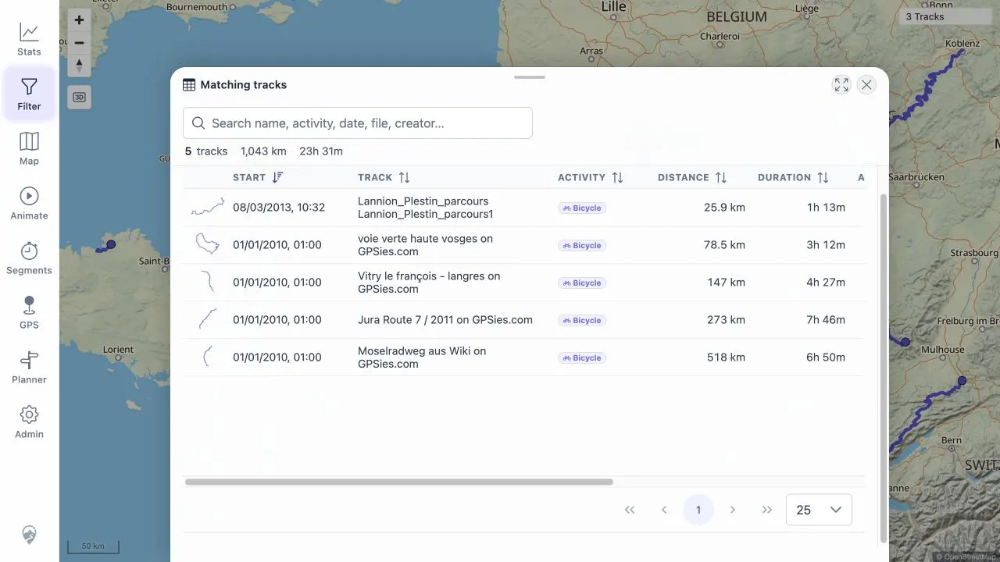

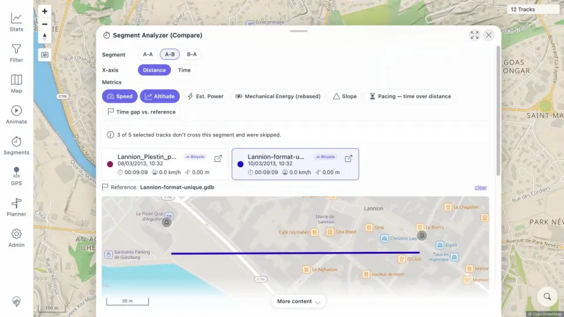

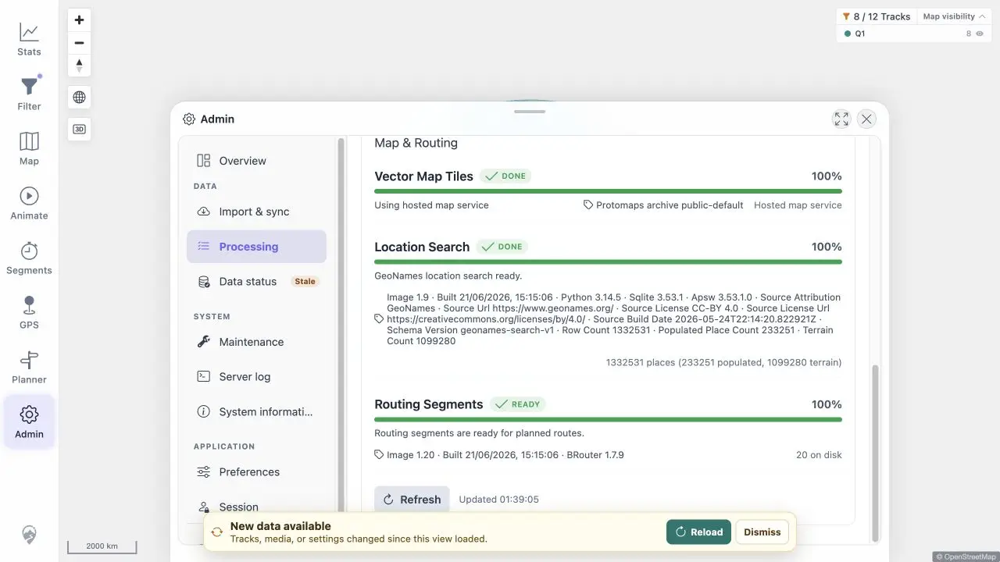

## Passing End-User Evidence

The packet set includes compact screenshots for successful functions as well as failures.

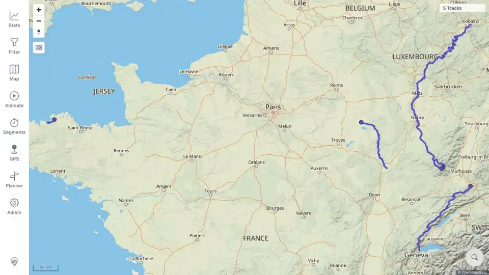

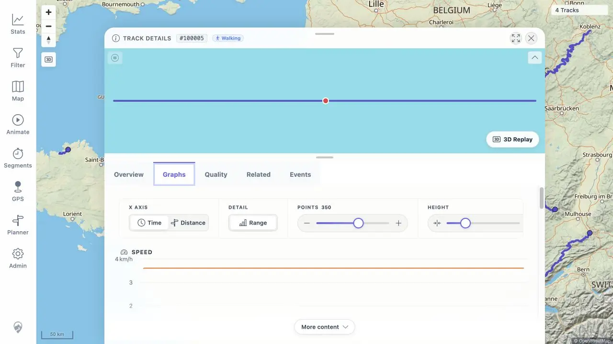

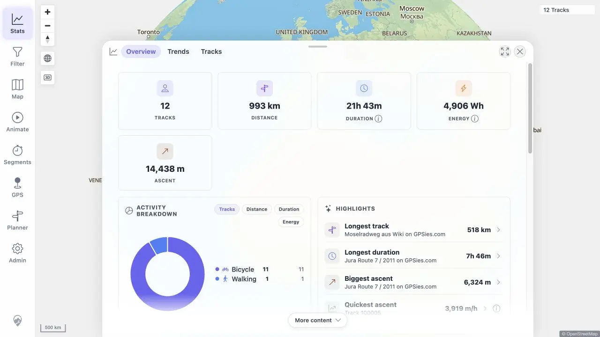

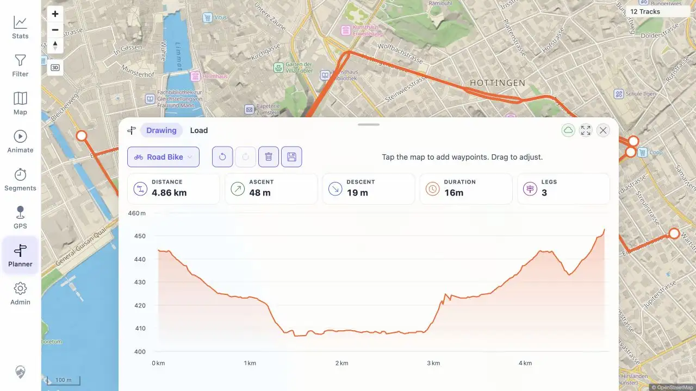

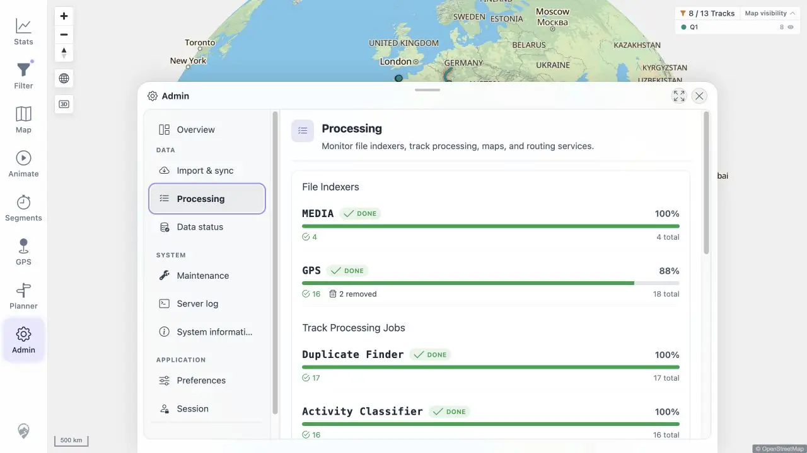

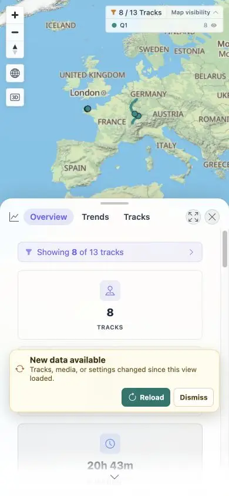

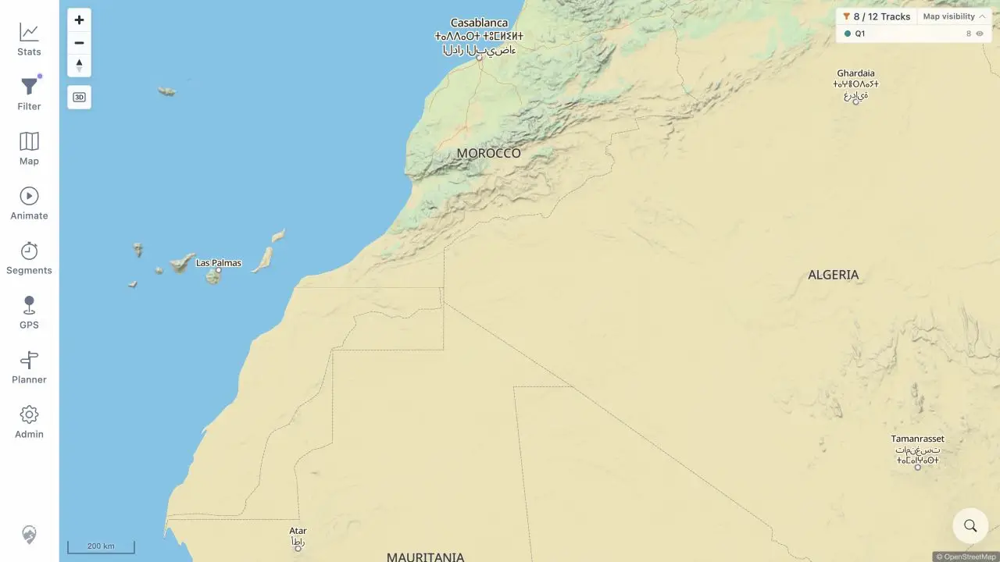

## UX Performance

Three consecutive warmed desktop journeys covered map pan/zoom, effective Filter reset/apply, Statistics Overview and Tracks, Jura search, #100000 details tabs, Planner open/close, and return to map. All 60 measured inputs produced first visible feedback within 150 ms. The maximum responsiveness-probe gap was 150 ms, below the 500 ms budget.

Server completion logs captured 171 first-party requests across 15 routes. All returned HTTP 200; the maximum was 478 ms. No console warning/error or visible pending state remained. See [interaction timings](assets/UXP_01-interactions.txt) and [all API timings](assets/UXP_01-api-timings.txt).

## Blocked And Not Applicable

- Native touch attribution was blocked for `PLN_11`, `MOB_01`, `MOB_02`, `MOB_04`, and `MOB_05` because the browser exposes no touch-event/emulation capability. Pointer and responsive checks were recorded separately.
- `TBS_13` keyboard attribution was blocked because the harness could not produce a native control path.
- `SGN_07` was blocked by the browser's server-down navigation safety policy.
- `MAP_14` was blocked because this quick install had no local map-server sidecar or isolated PMTiles failure switch.
- GPS live-session rows were not applicable on the remote plain-HTTP origin; the actionable HTTPS/localhost guidance passed.
- Installed-PWA offline/update rows were not applicable in the normal non-secure browser context.
- Demo credentials and unavailable-FIT-converter conditionals were not applicable to this configuration.

These rows are terminal constraints with reasons in their packets; no resumable status remains.

## Cleanup

Cleanup passed after the finalization gate:

- Four project containers, the project network, project database volume, and exact disposable install directory were removed.
- Ports 18080 and 18083 are unreachable.
- The supplied password-only SSH access was restored and verified.
- The temporary operator key was removed and verified unusable; `authorized_keys` has zero non-empty lines.
- 125 local PNG intermediates, 11 exact temporary files, two exact temporary directories, and 19 registered browser downloads were removed.
- No image removal or global Docker prune ran.
- Final evidence audit: 195 packets, 353 assets, no missing link/required section, no WebP over 85,000 bytes, no TXT over 5,000 bytes, and no `.log` asset.

See [RUN_CLEANUP](packets/RUN_CLEANUP.md), [cleanup evidence](assets/RUN_CLEANUP-cleanup.txt), and [evidence audit](assets/RUN_CLEANUP-evidence-audit.txt).

## Conclusion

The requested beta image installs and runs successfully, 164 of 193 frozen coverage IDs pass, the UX budget passes, and cleanup is complete. The overall result remains `FAIL`: four P1 defects were reproduced in the tested image, including stale post-refresh views, invalid A-B segment metrics, and a failed import shown as completed. Re-test a new image after those P1 fixes; retain the P2 list for the same follow-up.
