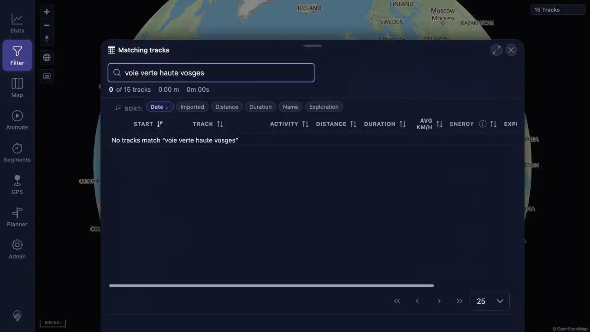
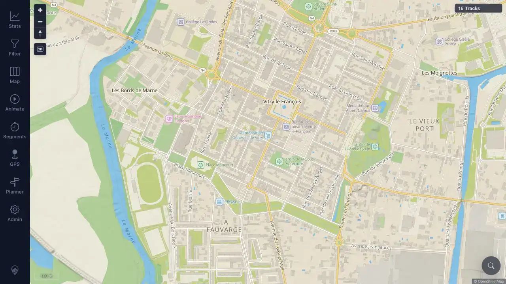

# Packet: DEL_03

## Scope

- Coverage source: [coverage-plan.md](../coverage-plan.md)
- Coverage ID or run packet: DEL_03
- In scope: Deleted-track absence from map, track browser, filter results, selection lists, heatmap, related lists, and statistics.
- Out of scope: Deleted-track API or stale URL behavior under DEL_05.

## Prerequisites

- Required previous coverage IDs or run packets: DEL_01-DEL_02.
- Required app/data state: Former tracks 100001 and 100003 removed; current result at 15 tracks.
- Required browser context: Signed-in desktop browser with current data.

## Allowed Mutations

- Allowed: Read-only searches/navigation and presentation-only Heatmap enable.
- Not allowed: Restore or delete additional sources.

## Actions And Results

| Coverage ID | Action | Expected result | Actual result | Status | Evidence |
|---|---|---|---|---|---|
| DEL_03 | Searched both deleted names in Track Browser and Choose tracks; checked former route areas/popup state; enabled the heatmap; inspected retained-track Related; and checked Statistics Overview, Trends, and Tracks. | Both deleted tracks disappear from every listed user-visible surface and totals reflect the current set. | Both searches returned no data; former map areas produced no stale selection/details/popup; current heatmap used the 15-track result; Related omitted both; Statistics consistently reported 15 tracks and omitted both names. | PASS | [assets/DEL_03-cross-view-absence.txt](../assets/DEL_03-cross-view-absence.txt); [assets/DEL_03-browser-absence.webp](../assets/DEL_03-browser-absence.webp); [assets/MAP_04-vitry-absence.webp](../assets/MAP_04-vitry-absence.webp) |

## Issues

| ID | Severity | Summary | Reproduction | Expected | Actual | Evidence | Release impact |
|---|---|---|---|---|---|---|---|

## Evidence Files

| File | Purpose |
|---|---|
| [assets/DEL_03-cross-view-absence.txt](../assets/DEL_03-cross-view-absence.txt) | Exact results for every required user-visible surface and post-delete totals. |
| [assets/DEL_03-browser-absence.webp](../assets/DEL_03-browser-absence.webp) | Exact deleted-name search showing 0 of 15 and no matching row. |
| [assets/MAP_04-vitry-absence.webp](../assets/MAP_04-vitry-absence.webp) | Former Vitry route start at 100 m with no stale line selection, popup, or details. |

## Screenshot Evidence

## Timings

| Step | Timing |
|---|---:|
| Exact search refresh | Under 0.4 seconds each |
| Map click settle | 0.5 seconds each |
| Heatmap live enable | Under 0.5 seconds |

## Handoff Notes

- Completed: Direct checks of every DEL_03 surface for both targets.
- Remaining unfinished coverage: None for DEL_03.
- Blocked or not applicable: None.
- State left for the next packet: Current 15-track data; heatmap enabled; no panel open.
