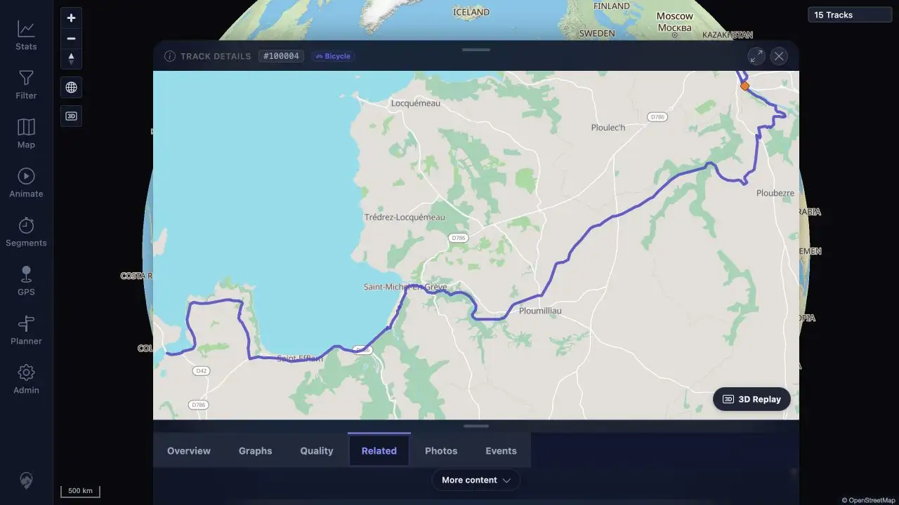

# Packet: DEL_04

## Scope

- Coverage source: [coverage-plan.md](../coverage-plan.md)
- Coverage ID or run packet: DEL_04
- In scope: All three retained original GPX imports still display and open after deletion.
- Out of scope: The two deleted targets.

## Prerequisites

- Required previous coverage IDs or run packets: DEL_01-DEL_03.
- Required app/data state: Retained tracks 100000, 100002, and 100004.
- Required browser context: Signed-in desktop map, selector, browser, details, Related, and Statistics.

## Allowed Mutations

- Allowed: Read-only exact searches and track-detail navigation.
- Not allowed: Track/source changes.

## Actions And Results

| Coverage ID | Action | Expected result | Actual result | Status | Evidence |
|---|---|---|---|---|---|
| DEL_04 | Exact-searched all three retained imports in Choose tracks; exact-searched/opened 100004 in Track Browser; inspected its Overview, mini-map, and Related; checked retained names in Statistics. | Each retained import remains visible and opens correctly. | All three selectors returned one row. Track 100004 opened with the correct ID/name, Overview, mini-map, and Related; Related listed retained 100000/100002. Statistics retained all three names. | PASS | [assets/DEL_04-retained-tracks.txt](../assets/DEL_04-retained-tracks.txt); [assets/DEL_04-retained-related.webp](../assets/DEL_04-retained-related.webp) |

## Issues

| ID | Severity | Summary | Reproduction | Expected | Actual | Evidence | Release impact |
|---|---|---|---|---|---|---|---|

## Evidence Files

| File | Purpose |
|---|---|
| [assets/DEL_04-retained-tracks.txt](../assets/DEL_04-retained-tracks.txt) | Per-target selector, browser, detail, related, and statistics results. |
| [assets/DEL_04-retained-related.webp](../assets/DEL_04-retained-related.webp) | Open retained 100004 Related tab showing retained 100000 and 100002. |

## Screenshot Evidence

## Timings

| Step | Timing |
|---|---:|
| Exact selector search refresh | Under 0.4 seconds each |
| Retained Track Details open | About 3.1 seconds including controller settle |

## Handoff Notes

- Completed: Display/open checks for all three retained original imports.
- Remaining unfinished coverage: None for DEL_04.
- Blocked or not applicable: None.
- State left for the next packet: Current 15-track map with all three retained imports available.
