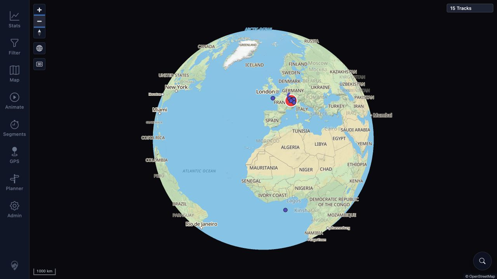

# Packet: ERR_02

## Scope

- Coverage source: [coverage-plan.md](../coverage-plan.md)
- Coverage ID or run packet: ERR_02
- In scope: Rapid tool switching and cleanup of previous panels, markers/listeners, and cursor state.
- Out of scope: Native touch gestures.

## Prerequisites

- Required previous coverage IDs or run packets: ERR_01.
- Required app/data state: Authenticated 15-track desktop map; no active route or segment drawing.
- Required browser context: Desktop pointer session.

## Allowed Mutations

- Allowed: Open tools, close the final tool, and perform reversible map pan/zoom.
- Not allowed: Save tool state or create route/segment data.

## Actions And Results

| Coverage ID | Action | Expected result | Actual result | Status | Evidence |
|---|---|---|---|---|---|
| ERR_02 | Ran two immediate successive tool sequences across every main tool, inspected final-only content, closed the last tool, checked map cursor, double-clicked, dragged, restored zoom, and checked new console errors. | Rapid switching leaves no previous tool markers, listeners, or cursors behind. | Each sequence ended with only the final tool content visible; no prior tool content remained. After closing, the canvas cursor was `grab` before and after drag, double-click changed 1000 km→500 km, drag worked, controls/attribution remained, Zoom out restored 1000 km, and no new console errors appeared. | PASS | [assets/ERR_02-switch-results.txt](../assets/ERR_02-switch-results.txt); [assets/ERR_02-clean-map.jpg](../assets/ERR_02-clean-map.jpg) |

## Issues

| ID | Severity | Summary | Reproduction | Expected | Actual | Evidence | Release impact |
|---|---|---|---|---|---|---|---|

## Evidence Files

| File | Purpose |
|---|---|
| [assets/ERR_02-switch-results.txt](../assets/ERR_02-switch-results.txt) | Exact sequences, stale-content checks, cursor, map interaction, restore, and console result. |
| [assets/ERR_02-clean-map.jpg](../assets/ERR_02-clean-map.jpg) | Clean responsive map after all switches and the final pan/zoom sequence. |

## Screenshot Evidence

## Timings

| Step | Timing |
|---|---:|
| Per controller-settled tool transition | About 3.0-3.2 seconds |
| Final double-click/drag settle | About 0.5 seconds each |

## Handoff Notes

- Completed: Both switch sequences, final-only content checks, cursor cleanup, map interaction, and error-log check.
- Remaining unfinished coverage: None for ERR_02.
- Blocked or not applicable: None.
- State left for the next packet: Authenticated desktop root, no tool open, 15 tracks, 1000 km scale, normal grab cursor.
