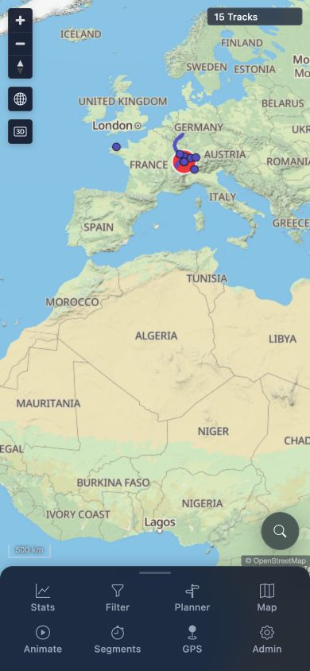

# Packet: MOB_01

## Scope

- Coverage source: [coverage-plan.md](../coverage-plan.md)
- Coverage ID or run packet: MOB_01
- In scope: Narrow mobile width and touch-enabled input.
- Out of scope: Feature-specific mobile interactions covered by MOB_02-MOB_06.

## Prerequisites

- Required previous coverage IDs or run packets: LOC_05.
- Required app/data state: Authenticated 15-track map with default locale, units, filter, and map settings.
- Required browser context: Codex in-app browser with responsive viewport capability.

## Allowed Mutations

- Allowed: Temporary viewport override.
- Not allowed: Track, filter, preference, map-style, or saved-plan mutation.

## Actions And Results

| Coverage ID | Action | Expected result | Actual result | Status | Evidence |
|---|---|---|---|---|---|
| MOB_01 | Applied a 390 x 844 viewport, loaded the authenticated map, and inspected available input/device capabilities. | The app renders at narrow mobile width with touch input enabled. | The authenticated map rendered at the exact 390 x 844 size with compact bottom navigation and usable controls. The browser channel exposes viewport control but no touch-input or touch-device emulation capability, so the required touch-enabled branch could not be executed. | BLOCKED | [assets/MOB_01-mobile-root.jpg](../assets/MOB_01-mobile-root.jpg); [assets/MOB_01-mobile-capability.txt](../assets/MOB_01-mobile-capability.txt) |

## Issues

| ID | Severity | Summary | Reproduction | Expected | Actual | Evidence | Release impact |
|---|---|---|---|---|---|---|---|

## Evidence Files

| File | Purpose |
|---|---|
| [assets/MOB_01-mobile-root.jpg](../assets/MOB_01-mobile-root.jpg) | Exact 390 x 844 authenticated mobile map rendering. |
| [assets/MOB_01-mobile-capability.txt](../assets/MOB_01-mobile-capability.txt) | Viewport dimensions and missing native touch capability. |

## Screenshot Evidence

## Timings

| Step | Timing |
|---|---:|
| Responsive resize and render | 1.5 seconds |

## Handoff Notes

- Completed: Exact narrow-width rendering passed.
- Remaining unfinished coverage: None for MOB_01.
- Blocked or not applicable: Native touch input cannot be enabled or injected through the available in-app browser channel; this makes MOB_01 terminal BLOCKED but does not block pointer-based mobile coverage.
- State left for the next packet: Authenticated app at 390 x 844, 15 tracks, defaults intact.
