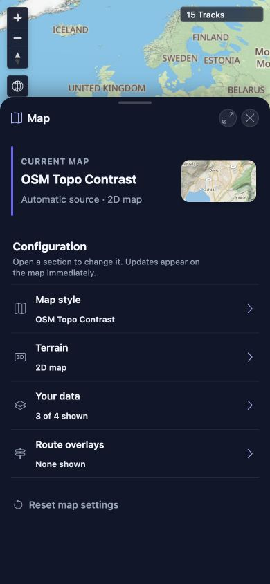

# Packet: MOB_02

## Scope

- Coverage source: [coverage-plan.md](../coverage-plan.md)
- Coverage ID or run packet: MOB_02
- In scope: Mobile bottom-sheet and navigation-sheet drag, snap, restore, and close behavior.
- Out of scope: Native touch injection, covered by the MOB_01 tooling constraint.

## Prerequisites

- Required previous coverage IDs or run packets: MOB_01.
- Required app/data state: Authenticated 15-track map with defaults intact.
- Required browser context: 390 x 844 responsive viewport.

## Allowed Mutations

- Allowed: Open, drag, maximize, restore, and close reversible sheets.
- Not allowed: Persist settings or mutate tracks.

## Actions And Results

| Coverage ID | Action | Expected result | Actual result | Status | Evidence |
|---|---|---|---|---|---|
| MOB_02 | Opened Statistics, maximized/restored it, pointer-dragged its handle between settled heights, closed it, then opened and closed the Map navigation sheet. | Bottom sheets and the navigation sheet drag, snap, and close correctly. | Statistics opened at partial height, snapped full and restored, moved cleanly under pointer drag, and closed without an orphaned overlay. Map opened as a usable navigation sheet and closed back to the eight-button mobile navigation. | PASS | [assets/MOB_02-sheet-results.txt](../assets/MOB_02-sheet-results.txt); [assets/MOB_02-map-sheet.jpg](../assets/MOB_02-map-sheet.jpg) |

## Issues

| ID | Severity | Summary | Reproduction | Expected | Actual | Evidence | Release impact |
|---|---|---|---|---|---|---|---|

## Evidence Files

| File | Purpose |
|---|---|
| [assets/MOB_02-sheet-results.txt](../assets/MOB_02-sheet-results.txt) | Exact open, snap, drag, restore, and close observations. |
| [assets/MOB_02-map-sheet.jpg](../assets/MOB_02-map-sheet.jpg) | Mobile Map navigation sheet at its normal partial height. |

## Screenshot Evidence

## Timings

| Step | Timing |
|---|---:|
| Open/snap/restore transitions | 0.3-0.5 seconds each |

## Handoff Notes

- Completed: Statistics and Map sheets opened, moved/snapped, restored, and closed correctly.
- Remaining unfinished coverage: None for MOB_02.
- Blocked or not applicable: None.
- State left for the next packet: Authenticated map at 390 x 844, all sheets closed, defaults intact.
