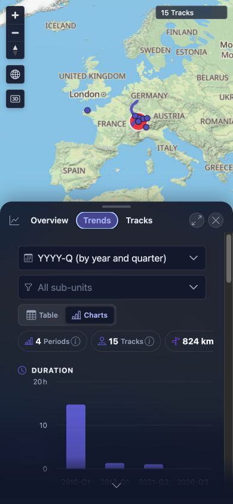

# Packet: MOB_03

## Scope

- Coverage source: [coverage-plan.md](../coverage-plan.md)
- Coverage ID or run packet: MOB_03
- In scope: Mobile tables, charts, map controls, and text-overflow behavior.
- Out of scope: Native multi-touch gestures.

## Prerequisites

- Required previous coverage IDs or run packets: MOB_02.
- Required app/data state: Authenticated 15-track map and populated Statistics.
- Required browser context: 390 x 844 responsive viewport.

## Allowed Mutations

- Allowed: Reversible Statistics tab/view switches and map zoom in/out.
- Not allowed: Persist settings or mutate data.

## Actions And Results

| Coverage ID | Action | Expected result | Actual result | Status | Evidence |
|---|---|---|---|---|---|
| MOB_03 | Audited Statistics Trends in chart and table modes, measured page/table overflow, scanned visible leaf text for clipping, and exercised map zoom controls. | Tables, charts, and map controls stay usable; no text overflows. | Charts, selectors, summary chips, axes, and labels rendered at 390 px. The 14-column table stayed in a contained 354 px horizontal scroller without widening the page. No visible leaf text overflow was found. Zoom in changed the scale 500 km→300 km and Zoom out restored 500 km; all named map/navigation controls remained available. | PASS | [assets/MOB_03-layout-results.txt](../assets/MOB_03-layout-results.txt); [assets/MOB_03-trends.jpg](../assets/MOB_03-trends.jpg) |

## Issues

| ID | Severity | Summary | Reproduction | Expected | Actual | Evidence | Release impact |
|---|---|---|---|---|---|---|---|

## Evidence Files

| File | Purpose |
|---|---|
| [assets/MOB_03-layout-results.txt](../assets/MOB_03-layout-results.txt) | Exact overflow, table-container, and map-control observations. |
| [assets/MOB_03-trends.jpg](../assets/MOB_03-trends.jpg) | Mobile chart with usable selectors, labels, chips, axes, and bars. |

## Screenshot Evidence

## Timings

| Step | Timing |
|---|---:|
| Chart/table switch | Under 0.5 seconds |
| Map zoom response | About 0.35 seconds each |

## Handoff Notes

- Completed: Tables, charts, map controls, body overflow, and visible text clipping checked.
- Remaining unfinished coverage: None for MOB_03.
- Blocked or not applicable: None.
- State left for the next packet: Authenticated map at 390 x 844, Statistics closed, map zoom restored, defaults intact.
