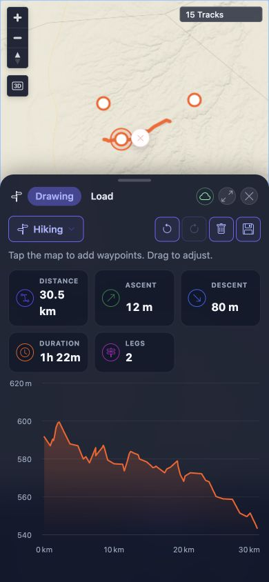

# Packet: MOB_04

## Scope

- Coverage source: [coverage-plan.md](../coverage-plan.md)
- Coverage ID or run packet: MOB_04
- In scope: Mobile Planner waypoint placement, drag, and route-line insertion with touch.
- Out of scope: Saving a route.

## Prerequisites

- Required previous coverage IDs or run packets: MOB_03.
- Required app/data state: BRouter ready, no saved or active Planner route.
- Required browser context: 390 x 844 responsive viewport; pointer available, native touch unavailable.

## Allowed Mutations

- Allowed: One temporary unsaved Planner route and reversible map zoom.
- Not allowed: Save the route or change source tracks.

## Actions And Results

| Coverage ID | Action | Expected result | Actual result | Status | Evidence |
|---|---|---|---|---|---|
| MOB_04 | At a 20 km scale, pointer-placed two waypoints, dragged the endpoint, clicked the routed line to insert an intermediate waypoint, then cleared the route. | Planner waypoints can be tapped, dragged, and inserted with touch. | Pointer equivalents all passed: two points produced a 30.1 km/1-leg route, endpoint drag recomputed it to 14.7 km, route-line insertion produced 30.5 km/2 legs, and cleanup restored zero legs. Native touch input cannot be enabled or injected through this browser channel, so the touch-specific branch is unexecuted. | BLOCKED | [assets/MOB_04-planner-results.txt](../assets/MOB_04-planner-results.txt); [assets/MOB_04-planner-waypoints.jpg](../assets/MOB_04-planner-waypoints.jpg) |

## Issues

| ID | Severity | Summary | Reproduction | Expected | Actual | Evidence | Release impact |
|---|---|---|---|---|---|---|---|

## Evidence Files

| File | Purpose |
|---|---|
| [assets/MOB_04-planner-results.txt](../assets/MOB_04-planner-results.txt) | Route values after placement, drag, insertion, and cleanup, plus the touch constraint. |
| [assets/MOB_04-planner-waypoints.jpg](../assets/MOB_04-planner-waypoints.jpg) | Three-waypoint, two-leg mobile Planner route and elevation profile. |

## Screenshot Evidence

## Timings

| Step | Timing |
|---|---:|
| BRouter recomputations | 2.2-2.5 seconds each |

## Handoff Notes

- Completed: Pointer placement, endpoint drag, route-line insertion, route recomputation, and cleanup.
- Remaining unfinished coverage: None for MOB_04.
- Blocked or not applicable: Native touch input/device emulation is unavailable; MOB_04 is terminal BLOCKED.
- State left for the next packet: Planner closed, route cleared, 390 x 844 viewport, zoomed map, defaults otherwise intact.
