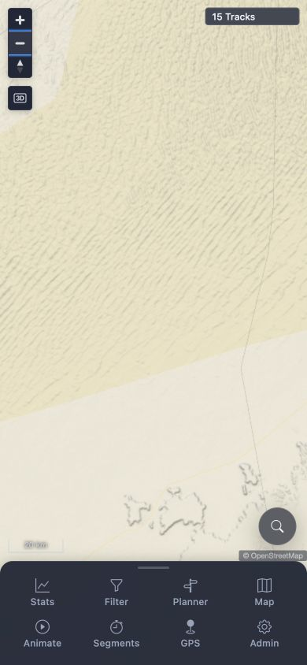

# Packet: MOB_05

## Scope

- Coverage source: [coverage-plan.md](../coverage-plan.md)
- Coverage ID or run packet: MOB_05
- In scope: Pinch, double-tap, and drag map gestures after each mobile tool.
- Out of scope: Feature behavior inside the tool sheets.

## Prerequisites

- Required previous coverage IDs or run packets: MOB_04.
- Required app/data state: Authenticated mobile map; Planner route cleared.
- Required browser context: 390 x 844 viewport; pointer available, native touch unavailable.

## Allowed Mutations

- Allowed: Open/close each tool, temporary zoom/pan, and map-setting reset.
- Not allowed: Persist feature data or save routes.

## Actions And Results

| Coverage ID | Action | Expected result | Actual result | Status | Evidence |
|---|---|---|---|---|---|
| MOB_05 | For Stats, Filter, Planner, Map, Animate, Segments, GPS, and Admin: opened and closed the tool, double-clicked the map, pointer-dragged it, and restored zoom. Inspected native gesture capability. | Pinch, double-tap, and drag work after using each tool. | All eight tool sheets opened. After every tool, double-click changed 20 km→10 km, pointer drag completed, and Zoom out restored 20 km. Native multi-touch cannot be enabled or injected, so pinch remains unexecuted. | BLOCKED | [assets/MOB_05-gesture-results.txt](../assets/MOB_05-gesture-results.txt); [assets/MOB_05-map-after-tools.jpg](../assets/MOB_05-map-after-tools.jpg) |

## Issues

| ID | Severity | Summary | Reproduction | Expected | Actual | Evidence | Release impact |
|---|---|---|---|---|---|---|---|

## Evidence Files

| File | Purpose |
|---|---|
| [assets/MOB_05-gesture-results.txt](../assets/MOB_05-gesture-results.txt) | Per-tool open, double-click zoom, drag, restore, and pinch constraint. |
| [assets/MOB_05-map-after-tools.jpg](../assets/MOB_05-map-after-tools.jpg) | Responsive mobile map after the eighth completed pointer gesture sequence. |

## Screenshot Evidence

## Timings

| Step | Timing |
|---|---:|
| Each double-click zoom | About 0.5 seconds |
| Each pointer drag | About 0.5 seconds |

## Handoff Notes

- Completed: Double-click zoom and pointer drag after all eight tools, with zoom restored each time.
- Remaining unfinished coverage: None for MOB_05.
- Blocked or not applicable: Native pinch injection is unavailable; MOB_05 is terminal BLOCKED.
- State left for the next packet: Authenticated app at 390 x 844, all tool sheets closed, no temporary route, map settings reset.
