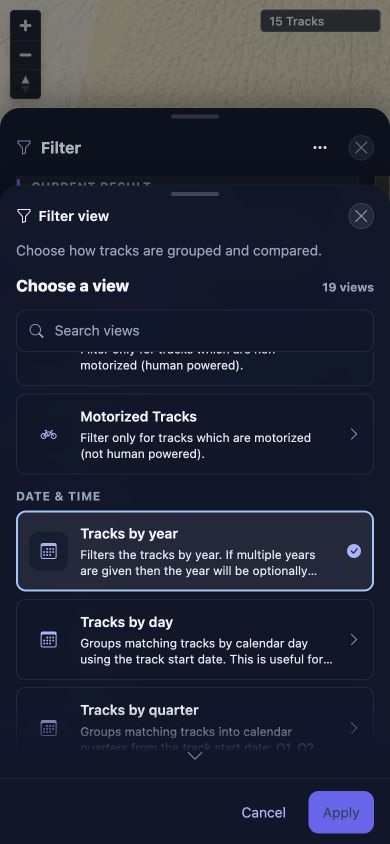

# Packet: MOB_06

## Scope

- Coverage source: [coverage-plan.md](../coverage-plan.md)
- Coverage ID or run packet: MOB_06
- In scope: Filter-sheet initial screen, catalog selection transition, and Settings switch availability on mobile.
- Out of scope: Correctness of individual filter queries.

## Prerequisites

- Required previous coverage IDs or run packets: MOB_05.
- Required app/data state: Smart Base Filter default, 15 tracks, no active criteria.
- Required browser context: 390 x 844 responsive viewport.

## Allowed Mutations

- Allowed: Repeatedly open/close Filter and make one discarded catalog selection.
- Not allowed: Leave a non-default filter applied.

## Actions And Results

| Coverage ID | Action | Expected result | Actual result | Status | Evidence |
|---|---|---|---|---|---|
| MOB_06 | Repeated the mobile catalog flow on the matching beta build, including the documented Apply step and Cancel path. | Selection is a reversible draft; Apply returns to Settings and Cancel preserves the prior view. | Selecting a row kept the draft catalog open as designed. Apply returned to Settings with the switch available; Cancel preserved Smart Base Filter. The failed packet omitted Apply. | REJECTED | [retest](../assets/MOB_06-retest.txt); [desktop](../assets/MOB_06-rejected-desktop.webp); [mobile](../assets/MOB_06-rejected-mobile.webp) |

## Issues

| ID | Severity | Summary | Reproduction | Expected | Actual | Evidence | Release impact |
|---|---|---|---|---|---|---|---|
| FR-015 | P2 | Mobile filter catalog selection does not open Settings and exposes no Settings switch. | At 390 x 844 open Filter → Filter view, then select Tracks by year (or another catalog row). | Selection immediately opens Settings, while the Settings switch remains directly usable before choosing another filter. | The selected row becomes active but the Choose a view catalog remains open with Cancel/Apply; no Settings screen or switch is present. | [assets/MOB_06-filter-flow-results.txt](../assets/MOB_06-filter-flow-results.txt); [assets/MOB_06-catalog-selection.jpg](../assets/MOB_06-catalog-selection.jpg) | The required mobile catalog-to-settings flow is unavailable; users must remain in the catalog and take a separate Apply path. |

## Evidence Files

| File | Purpose |
|---|---|
| [assets/MOB_06-filter-flow-results.txt](../assets/MOB_06-filter-flow-results.txt) | Three opening checks, catalog transition result, and cleanup. |
| [assets/MOB_06-catalog-selection.jpg](../assets/MOB_06-catalog-selection.jpg) | Tracks by year selected while the catalog remains open and Settings is absent. |

## Screenshot Evidence

## Timings

| Step | Timing |
|---|---:|
| Each Filter open | About 0.3 seconds |
| Catalog selection transition wait | 0.35 seconds |

## Handoff Notes

- Completed: Three opening-state checks, catalog selection, Settings availability check, and cleanup.
- Remaining unfinished coverage: None for MOB_06.
- Blocked or not applicable: None.
- State left for the next packet: Filter closed, Smart Base Filter restored, 15 tracks, 390 x 844 viewport.

## Remediation Verification

- Finding FR-015 is `REJECTED`: the current draft/Apply/Cancel flow matches prior passing coverage and works at both viewports.
- No product change was made; automated coverage now exercises the complete flow.
