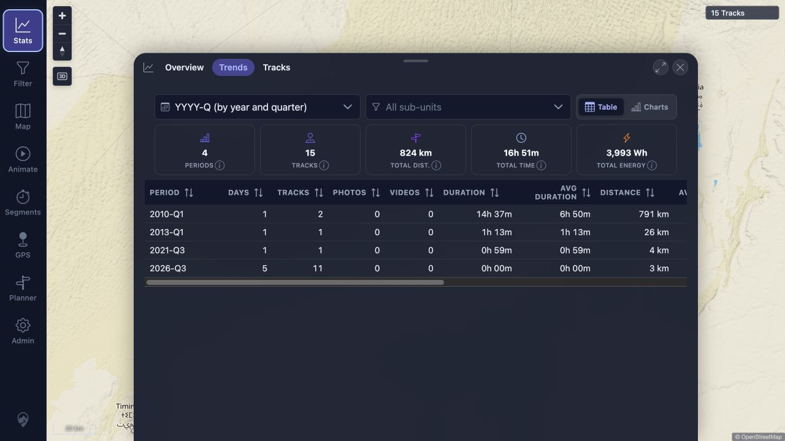

# Packet: NET_02

## Scope

- Coverage source: [coverage-plan.md](../coverage-plan.md)
- Coverage ID or run packet: NET_02
- In scope: Recoverable user-visible behavior during a temporary application connection loss.
- Out of scope: Installed-PWA offline cache behavior.

## Prerequisites

- Required previous coverage IDs or run packets: NET_01.
- Required app/data state: Warm authenticated desktop session with cached 15-track data.
- Required browser context: Normal desktop tab kept loaded while the disposable app service is briefly unavailable.

## Allowed Mutations

- Allowed: Briefly stop/start only the run's app service and reload after recovery.
- Not allowed: Stop the database, BRouter, location search, or any installation outside this run.

## Actions And Results

| Coverage ID | Action | Expected result | Actual result | Status | Evidence |
|---|---|---|---|---|---|
| NET_02 | Warmed Statistics, stopped only the app service, opened Statistics, then restarted and selected Retry on the fixed build at desktop and mobile sizes. | Cached content remains visible with a clear recoverable error state. | Statistics retained the cached row, displayed Statistics could not be loaded with Retry on every tab, and cleared the alert after service recovery. | FIXED | [details](../assets/NET_02-remediation.txt); [desktop](../assets/NET_02-fixed-desktop.webp); [mobile](../assets/NET_02-fixed-mobile.webp) |

## Issues

| ID | Severity | Summary | Reproduction | Expected | Actual | Evidence | Release impact |
|---|---|---|---|---|---|---|---|
| FR-016 | P1 | Statistics silently presents cached data when refresh requests fail during a connection drop. | Load the signed-in app, stop connectivity to the app service, then open Statistics. | Keep the UI non-blank and show a recoverable offline/stale state with retry or reconnect guidance. | The UI shows the cached 15-track table without any failure indication while console logs report network drops and failed Statistics requests. | [assets/NET_02-flaky-results.txt](../assets/NET_02-flaky-results.txt); [assets/NET_02-silent-stale-stats.jpg](../assets/NET_02-silent-stale-stats.jpg) | Users can mistake stale statistics for current data and receive no recovery action. |

## Evidence Files

| File | Purpose |
|---|---|
| [assets/NET_02-flaky-results.txt](../assets/NET_02-flaky-results.txt) | Fault injection, console failures, visible UI state, recovery, and final service state. |
| [assets/NET_02-silent-stale-stats.jpg](../assets/NET_02-silent-stale-stats.jpg) | Cached Statistics presented without an outage/stale warning while the app service is stopped. |

## Screenshot Evidence

## Timings

| Step | Timing |
|---|---:|
| Outage UI observation | 2.5 seconds |
| Service restart to HTTP 200 | About 37 seconds |
| Recovered app reload | About 2.5 seconds |

## Handoff Notes

- Completed: Controlled connection drop, non-blank/stale-state inspection, service recovery, and browser recovery.
- Remaining unfinished coverage: None for NET_02.
- Blocked or not applicable: None.
- State left for the next packet: All Compose services running, authenticated desktop map with 15 tracks, Statistics closed.

## Remediation Verification

- Finding FR-016 is `FIXED`: failed Statistics refreshes expose stale/offline state without discarding cached data.
- Retry clears the alert after recovery, including after a successful empty result.
