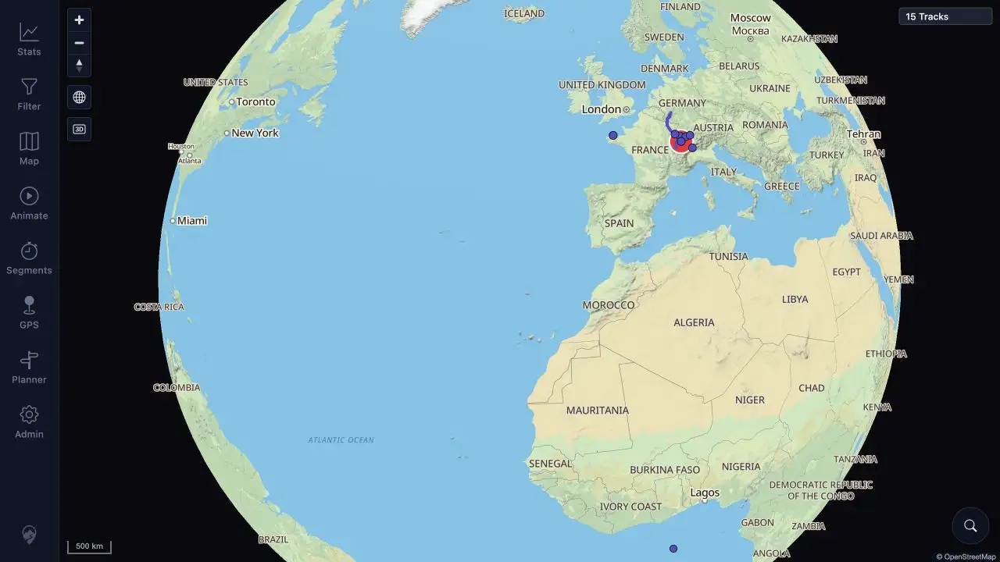

# Packet: UXP_01

## Scope

- Coverage source: [coverage-plan.md](../coverage-plan.md)
- Coverage ID or run packet: UXP_01
- In scope: Three warmed desktop journeys and required browser responsiveness, main-thread stall, first-party fetch/XHR timing, pending-request, UI-result, and console evidence.
- Out of scope: Static assets, map tiles/providers, uploads, downloads, and intentionally cancelled requests.

## Prerequisites

- Required previous coverage IDs or run packets: ERR_02.
- Required app/data state: Signed-in warmed desktop session, 15 controlled tracks, and background work settled.
- Required browser context: Desktop in-app browser at 1280 x 720.

## Allowed Mutations

- Allowed: Reversible map movement, filter apply/reset, panel and tab navigation, and track search.
- Not allowed: Persisted changes to tracks, routes, segments, settings, or source data.

## Actions And Results

| Coverage ID | Action | Expected result | Actual result | Status | Evidence |
|---|---|---|---|---|---|
| UXP_01 | Ran three consecutive journeys through map pan/zoom, Filter apply/reset, Statistics Overview/Tracks, track search/details tabs, Planner open/close, and return to map; checked console and attempted the required performance/request instrumentation. | Every input has feedback within 200 ms; no main-thread stall exceeds 500 ms; each first-party API finishes within 2 seconds with expected status/UI result; no unexpected pending request or console error; interaction remains responsive. | All 62 functional steps completed, each journey returned to a responsive map, and zero console errors appeared. The selected browser does not expose page performance entries, main-thread stalls, or fetch/XHR route/status/duration/pending events, so the mandatory budgets and timing table cannot be established. | BLOCKED | [assets/UXP_01-functional-journeys.txt](../assets/UXP_01-functional-journeys.txt); [assets/UXP_01-instrumentation-gap.txt](../assets/UXP_01-instrumentation-gap.txt); [assets/UXP_01-final-map.webp](../assets/UXP_01-final-map.webp) |

## Issues

| ID | Severity | Summary | Reproduction | Expected | Actual | Evidence | Release impact |
|---|---|---|---|---|---|---|---|

## Evidence Files

| File | Purpose |
|---|---|
| [assets/UXP_01-functional-journeys.txt](../assets/UXP_01-functional-journeys.txt) | Three exact functional journeys, controller-only diagnostics, final interaction state, and console result. |
| [assets/UXP_01-instrumentation-gap.txt](../assets/UXP_01-instrumentation-gap.txt) | Required timing fields, unavailable browser surfaces, and why the result is blocked. |
| [assets/UXP_01-final-map.webp](../assets/UXP_01-final-map.webp) | Responsive authenticated map after the third journey. |

## Screenshot Evidence

## Timings

| Step | Timing |
|---|---:|
| Required visible-feedback timing | Unavailable |
| Required maximum main-thread stall | Unavailable |
| Required first-party API route/status/duration | Unavailable |
| Controller-only whole-journey diagnostic | 45.9-109.3 seconds including automation/tool waits |

## Handoff Notes

- Completed: Three functional journeys, final map responsiveness, console check, and direct attempts to obtain all required performance/request fields.
- Remaining unfinished coverage: None for UXP_01.
- Blocked or not applicable: UXP_01 is blocked by the selected browser's missing performance and first-party request instrumentation; this does not block remaining functional packets.
- State left for the next packet: Authenticated desktop root map, 15 tracks, no tool open.
