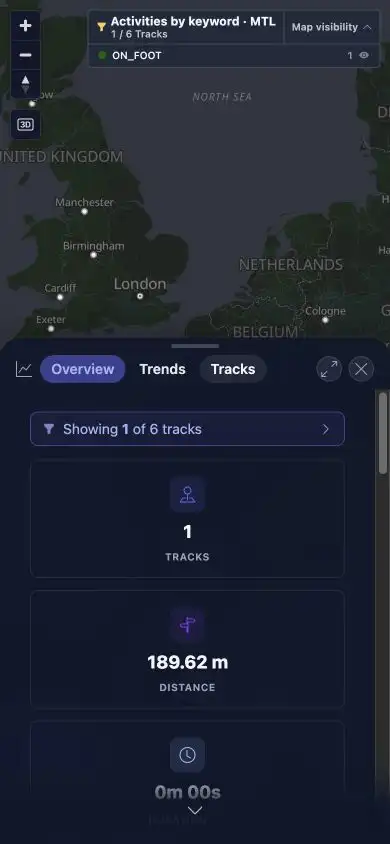
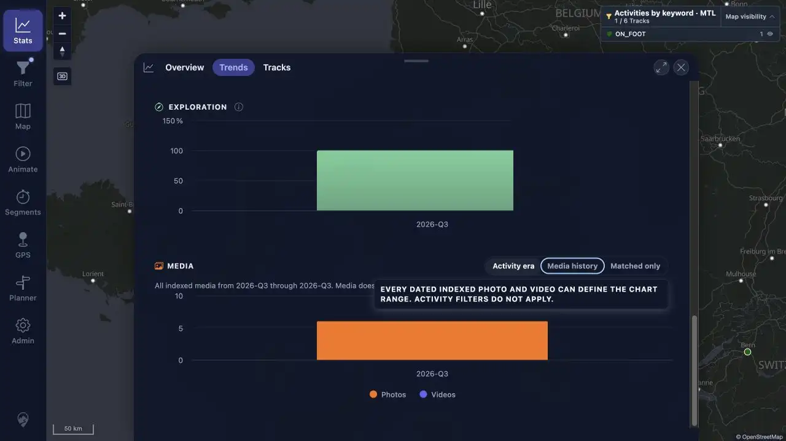
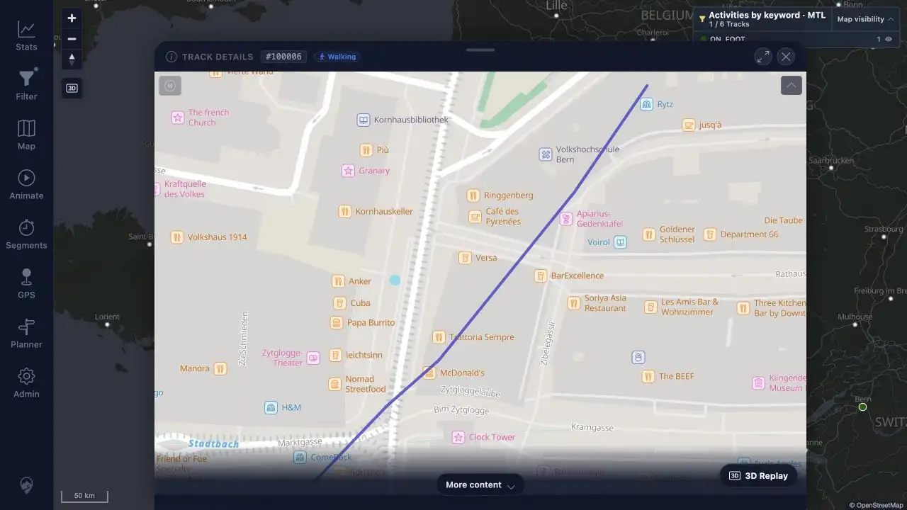
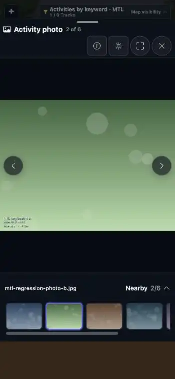

# MTL Explorer Regression Remediation

## Result

All 16 findings from the 2026-08-17 beta full regression are resolved.

| Measure | Result |
|---|---:|
| Findings fixed | 10 |
| Findings rejected after reproduction | 6 |
| Failed coverage rows resolved | 19 of 19 |
| Fixed coverage rows | 11 |
| Rejected coverage rows | 8 |
| Desktop retest | 1280 × 720 |
| Mobile retest | 390 × 844 |

This was a targeted remediation pass over the original failures. The original 42 `BLOCKED` rows and 9 conditional `NOT APPLICABLE` rows were not reclassified.

## Finding Results

| Finding | Coverage | Result | Resolution |
|---|---|---|---|
| FR-001 | [MED_06](packets/MED_06.md) | REJECTED | Exact-beta pointer activation queued the MEDIA rescan, returned HTTP 200, and indexed 6/6 files. |
| FR-002 | [MAP_13](packets/MAP_13.md) | REJECTED | Exact-beta OSM Dark loaded CARTO tiles and correct attribution at both viewports. |
| FR-003 | [TRD_13](packets/TRD_13.md) | REJECTED | Exact-beta Previous and Next cards changed route and track identity at both viewports. |
| FR-004 | [TRD_15](packets/TRD_15.md) | REJECTED | Exact-beta direct-route Close returned to the map after app readiness at both viewports. |
| FR-005 | [FLT_01](packets/FLT_01.md), [FLT_03](packets/FLT_03.md) | FIXED | Map and Filter now identify the active view and first string criterion after hydration and navigation. |
| FR-006 | [TBS_12](packets/TBS_12.md) | FIXED | Statistics no longer appends curation overrides outside the current track set. |
| FR-007 | [TBS_13](packets/TBS_13.md) | FIXED | Enter and Space open Filter from the filtered summary without duplicate activation. |
| FR-008 | [TBS_14](packets/TBS_14.md) | FIXED | Focus now exposes the same media-mode help as hover with ARIA linkage. |
| FR-009 | [MED_02](packets/MED_02.md) | FIXED | Broad overview bounds are skipped; local viewports fetch independently and stale responses cannot win. |
| FR-010 | [MED_16](packets/MED_16.md), [MED_22](packets/MED_22.md), [MED_35](packets/MED_35.md) | REJECTED | The fixture lacked GPS timestamps and its five-minute route was shorter than the minimum offset. Corrected 4/2 provenance on a 25-minute route passes. |
| FR-011 | [MED_20](packets/MED_20.md) | FIXED | Default file change detection now includes modification time and reingests same-size replacements. |
| FR-012 | [MED_31](packets/MED_31.md) | FIXED | Phone layouts show `Nearby`; desktop and accessible text retain `Nearby photos`. |
| FR-013 | [SRC_04](packets/SRC_04.md) | FIXED | Empty Search now shows a neutral prompt without issuing an empty request. |
| FR-014 | [LOC_05](packets/LOC_05.md) | FIXED | Main, 3D, and mini-map scale controls follow live Metric/Imperial preference changes. |
| FR-015 | [MOB_06](packets/MOB_06.md) | REJECTED | The failed procedure stopped at the reversible draft. Apply correctly returns to Settings; Cancel preserves the prior view. |
| FR-016 | [NET_02](packets/NET_02.md) | FIXED | Statistics keeps cached data visible with an error and Retry, then clears the alert after recovery. |

## Valid Fixes

### Filter identity

The active filter formatter is shared by the store, map control, and Filter Current result. It shows the public saved-view name and the first nonblank string criterion. The separate map visibility toggle and counts remain unchanged.

### Statistics consistency and access

Track overrides are now constrained to the current resolved set. The filtered summary handles keyboard activation, and media-mode help has a focus-visible tooltip with `aria-describedby`.

### Media loading and source replacement

The media overlay no longer stores an initial global padded bound. It fetches Bern and New York independently and rejects late responses from superseded requests. GPS indexing now defaults to size-and-modification-time change detection, so a changed 1,080-byte replacement was reingested and its six affected media were recalculated.

### Responsive, search, units, and recovery UI

Phone viewer copy is compact, empty Search has guidance, every MapLibre scale follows the measurement system, and failed Statistics refreshes expose cached state with Retry.

## Rejected Findings

FR-001 through FR-004 passed on the exact beta image that produced the original report. Their source event chains were unchanged, so no speculative product patch was made. [MED_06 retest](assets/MED_06-retest.txt), [MAP_13 retest](assets/MAP_13-retest.txt), [TRD_13 retest](assets/TRD_13-retest.txt), and [TRD_15 retest](assets/TRD_15-retest.txt) preserve the observations.

FR-010 was a synthetic-data defect. Four files described as GPS-timed contained GPS coordinates but no `GPSDateStamp` or `GPSTimeStamp`, so all six files were correctly treated as camera-clock media. The five-minute route was also shorter than the UI's minimum 15-minute adjustment. The generator now creates four true EXIF GPS rows and two camera-clock rows on a 25-minute same-size synthetic route. The corrected server contained exactly 4 `EXIF_GPS` and 2 `EXIF_DATE_TAKEN` rows; preview retained all six, changed only the two camera-clock rows, preserved a retained manual assignment, and enabled Save.

FR-015 omitted the catalog's Apply confirmation. Both Cancel and Apply paths worked as designed in the exact beta. [MOB_06 retest](assets/MOB_06-retest.txt) preserves the result.

## Verification

| Check | Result |
|---|---|
| Frontend Vitest | PASS — 123 files, 657 tests |
| Frontend type check | PASS |
| Frontend lint | PASS — 0 errors; 7 unrelated existing warnings |
| Targeted server tests | PASS — 20 tests |
| Synthetic media generator test | PASS |
| Root Maven install without tests | PASS |
| Full server test attempt | 423 tests; 0 failures; 4 context errors because local PostgreSQL was unavailable |
| Browser fixed-build retest | PASS at desktop and mobile for every fixed or rejected finding |
| Extra responsive viewports | MED_31 at 375 × 667 and 390 × 760; MED_35 at 390 × 760 |

The four full-suite context errors were limited to database integration contexts that could not connect to local PostgreSQL. Targeted tests for the changed indexer and media parser passed, and the fixed server deployment supplied the database-backed end-to-end checks.

See [automated test evidence](assets/REMEDIATION-automated-tests.txt).

## Environment And Cleanup

- Original beta image: `wauwau0977/mytraillog:beta`, digest `sha256:eb68ce2b4de68fdbad0357ae11b9446c6dbd2e2a784048e5c29351fdc67b5546`.
- Source forensics used commit `0090bdae`, which immediately preceded the beta build.
- The original regression Compose project had already been removed. Docker journal entries preserved its lifecycle; app container logs did not survive that cleanup.
- A fresh disposable project used only public and synthetic data. The fixed image was built from the current workspace, deployed, and checked through the normal browser UI and database state.
- Disposable verification cleanup: all four project containers, the project network and volume, derived test image, and exact test directory were removed. Port 18080 is closed. This disposable state is not recoverable.

See [server verification evidence](assets/REMEDIATION-server-verification.txt).

## Evidence Rules

All new screenshots are WebP. Each is at most 85,000 bytes. Concise text evidence is at most 5 KiB. The affected packet rows link both desktop and mobile evidence.
