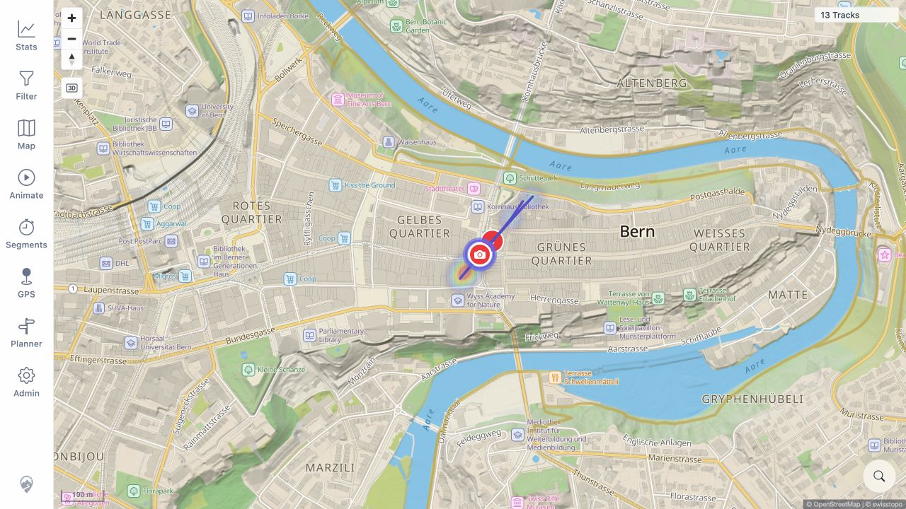
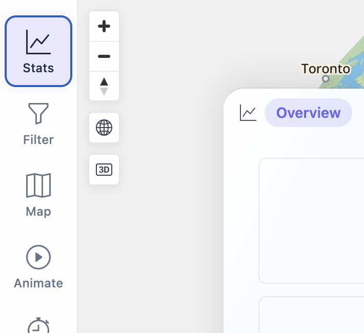
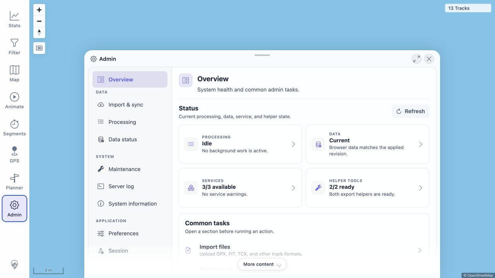
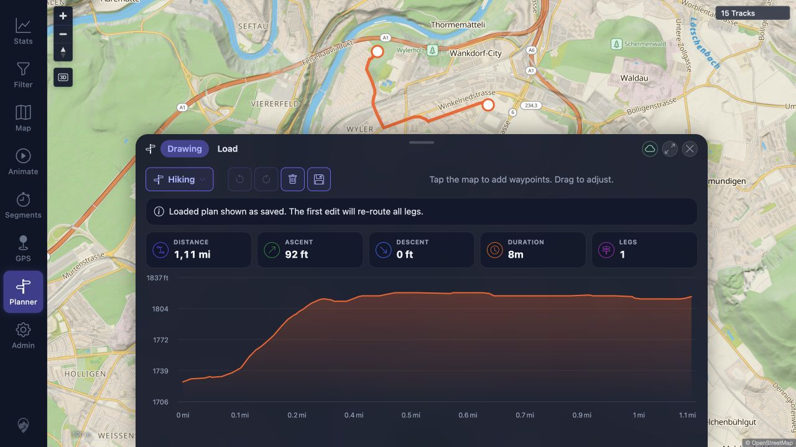
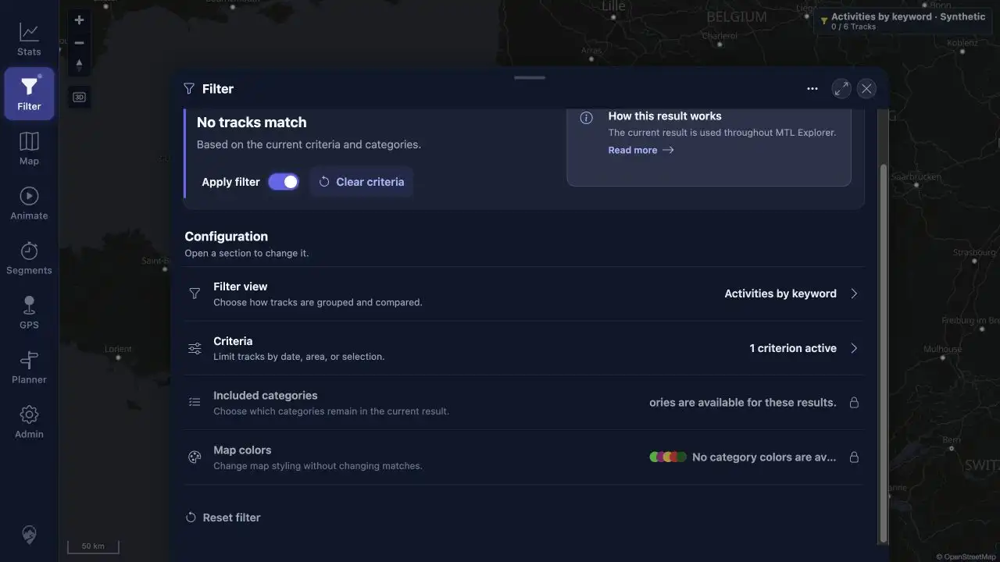
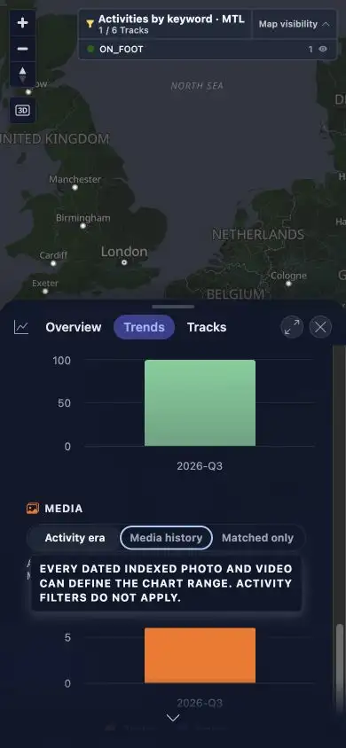
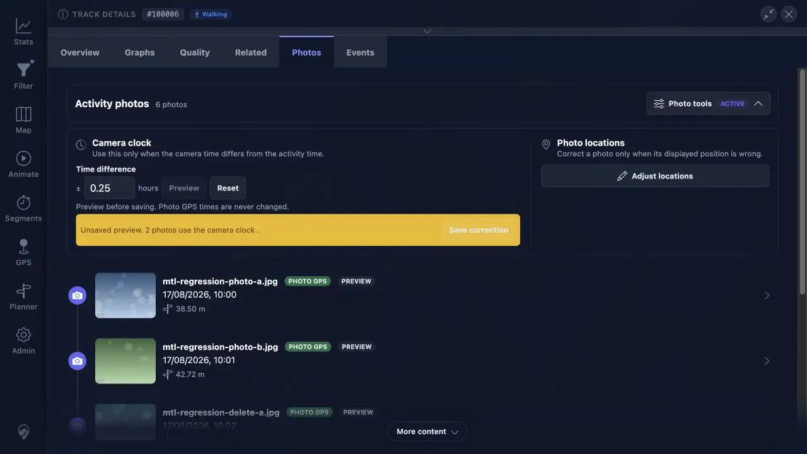
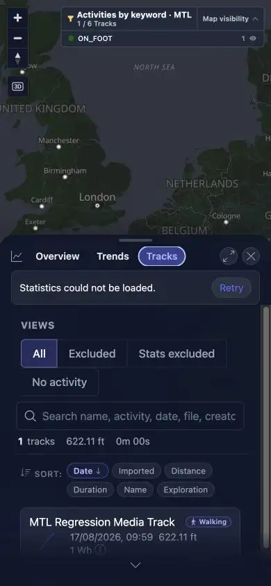

> **REMEDIATION RESULT: PASS — all 16 reported findings are resolved: 10 fixed and 6 rejected after direct reproduction.**
>
> **ORIGINAL RUN RESULT: FAIL — quick install and cleanup passed, but 10 P1 defects were reported in the tested beta.**

# MTL Explorer Quick-Install Full Regression

## Goal

Validate one fresh README quick install of the required beta image, execute every ID in the frozen end-user plan, preserve one packet per ID, enforce the finalization gate, assemble this report from those packets, and remove the disposable environment.

## Outcome

The original frozen run outcome is preserved below. A targeted remediation pass subsequently resolved all 19 failed coverage rows. See the [remediation report](remediation-report.md).

| Measure | Result |
|---|---:|
| Frozen coverage IDs | 228 |
| PASS | 158 |
| FAIL | 19 |
| BLOCKED | 42 |
| NOT APPLICABLE | 9 |
| Distinct findings | 16 (10 P1, 6 P2) |
| RUN_SETUP | PASS |
| Finalization gate | PASS — 228 terminal IDs |
| RUN_CLEANUP | PASS |

The required image installed and started correctly, all frozen coverage IDs reached a terminal state, packet/evidence integrity passed, and cleanup completed. The original release result was `FAIL`. The later remediation pass classified 11 affected coverage rows as `FIXED` and 8 as `REJECTED`; no finding remains open. The 42 original `BLOCKED` rows were not broadened into this targeted retest.

## Scope And Environment

| Field | Value |
|---|---|
| Target | `62.238.106.141`, Ubuntu 26.04 LTS, amd64 |
| Install source | README and Compose from public GitHub `main` |
| Required/running image | `wauwau0977/mytraillog:beta` |
| Image ID/digest | `sha256:eb68ce2b4de68fdbad0357ae11b9446c6dbd2e2a784048e5c29351fdc67b5546` |
| Reported app/image | About `dev`; server `0.0.1-SNAPSHOT`; image `1.351` |
| App/image build | server `2026-08-17T20:26:42.615Z`; image `2026-08-17T20:26:28Z` |
| Docker / Compose | 29.7.2 / v5.5.0 |
| Browser | Codex in-app browser; 1280×720 desktop and exact 390×844 mobile viewport |
| Origin | Remote plain HTTP, normal browser display mode |
| Frozen plan | [coverage-plan.md](coverage-plan.md), 228 IDs |
| Durable state | [run-state.md](run-state.md) |

The run used five public real-track GPX files, one public Garmin GPS-bearing FIT file, all additional supported-format samples, and fully synthetic route, upload, stress, and media fixtures. No private local GPX track or private photo was used.

## README Quick-Install Facts And Result

- Docker Engine and the Docker Compose plugin are required.
- The quick start uses `docker compose up -d`, opens `http://localhost:18080/mtl/`, and watches `./data/gpx/` for imports.
- Docker was absent, so Docker Engine 29.7.2 and Compose v5.5.0 were installed as the missing prerequisite.
- `MTL_APP_IMAGE=wauwau0977/mytraillog:beta` was set before the first start and used for all later Compose operations.
- Effective Compose configuration and the running app container matched the requested reference and digest.
- The local URL and remote `http://62.238.106.141:18080/mtl/` both returned content; the README-documented login reached the fresh empty map. Password values are not repeated here.

See [RUN_SETUP](packets/RUN_SETUP.md), [install evidence](assets/RUN_SETUP-install.txt), and [browser evidence](assets/RUN_SETUP-browser.txt).

## Timings

| Phase or action | Timing | Source packet |
|---|---:|---|
| Docker prerequisite installation | 18 s | [RUN_SETUP](packets/RUN_SETUP.md) |
| Compose pull/create/start | 31 s | [RUN_SETUP](packets/RUN_SETUP.md) |
| App readiness after Compose returned | 12 s | [RUN_SETUP](packets/RUN_SETUP.md) |
| Five-GPX automatic ingest | Under 20 s | [IMP_03](packets/IMP_03.md) |
| Synthetic media API fallback, six-file indexing/correlation | Under 3 s | [MED_06](packets/MED_06.md) |
| Two-source GPS delete processing | Both REMOVED within 44 ms; no rescan | [DEL_02](packets/DEL_02.md) |
| Two-photo file removal | About 1 s | [MED_08](packets/MED_08.md) |
| Media delete rescan and freshness settle | Under 4 s | [MED_09](packets/MED_09.md) |
| Desktop/data packet envelope | About 6h 16m | [RUN_CLEANUP](packets/RUN_CLEANUP.md) |
| Mobile MOB_01-MOB_06 packet span | About 12m 13s | [RUN_CLEANUP](packets/RUN_CLEANUP.md) |
| Network NET_01-NET_04 packet span | About 5m 17s | [RUN_CLEANUP](packets/RUN_CLEANUP.md) |
| Error/UX/deferred final verification span | About 26m 44s | [RUN_CLEANUP](packets/RUN_CLEANUP.md) |
| Full run start to cleanup verification | About 8h 17m | [RUN_CLEANUP](packets/RUN_CLEANUP.md) |
| Compose down and project resource removal | 11 s | [RUN_CLEANUP](packets/RUN_CLEANUP.md) |

UXP_01's functional journeys completed, but its required page main-thread and first-party fetch/XHR measurements were unavailable; controller call times were explicitly excluded from product budgets.

## Coverage-ID Matrix

This matrix is generated from each packet's `Actions And Results` row in frozen-plan order.

| Coverage ID | Status | Packet |
|---|---|---|
| ACC_01 | PASS | [packet](packets/ACC_01.md) |
| ACC_02 | PASS | [packet](packets/ACC_02.md) |
| ACC_03 | PASS | [packet](packets/ACC_03.md) |
| ACC_04 | BLOCKED | [packet](packets/ACC_04.md) |
| ACC_05 | PASS | [packet](packets/ACC_05.md) |
| DAT_01 | PASS | [packet](packets/DAT_01.md) |
| DAT_02 | PASS | [packet](packets/DAT_02.md) |
| DAT_03 | PASS | [packet](packets/DAT_03.md) |
| DAT_04 | PASS | [packet](packets/DAT_04.md) |
| DAT_05 | PASS | [packet](packets/DAT_05.md) |
| DAT_06 | PASS | [packet](packets/DAT_06.md) |
| DAT_07 | PASS | [packet](packets/DAT_07.md) |
| DAT_08 | PASS | [packet](packets/DAT_08.md) |
| IMP_01 | PASS | [packet](packets/IMP_01.md) |
| IMP_02 | PASS | [packet](packets/IMP_02.md) |
| IMP_03 | PASS | [packet](packets/IMP_03.md) |
| IMP_04 | PASS | [packet](packets/IMP_04.md) |
| IMP_05 | PASS | [packet](packets/IMP_05.md) |
| IMP_06 | PASS | [packet](packets/IMP_06.md) |
| IMP_07 | BLOCKED | [packet](packets/IMP_07.md) |
| IMP_08 | PASS | [packet](packets/IMP_08.md) |
| IMP_09 | BLOCKED | [packet](packets/IMP_09.md) |
| DEL_01 | PASS | [packet](packets/DEL_01.md) |
| DEL_02 | PASS | [packet](packets/DEL_02.md) |
| DEL_03 | PASS | [packet](packets/DEL_03.md) |
| DEL_04 | PASS | [packet](packets/DEL_04.md) |
| DEL_05 | PASS | [packet](packets/DEL_05.md) |
| FIT_01 | PASS | [packet](packets/FIT_01.md) |
| FIT_02 | PASS | [packet](packets/FIT_02.md) |
| FIT_03 | BLOCKED | [packet](packets/FIT_03.md) |
| FIT_04 | BLOCKED | [packet](packets/FIT_04.md) |
| FIT_05 | BLOCKED | [packet](packets/FIT_05.md) |
| FIT_06 | NOT APPLICABLE | [packet](packets/FIT_06.md) |
| FMT_01 | PASS | [packet](packets/FMT_01.md) |
| FMT_02 | BLOCKED | [packet](packets/FMT_02.md) |
| MED_06 | REJECTED | [packet](packets/MED_06.md) |
| SGN_01 | PASS | [packet](packets/SGN_01.md) |
| SGN_02 | PASS | [packet](packets/SGN_02.md) |
| SGN_03 | PASS | [packet](packets/SGN_03.md) |
| SGN_04 | NOT APPLICABLE | [packet](packets/SGN_04.md) |
| SGN_05 | PASS | [packet](packets/SGN_05.md) |
| SGN_06 | PASS | [packet](packets/SGN_06.md) |
| SGN_07 | BLOCKED | [packet](packets/SGN_07.md) |
| SGN_08 | PASS | [packet](packets/SGN_08.md) |
| SGN_09 | PASS | [packet](packets/SGN_09.md) |
| MAP_01 | PASS | [packet](packets/MAP_01.md) |
| MAP_02 | PASS | [packet](packets/MAP_02.md) |
| MAP_03 | PASS | [packet](packets/MAP_03.md) |
| MAP_04 | PASS | [packet](packets/MAP_04.md) |
| MAP_05 | BLOCKED | [packet](packets/MAP_05.md) |
| MAP_06 | BLOCKED | [packet](packets/MAP_06.md) |
| MAP_07 | BLOCKED | [packet](packets/MAP_07.md) |
| MAP_08 | BLOCKED | [packet](packets/MAP_08.md) |
| MAP_09 | PASS | [packet](packets/MAP_09.md) |
| MAP_10 | PASS | [packet](packets/MAP_10.md) |
| MAP_11 | BLOCKED | [packet](packets/MAP_11.md) |
| MAP_12 | BLOCKED | [packet](packets/MAP_12.md) |
| MAP_13 | REJECTED | [packet](packets/MAP_13.md) |
| MAP_14 | BLOCKED | [packet](packets/MAP_14.md) |
| MAP_15 | PASS | [packet](packets/MAP_15.md) |
| TRD_01 | PASS | [packet](packets/TRD_01.md) |
| TRD_02 | PASS | [packet](packets/TRD_02.md) |
| TRD_03 | PASS | [packet](packets/TRD_03.md) |
| TRD_04 | PASS | [packet](packets/TRD_04.md) |
| TRD_05 | PASS | [packet](packets/TRD_05.md) |
| TRD_06 | PASS | [packet](packets/TRD_06.md) |
| TRD_07 | PASS | [packet](packets/TRD_07.md) |
| TRD_08 | BLOCKED | [packet](packets/TRD_08.md) |
| TRD_09 | BLOCKED | [packet](packets/TRD_09.md) |
| TRD_10 | PASS | [packet](packets/TRD_10.md) |
| TRD_11 | PASS | [packet](packets/TRD_11.md) |
| TRD_12 | PASS | [packet](packets/TRD_12.md) |
| TRD_13 | REJECTED | [packet](packets/TRD_13.md) |
| TRD_14 | BLOCKED | [packet](packets/TRD_14.md) |
| TRD_15 | REJECTED | [packet](packets/TRD_15.md) |
| FLT_01 | FIXED | [packet](packets/FLT_01.md) |
| FLT_02 | PASS | [packet](packets/FLT_02.md) |
| FLT_03 | FIXED | [packet](packets/FLT_03.md) |
| FLT_04 | PASS | [packet](packets/FLT_04.md) |
| FLT_05 | PASS | [packet](packets/FLT_05.md) |
| FLT_06 | PASS | [packet](packets/FLT_06.md) |
| FLT_07 | PASS | [packet](packets/FLT_07.md) |
| FLT_08 | PASS | [packet](packets/FLT_08.md) |
| FLT_09 | PASS | [packet](packets/FLT_09.md) |
| FLT_10 | PASS | [packet](packets/FLT_10.md) |
| FLT_11 | PASS | [packet](packets/FLT_11.md) |
| FLT_12 | PASS | [packet](packets/FLT_12.md) |
| FLT_13 | PASS | [packet](packets/FLT_13.md) |
| FLT_14 | PASS | [packet](packets/FLT_14.md) |
| FLT_15 | PASS | [packet](packets/FLT_15.md) |
| FLT_16 | PASS | [packet](packets/FLT_16.md) |
| FLT_17 | PASS | [packet](packets/FLT_17.md) |
| FLT_18 | PASS | [packet](packets/FLT_18.md) |
| FLT_19 | PASS | [packet](packets/FLT_19.md) |
| FLT_20 | PASS | [packet](packets/FLT_20.md) |
| FLT_21 | PASS | [packet](packets/FLT_21.md) |
| TBS_01 | PASS | [packet](packets/TBS_01.md) |
| TBS_02 | PASS | [packet](packets/TBS_02.md) |
| TBS_03 | PASS | [packet](packets/TBS_03.md) |
| TBS_04 | PASS | [packet](packets/TBS_04.md) |
| TBS_05 | PASS | [packet](packets/TBS_05.md) |
| TBS_06 | PASS | [packet](packets/TBS_06.md) |
| TBS_07 | PASS | [packet](packets/TBS_07.md) |
| TBS_08 | PASS | [packet](packets/TBS_08.md) |
| TBS_09 | PASS | [packet](packets/TBS_09.md) |
| TBS_10 | PASS | [packet](packets/TBS_10.md) |
| TBS_11 | PASS | [packet](packets/TBS_11.md) |
| TBS_12 | FIXED | [packet](packets/TBS_12.md) |
| TBS_13 | FIXED | [packet](packets/TBS_13.md) |
| TBS_14 | FIXED | [packet](packets/TBS_14.md) |
| TBS_15 | BLOCKED | [packet](packets/TBS_15.md) |
| TBS_16 | BLOCKED | [packet](packets/TBS_16.md) |
| PLN_01 | PASS | [packet](packets/PLN_01.md) |
| PLN_02 | PASS | [packet](packets/PLN_02.md) |
| PLN_03 | BLOCKED | [packet](packets/PLN_03.md) |
| PLN_04 | PASS | [packet](packets/PLN_04.md) |
| PLN_05 | PASS | [packet](packets/PLN_05.md) |
| PLN_06 | PASS | [packet](packets/PLN_06.md) |
| PLN_07 | PASS | [packet](packets/PLN_07.md) |
| PLN_08 | BLOCKED | [packet](packets/PLN_08.md) |
| PLN_09 | PASS | [packet](packets/PLN_09.md) |
| PLN_10 | PASS | [packet](packets/PLN_10.md) |
| PLN_11 | BLOCKED | [packet](packets/PLN_11.md) |
| MCT_01 | PASS | [packet](packets/MCT_01.md) |
| MCT_02 | PASS | [packet](packets/MCT_02.md) |
| MCT_03 | PASS | [packet](packets/MCT_03.md) |
| MCT_04 | PASS | [packet](packets/MCT_04.md) |
| MCT_05 | PASS | [packet](packets/MCT_05.md) |
| MCT_06 | PASS | [packet](packets/MCT_06.md) |
| AVR_01 | PASS | [packet](packets/AVR_01.md) |
| AVR_02 | PASS | [packet](packets/AVR_02.md) |
| AVR_03 | PASS | [packet](packets/AVR_03.md) |
| AVR_04 | PASS | [packet](packets/AVR_04.md) |
| MED_01 | PASS | [packet](packets/MED_01.md) |
| MED_02 | FIXED | [packet](packets/MED_02.md) |
| MED_03 | BLOCKED | [packet](packets/MED_03.md) |
| MED_04 | BLOCKED | [packet](packets/MED_04.md) |
| MED_05 | PASS | [packet](packets/MED_05.md) |
| MED_13 | PASS | [packet](packets/MED_13.md) |
| MED_14 | PASS | [packet](packets/MED_14.md) |
| MED_15 | PASS | [packet](packets/MED_15.md) |
| MED_16 | REJECTED | [packet](packets/MED_16.md) |
| MED_17 | BLOCKED | [packet](packets/MED_17.md) |
| MED_18 | PASS | [packet](packets/MED_18.md) |
| MED_19 | PASS | [packet](packets/MED_19.md) |
| MED_20 | FIXED | [packet](packets/MED_20.md) |
| MED_21 | BLOCKED | [packet](packets/MED_21.md) |
| MED_22 | REJECTED | [packet](packets/MED_22.md) |
| MED_23 | BLOCKED | [packet](packets/MED_23.md) |
| MED_24 | PASS | [packet](packets/MED_24.md) |
| MED_25 | PASS | [packet](packets/MED_25.md) |
| MED_26 | BLOCKED | [packet](packets/MED_26.md) |
| MED_27 | BLOCKED | [packet](packets/MED_27.md) |
| MED_28 | BLOCKED | [packet](packets/MED_28.md) |
| MED_29 | BLOCKED | [packet](packets/MED_29.md) |
| MED_30 | PASS | [packet](packets/MED_30.md) |
| MED_31 | FIXED | [packet](packets/MED_31.md) |
| MED_32 | BLOCKED | [packet](packets/MED_32.md) |
| MED_33 | BLOCKED | [packet](packets/MED_33.md) |
| MED_34 | BLOCKED | [packet](packets/MED_34.md) |
| MED_35 | REJECTED | [packet](packets/MED_35.md) |
| MED_07 | PASS | [packet](packets/MED_07.md) |
| MED_08 | PASS | [packet](packets/MED_08.md) |
| MED_09 | PASS | [packet](packets/MED_09.md) |
| MED_10 | PASS | [packet](packets/MED_10.md) |
| MED_11 | PASS | [packet](packets/MED_11.md) |
| MED_12 | PASS | [packet](packets/MED_12.md) |
| HMO_01 | PASS | [packet](packets/HMO_01.md) |
| HMO_02 | PASS | [packet](packets/HMO_02.md) |
| HMO_03 | PASS | [packet](packets/HMO_03.md) |
| GPS_01 | NOT APPLICABLE | [packet](packets/GPS_01.md) |
| GPS_02 | NOT APPLICABLE | [packet](packets/GPS_02.md) |
| GPS_03 | NOT APPLICABLE | [packet](packets/GPS_03.md) |
| GPS_04 | NOT APPLICABLE | [packet](packets/GPS_04.md) |
| GPS_05 | NOT APPLICABLE | [packet](packets/GPS_05.md) |
| SRC_01 | PASS | [packet](packets/SRC_01.md) |
| SRC_02 | PASS | [packet](packets/SRC_02.md) |
| SRC_03 | PASS | [packet](packets/SRC_03.md) |
| SRC_04 | FIXED | [packet](packets/SRC_04.md) |
| GLB_01 | PASS | [packet](packets/GLB_01.md) |
| GLB_02 | PASS | [packet](packets/GLB_02.md) |
| GLB_03 | PASS | [packet](packets/GLB_03.md) |
| GLB_04 | PASS | [packet](packets/GLB_04.md) |
| ADM_01 | PASS | [packet](packets/ADM_01.md) |
| ADM_02 | PASS | [packet](packets/ADM_02.md) |
| ADM_03 | PASS | [packet](packets/ADM_03.md) |
| ADM_04 | BLOCKED | [packet](packets/ADM_04.md) |
| ADM_05 | PASS | [packet](packets/ADM_05.md) |
| ADM_06 | PASS | [packet](packets/ADM_06.md) |
| ADM_07 | PASS | [packet](packets/ADM_07.md) |
| ADM_08 | PASS | [packet](packets/ADM_08.md) |
| ADM_09 | PASS | [packet](packets/ADM_09.md) |
| ADM_10 | PASS | [packet](packets/ADM_10.md) |
| ADM_11 | PASS | [packet](packets/ADM_11.md) |
| ADM_12 | PASS | [packet](packets/ADM_12.md) |
| SYN_01 | PASS | [packet](packets/SYN_01.md) |
| SYN_02 | PASS | [packet](packets/SYN_02.md) |
| SYN_03 | PASS | [packet](packets/SYN_03.md) |
| SYN_04 | PASS | [packet](packets/SYN_04.md) |
| SYN_05 | PASS | [packet](packets/SYN_05.md) |
| SYN_06 | PASS | [packet](packets/SYN_06.md) |
| SYN_07 | PASS | [packet](packets/SYN_07.md) |
| APP_01 | PASS | [packet](packets/APP_01.md) |
| APP_02 | PASS | [packet](packets/APP_02.md) |
| APP_03 | PASS | [packet](packets/APP_03.md) |
| APP_04 | PASS | [packet](packets/APP_04.md) |
| APP_05 | PASS | [packet](packets/APP_05.md) |
| APP_06 | PASS | [packet](packets/APP_06.md) |
| APP_07 | PASS | [packet](packets/APP_07.md) |
| APP_08 | PASS | [packet](packets/APP_08.md) |
| LOC_01 | PASS | [packet](packets/LOC_01.md) |
| LOC_02 | PASS | [packet](packets/LOC_02.md) |
| LOC_03 | PASS | [packet](packets/LOC_03.md) |
| LOC_04 | BLOCKED | [packet](packets/LOC_04.md) |
| LOC_05 | FIXED | [packet](packets/LOC_05.md) |
| MOB_01 | BLOCKED | [packet](packets/MOB_01.md) |
| MOB_02 | PASS | [packet](packets/MOB_02.md) |
| MOB_03 | PASS | [packet](packets/MOB_03.md) |
| MOB_04 | BLOCKED | [packet](packets/MOB_04.md) |
| MOB_05 | BLOCKED | [packet](packets/MOB_05.md) |
| MOB_06 | REJECTED | [packet](packets/MOB_06.md) |
| NET_01 | NOT APPLICABLE | [packet](packets/NET_01.md) |
| NET_02 | FIXED | [packet](packets/NET_02.md) |
| NET_03 | PASS | [packet](packets/NET_03.md) |
| NET_04 | NOT APPLICABLE | [packet](packets/NET_04.md) |
| ERR_01 | BLOCKED | [packet](packets/ERR_01.md) |
| ERR_02 | PASS | [packet](packets/ERR_02.md) |
| UXP_01 | BLOCKED | [packet](packets/UXP_01.md) |

## Original Findings And Remediation

The original packet issue tables contained 16 findings: 10 P1 and 6 P2. The remediation pass fixed 10 valid findings and rejected 6 after exact-build or corrected-input reproduction. The table below preserves the original summaries; current status, cause, changes, and evidence are in the [remediation report](remediation-report.md).

| ID | Severity | Coverage | Summary |
|---|---|---|---|
| FR-001 | P1 | [MED_06](packets/MED_06.md) | Admin `Rescan Media` is a no-op. |
| FR-002 | P1 | [MAP_13](packets/MAP_13.md) | OSM Dark in intentional remote-raster mode does not request its configured Carto tiles. |
| FR-003 | P1 | [TRD_13](packets/TRD_13.md) | Related-track cards do not navigate. |
| FR-004 | P1 | [TRD_15](packets/TRD_15.md) | Close is inert for a directly opened Track Details route. |
| FR-005 | P2 | [FLT_01](packets/FLT_01.md) | Persisted active filter is not shown as a chip. |
| FR-006 | P1 | [TBS_12](packets/TBS_12.md) | Statistics Tracks can include a stale curated track outside an active geo filter. |
| FR-007 | P2 | [TBS_13](packets/TBS_13.md) | The filtered Statistics summary is not keyboard-activatable. |
| FR-008 | P2 | [TBS_14](packets/TBS_14.md) | Media timeline explanations are unavailable on keyboard focus. |
| FR-009 | P1 | [MED_02](packets/MED_02.md) | Media overlay loads/retains an initial world-scale bound instead of requesting local viewports. |
| FR-010 | P1 | [MED_16](packets/MED_16.md) | Camera-offset preview removes embedded-GPS photos despite the stated invariant. |
| FR-011 | P1 | [MED_20](packets/MED_20.md) | Modified watched GPS source is detected but not re-ingested, even after Rescan GPS. |
| FR-012 | P2 | [MED_31](packets/MED_31.md) | Phone viewer does not shorten the Nearby dock label. |
| FR-013 | P2 | [SRC_04](packets/SRC_04.md) | Empty location search has no empty-state prompt. |
| FR-014 | P1 | [LOC_05](packets/LOC_05.md) | Imperial preference leaves the global map scale in metric units. |
| FR-015 | P2 | [MOB_06](packets/MOB_06.md) | Mobile filter catalog selection does not open Settings and exposes no Settings switch. |
| FR-016 | P1 | [NET_02](packets/NET_02.md) | Statistics silently presents cached data when refresh requests fail during a connection drop. |

### FR-001 — P1 — MED_06

- Summary: Admin `Rescan Media` is a no-op.
- Reproduction: Open Admin > Maintenance with unindexed watched media; activate `Rescan Media` by click or keyboard.
- Expected: A MEDIA rescan request is queued and user feedback appears.
- Actual: No request, feedback, or state change occurs; the documented API endpoint works when called separately.
- Evidence: [assets/MED_06-setup.txt](assets/MED_06-setup.txt); [packet](packets/MED_06.md)
- Release impact: Blocks end-user recovery when filesystem watching misses media changes, including the WSL2 case described by the same page.

### FR-002 — P1 — MAP_13

- Summary: OSM Dark in intentional remote-raster mode does not request its configured Carto tiles.
- Reproduction: Start with `mtl.map-server.tile-mode=remote`; open Map style; select OSM Dark; zoom once; inspect observed page assets.
- Expected: `basemaps.cartocdn.com/dark_all/...png` tiles load and CARTO attribution appears.
- Actual: Radio and attribution update, but no Carto asset is observed and no new tile asset appears; provider URL independently returns HTTP 200.
- Evidence: [assets/MAP_13-remote-raster.txt](assets/MAP_13-remote-raster.txt); [packet](packets/MAP_13.md)
- Release impact: Remote-raster users can select a dark theme that does not load its declared background provider and may retain a stale or blank base map.

### FR-003 — P1 — TRD_13

- Summary: Related-track cards do not navigate.
- Reproduction: Open `/mtl/track/100006`, select Related, and activate a visible previous, next, or duplicate card.
- Expected: The selected related track opens.
- Actual: The route and detail identity remain on track 100006 after all three card types are activated.
- Evidence: [assets/TRD_13-related-navigation.txt](assets/TRD_13-related-navigation.txt); [packet](packets/TRD_13.md)
- Release impact: Users cannot follow duplicate or chronological relationships from Track Details.

### FR-004 — P1 — TRD_15

- Summary: Close is inert for a directly opened Track Details route.
- Reproduction: In a fresh authenticated tab, navigate directly to `/mtl/track/100017` and activate the Track Details Close button by click or Enter.
- Expected: Details close and the route returns to the map.
- Actual: Route remains `/mtl/track/100017` and Track Details remains open.
- Evidence: [assets/TRD_15-origin-return.txt](assets/TRD_15-origin-return.txt); [packet](packets/TRD_15.md)
- Release impact: Direct/shared track URLs provide no working in-app Close fallback.

### FR-005 — P2 — FLT_01

- Summary: Persisted active filter is not shown as a chip.
- Reproduction: Apply Tracks by year, leave Filter, then reopen it or inspect the map toolbar.
- Expected: An active filter chip identifies the saved view.
- Actual: The configuration card and toolbar icon indicate filtering, but no filter chip is rendered.
- Evidence: [assets/FLT_01-persistence.txt](assets/FLT_01-persistence.txt); [packet](packets/FLT_01.md)
- Release impact: Active filter is less explicit and fails the frozen filter-state visibility requirement.

### FR-006 — P1 — TBS_12

- Summary: Statistics Tracks can include a stale curated track outside an active geo filter.
- Reproduction: Temporarily exclude Mosel from highlights, restore it to Included, draw a rectangle selecting only Lannion, then open Statistics > Tracks > All without reloading.
- Expected: Tracks contains the same one matching track as map, Filter, Overview, and Trends.
- Actual: Tracks contains both Lannion and the stale Mosel row until a page reload; the other surfaces contain only Lannion.
- Evidence: [assets/TBS_12-geo-resolved-set.txt](assets/TBS_12-geo-resolved-set.txt); [packet](packets/TBS_12.md)
- Release impact: Filtered statistics are internally inconsistent and can overstate totals until reload.

### FR-007 — P2 — TBS_13

- Summary: The filtered Statistics summary is not keyboard-activatable.
- Reproduction: Apply a filter, open Statistics Overview, focus "Showing X of Y tracks", and press Enter or Space on desktop or mobile.
- Expected: Filter opens directly, matching pointer activation.
- Actual: Focus remains on the summary and Statistics stays open; Filter does not open.
- Evidence: [assets/TBS_13-summary-activation.txt](assets/TBS_13-summary-activation.txt); [packet](packets/TBS_13.md)
- Release impact: Keyboard-only users cannot use the summary shortcut.

### FR-008 — P2 — TBS_14

- Summary: Media timeline explanations are unavailable on keyboard focus.
- Reproduction: Open Statistics > Trends > Charts, focus an all-indexed mode or Matched only with the keyboard, and wait for its help tooltip.
- Expected: Focus exposes the same explanation available on hover.
- Actual: Visible help remains, but no focus tooltip is created; hover creates the expected tooltip.
- Evidence: [assets/TBS_14-media-help.txt](assets/TBS_14-media-help.txt); [packet](packets/TBS_14.md)
- Release impact: Keyboard-only users cannot access the contextual mode explanation promised by the control.

### FR-009 — P1 — MED_02

- Summary: Media overlay loads/retains an initial world-scale bound instead of requesting local viewports.
- Reproduction: Reload with media enabled at the initial 500 km view, search Bern, pan/zoom, then search New York while observing media-bounds requests.
- Expected: Each uncovered current viewport causes a bounded request; no whole-world library load.
- Actual: Only the initial broad request was logged; both local 100 m destinations reused it and issued no new media-bounds request.
- Evidence: [assets/MED_02-viewport-loading.txt](assets/MED_02-viewport-loading.txt); [packet](packets/MED_02.md)
- Release impact: Large libraries can be fetched at startup instead of being bounded by the local viewport.

### FR-010 — P1 — MED_16

- Summary: Camera-offset preview removes embedded-GPS photos despite the stated invariant.
- Reproduction: Open activity 100016 Photos, Photo tools, enter +0.25 h, select Preview.
- Expected: Four Photo GPS items remain unchanged; only two camera-clock items are previewed.
- Actual: All six items disappear and the preview reports 0 photos.
- Evidence: [assets/MED_16-camera-preview.txt](assets/MED_16-camera-preview.txt); [packet](packets/MED_16.md)
- Release impact: A correction preview can make authoritative GPS photos appear missing and prevents saving.

### FR-011 — P1 — MED_20

- Summary: Modified watched GPS source is detected but not re-ingested, even after Rescan GPS.
- Reproduction: Replace a previously indexed GPX at the same path with changed geometry; wait; use Admin Maintenance Rescan GPS.
- Expected: GPS track is re-ingested and only old/new-window media correlations recalculate to the new route.
- Actual: MODIFY is logged, rescan completes with new/changed=0, and the old track/correlation geometry remains.
- Evidence: [assets/MED_20-targeted-activity-recalculation.txt](assets/MED_20-targeted-activity-recalculation.txt); [packet](packets/MED_20.md)
- Release impact: Corrected/replaced activity files leave stale track and photo positions.

### FR-012 — P2 — MED_31

- Summary: Phone viewer does not shorten the Nearby dock label.
- Reproduction: At 375 x 667 or 390 x 760, open activity 100016 Photos, open a photo, then inspect expanded and collapsed dock labels.
- Expected: Visible phone label is "Nearby".
- Actual: Visible label remains "Nearby photos" in both states and both viewports.
- Evidence: [assets/MED_31-mobile-viewer.txt](assets/MED_31-mobile-viewer.txt); [packet](packets/MED_31.md)
- Release impact: Wastes limited phone dock width and violates the explicit responsive copy contract.

### FR-013 — P2 — SRC_04

- Summary: Empty location search has no empty-state prompt.
- Reproduction: Open Search, type any query, then activate Clear search.
- Expected: Empty query results region shows a clear prompt or message.
- Actual: Input placeholder returns, but the results region is blank; only sorting controls remain.
- Evidence: [assets/SRC_04-empty-states.txt](assets/SRC_04-empty-states.txt); [assets/SRC_04-empty.jpg](assets/SRC_04-empty.jpg); [packet](packets/SRC_04.md)
- Release impact: New users receive no explanation of what to enter or why the sheet is empty.

### FR-014 — P1 — LOC_05

- Summary: Imperial preference leaves the global map scale in metric units.
- Reproduction: In Admin → Preferences choose Imperial (US), then open Statistics, Tracks, Track Details/point popup, Segments, Planner, or replay and compare the map scale with adjacent values.
- Expected: The map scale converts to feet/miles and no checked view mixes unit systems.
- Actual: Adjacent content converts to mi/ft/mph, but the map scale remains `500 m` or `1 km`.
- Evidence: [assets/LOC_05-units-results.txt](assets/LOC_05-units-results.txt); [assets/LOC_05-imperial-planner.jpg](assets/LOC_05-imperial-planner.jpg); [assets/LOC_05-imperial-point.jpg](assets/LOC_05-imperial-point.jpg); [packet](packets/LOC_05.md)
- Release impact: Imperial users see conflicting distance systems on every map-backed surface.

### FR-015 — P2 — MOB_06

- Summary: Mobile filter catalog selection does not open Settings and exposes no Settings switch.
- Reproduction: At 390 x 844 open Filter → Filter view, then select Tracks by year (or another catalog row).
- Expected: Selection immediately opens Settings, while the Settings switch remains directly usable before choosing another filter.
- Actual: The selected row becomes active but the Choose a view catalog remains open with Cancel/Apply; no Settings screen or switch is present.
- Evidence: [assets/MOB_06-filter-flow-results.txt](assets/MOB_06-filter-flow-results.txt); [assets/MOB_06-catalog-selection.jpg](assets/MOB_06-catalog-selection.jpg); [packet](packets/MOB_06.md)
- Release impact: The required mobile catalog-to-settings flow is unavailable; users must remain in the catalog and take a separate Apply path.

### FR-016 — P1 — NET_02

- Summary: Statistics silently presents cached data when refresh requests fail during a connection drop.
- Reproduction: Load the signed-in app, stop connectivity to the app service, then open Statistics.
- Expected: Keep the UI non-blank and show a recoverable offline/stale state with retry or reconnect guidance.
- Actual: The UI shows the cached 15-track table without any failure indication while console logs report network drops and failed Statistics requests.
- Evidence: [assets/NET_02-flaky-results.txt](assets/NET_02-flaky-results.txt); [assets/NET_02-silent-stale-stats.jpg](assets/NET_02-silent-stale-stats.jpg); [packet](packets/NET_02.md)
- Release impact: Users can mistake stale statistics for current data and receive no recovery action.

## Blocked And Not-Applicable Areas

Blocked rows are terminal constraints, not passes. Each row below uses the direct result recorded by its packet.

| Coverage ID | Direct packet result | Packet |
|---|---|---|
| ACC_04 | Every direct screenshot call timed out in `Page.captureScreenshot`, while DOM inspection and interaction continued to work. No authentic browser screenshot could be saved. This is a tooling constraint and blocks the screenshot-evidence requirement, but not DOM-based functional testing. | [packet](packets/ACC_04.md) |
| IMP_07 | The canvas exposes no semantic line/point targets, the screenshot API is unavailable, and a direct map click focused the map without selecting a track. Accurate visual targeting of five lines/points is impossible without guessing; required geometry/popup evidence is blocked. | [packet](packets/IMP_07.md) |
| IMP_09 | Track, distance, duration, energy, ascent, activity, period, ranking, and browser totals all changed from empty to non-zero coherent values. Heatmap-density correctness cannot be directly inspected because it is canvas-only and screenshots are unavailable. | [packet](packets/IMP_09.md) |
| FIT_03 | All named tabs render coherent content, six charts are exposed, Quality shows 3,600 points, Related shows five GPX tracks, Events has a clear empty state, and mini-map exists. Point-popup parity cannot be directly exercised because the point markers are canvas-only and visual targeting is unavailable. | [packet](packets/FIT_03.md) |
| FIT_04 | The UI action caused no visible error, but the selected browser exposed neither a download event nor artifact path. The same authenticated endpoint returned `Activity.fit`, 94,096 bytes, a valid `.FIT` header, and an exact source checksum match. End-user artifact verification remains blocked by browser tooling. | [packet](packets/FIT_04.md) |
| FIT_05 | The browser exposed no download artifact. The same authenticated endpoint returned `Activity.gpx`, valid GPX 1.1 with 3,601 `trkpt`, zero `wpt`, and 3,602 time elements. End-user artifact verification remains blocked by browser tooling. | [packet](packets/FIT_05.md) |
| FMT_02 | Acceptance, conversion, map, details, charts, statistics, byte-exact originals, and real GPX responses passed for all eight. The browser exposed neither a native download event nor artifact path for FIT and repeat TCX actions, so downloaded-file inspection is blocked for the selected browser. | [packet](packets/FMT_02.md) |
| SGN_07 | The browser policy refused navigation while the origin was unavailable, so product UI could not be observed. Service was restored and remote HTTP 200 verified. | [packet](packets/SGN_07.md) |
| MAP_05 | Zoom worked (500 km to 50 km), all map canvases stayed nonzero, loading cleared, and no console errors appeared. The required canvas line-quality assertion cannot be seen because screenshots are blocked and lines lack semantic targets. | [packet](packets/MAP_05.md) |
| MAP_06 | Interaction settled with two nonzero canvases, zero visible progress indicators, no loading text, controls/attribution intact, and no console errors. Canvas-only stale-line and missing-tile assertions cannot be seen because screenshots are blocked. | [packet](packets/MAP_06.md) |
| MAP_07 | All prerequisites were established with a valid real track. Arrows/vertices are canvas-only, lack semantic targets, and cannot be seen because ACC_04 blocks screenshots. | [packet](packets/MAP_07.md) |
| MAP_08 | Detail opening works through Review Tracks, but the canvas line exposes no semantic target and ACC_04 blocks the visual channel needed to click it reliably. Direct highlight path was not guessed. | [packet](packets/MAP_08.md) |
| MAP_11 | Markers are canvas-only with no semantic target. ACC_04 blocks the visual channel needed to distinguish a marker from its connecting line, so the click/popup was not guessed. | [packet](packets/MAP_11.md) |
| MAP_12 | Applicable overlays activated and map remained interactive, but their canvas paths expose no semantic target. With screenshots blocked, no route line could be positively located; popup/close could not be exercised reliably. Reset restored defaults. | [packet](packets/MAP_12.md) |
| MAP_14 | Quick install is already in hosted `public-fallback`, has no running local map-server sidecar, and the browser has no request blocking/interception capability. No safe isolated PMTiles failure control exists. | [packet](packets/MAP_14.md) |
| TRD_08 | The UI actions produced no visible error and authenticated source bytes matched the imported FIT checksum exactly, but the selected browser exposes neither completed download events nor artifact paths. End-user artifact matching cannot be completed in this environment. | [packet](packets/TRD_08.md) |
| TRD_09 | The endpoint returned valid GPX 1.1 with 3,601 `trkpt`, zero `wpt`, and 3,602 time elements, and the UI produced no visible error. The browser exposed no completed artifact, so the actual end-user file cannot be parsed in this environment. | [packet](packets/TRD_09.md) |
| TRD_14 | The 12m25 GPS gap at 1.84-1.86 km rendered. Selection toggled `aria-pressed` false→true and `event-row--selected`; deselection restored false and removed the class. The actual map highlight is WebGL-only and cannot be visually captured because screenshot export is blocked. | [packet](packets/TRD_14.md) |
| TBS_15 | All eight charts shared exact timelines and kept zero photo/video/activity points. Month 08 retained one slot and reported six photos. Matched only reduced media to zero under the 2013 filter; Media history restored the indexed range/populated 2026 column. The prescribed six-file set contains no undated item, so that child check could not run. | [packet](packets/TBS_15.md) |
| TBS_16 | Six-item period, All/Photos/Videos, ordering, viewer 1/6→2/6, all-indexed action absence, and Matched-only return to track 100016 Photos all passed. No undated item, 61-plus-item page, or deterministic error fixture exists, blocking those children. | [packet](packets/TBS_16.md) |
| PLN_03 | Both gestures left 1 leg and 2.93 km. The WebGL-only line exposes no DOM target, and screenshot/pixel targeting is unavailable, so a reliable hit cannot be made. | [packet](packets/PLN_03.md) |
| PLN_08 | UI triggered HTTP 200. Response was valid 573-byte GPX with correct name and five points matching the saved five-point/710 m route. Browser download storage is unavailable, so final file delivery cannot be inspected. | [packet](packets/PLN_08.md) |
| PLN_11 | Mobile layout, pointer placement, 73 m route computation, and drag state change worked. Browser automation cannot emit a touch pointer, so actual touch semantics cannot be proven. | [packet](packets/PLN_11.md) |
| MED_03 | Reliable WebGL marker targeting was unavailable without screenshots; attempts opened track selection or no sheet, so the pin entry and navigation could not be credited. | [packet](packets/MED_03.md) |
| MED_04 | All six controlled files are JPEG; no HEIC/HEIF input exists, so conversion/display cannot be exercised without changing the frozen data contract. | [packet](packets/MED_04.md) |
| MED_17 | Preview returns 0 photos and disables Save correction; no correction can be created through the end-user flow. | [packet](packets/MED_17.md) |
| MED_21 | Run has 6 media and 17 stored activities; required isolated scale seed is absent. Intended spatial/timeline indexes exist, but scale behavior cannot be measured. | [packet](packets/MED_21.md) |
| MED_23 | UI permits 900-second steps only, MED_17 cannot save, and all six items have known provenance; neither required state is reachable end to end. | [packet](packets/MED_23.md) |
| MED_26 | Queue supports attempt_count/last_error/retry_after but is empty; no deterministic failing fixture or product trigger is supplied. | [packet](packets/MED_26.md) |
| MED_27 | Desktop cluster/map/activity destinations passed with correct scope labels and unchanged camera. The phone capability remained 1280 x 720; MED_02 made markers disappear at local zoom; six fixtures cannot cross a 200-item page boundary. | [packet](packets/MED_27.md) |
| MED_28 | Six UI rows and markers rendered in capture-time order; live API defaulted to 100, accepted 200, rejected 201, and returned in 0.09-0.14 s. The frozen run has six rows, not the required 100,000, so multi-page behavior is unreachable. | [packet](packets/MED_28.md) |
| MED_29 | Photo GPS blue, Estimated brown, and Set by you purple all used the same circular camera glyph with correct accessible text in both tested maps. Clear restored Estimated. No unknown-position fixture exists. | [packet](packets/MED_29.md) |
| MED_32 | Panel maximize/restore and all state/navigation/zoom checks passed. The in-app browser exposes no Fullscreen API: both activations left fullscreenElement null and no Exit action, so true-fullscreen state/exit checks are unreachable. | [packet](packets/MED_32.md) |
| MED_33 | Current six-item viewer has exactly six buttons/thumbnails and one active image. No collection can reach a page boundary because the required 100,000-row fixture is absent. | [packet](packets/MED_33.md) |
| MED_34 | Default dark, light styling, persistence across all three entries, app independence, and dark maximize/Details/Nearby/zoom/navigation passed. True fullscreen remains unreachable because this browser exposes no Fullscreen API. | [packet](packets/MED_34.md) |
| ADM_04 | Both browser queued messages and map continuity passed. Concurrent endpoint calls proved exact ALREADY_RUNNING responses, but the browser frame always landed on STARTED. Authenticated startup probes found indexers ready, so NOT_RUNNING was not safely reachable. | [packet](packets/ADM_04.md) |
| LOC_04 | Large, zero, and negative values rendered correctly with no `NaN`, `undefined`, `null`, or `Infinity`. Current data contained zero null altitude points and no top-level null-elevation case, so that required branch could not be exercised safely. | [packet](packets/LOC_04.md) |
| MOB_01 | The authenticated map rendered at the exact 390 x 844 size with compact bottom navigation and usable controls. The browser channel exposes viewport control but no touch-input or touch-device emulation capability, so the required touch-enabled branch could not be executed. | [packet](packets/MOB_01.md) |
| MOB_04 | Pointer equivalents all passed: two points produced a 30.1 km/1-leg route, endpoint drag recomputed it to 14.7 km, route-line insertion produced 30.5 km/2 legs, and cleanup restored zero legs. Native touch input cannot be enabled or injected through this browser channel, so the touch-specific branch is unexecuted. | [packet](packets/MOB_04.md) |
| MOB_05 | All eight tool sheets opened. After every tool, double-click changed 20 km→10 km, pointer drag completed, and Zoom out restored 20 km. Native multi-touch cannot be enabled or injected, so pinch remains unexecuted. | [packet](packets/MOB_05.md) |
| ERR_01 | Track failure showed a specific connection message plus Retry/Close and recovered after restart. Missing media, planner route, and invalid session also passed their actionable recovery flows. Failed map config remains unexecutable because no isolated safe failure control exists in this topology/browser. | [packet](packets/ERR_01.md) |
| UXP_01 | All 62 functional steps completed, each journey returned to a responsive map, and zero console errors appeared. The selected browser does not expose page performance entries, main-thread stalls, or fetch/XHR route/status/duration/pending events, so the mandatory budgets and timing table cannot be established. | [packet](packets/UXP_01.md) |

Not-applicable rows were conditional branches that did not apply to this configured run:

| Coverage ID | Direct packet result | Packet |
|---|---|---|
| FIT_06 | The condition is false: GPSBabel 1.10.0 is installed, FIT import completed, and server conversion produced 3,601 trackpoints. The unavailable-converter error path does not apply to this run. | [packet](packets/FIT_06.md) |
| SGN_04 | Runtime reports `demoMode:false`; no banner is present. The conditional requirement does not apply. | [packet](packets/SGN_04.md) |
| GPS_01 | Origin is `http://62.238.106.141:18080`, neither localhost nor HTTPS. | [packet](packets/GPS_01.md) |
| GPS_02 | Remote plain HTTP cannot provide the required standards-compliant live permission/accepted-location path; no location was fabricated. | [packet](packets/GPS_02.md) |
| GPS_03 | GPS_02 is not applicable on remote plain HTTP, so no standards-valid marker/update stream exists for this row. | [packet](packets/GPS_03.md) |
| GPS_04 | Remote plain HTTP does not expose the required standards-valid prompt/decision path; no denied state was fabricated. | [packet](packets/GPS_04.md) |
| GPS_05 | Remote plain HTTP cannot establish the accepted live marker/update prerequisite, so disable/removal cannot be validly exercised. | [packet](packets/GPS_05.md) |
| NET_01 | The test runs in a normal in-app browser tab: standalone/fullscreen/minimal-ui are false and there are zero registrations. The frozen plan explicitly excludes this context from the offline reload requirement. | [packet](packets/NET_01.md) |
| NET_04 | This is a normal tab, not standalone, with zero registered or waiting service workers. The frozen plan assigns the NET_01-NET_04 offline/cache pass to installed web-app mode, which is absent in this run. | [packet](packets/NET_04.md) |

## Selected Evidence

The packet set contains compact evidence for working functions and failures. Representative examples follow.

### Remediation Evidence

## Cleanup

Cleanup passed after the finalization gate and local evidence audit passed.

- The exact disposable directory was validated before deletion.
- `docker compose down --volumes --remove-orphans` stopped and removed the four run containers and project network in 11 seconds.
- Independent label checks found zero running/all project containers, volumes, and networks.
- The disposable directory is absent and the public app endpoint refuses connections with HTTP 000.
- No global prune or unrelated resource removal ran.
- Final packet-link audit found zero broken links, zero WebP assets over 85,000 bytes, and zero text evidence assets over 5 KiB.

See [RUN_CLEANUP](packets/RUN_CLEANUP.md) and [cleanup evidence](assets/RUN_CLEANUP-results.txt).

The later remediation environment was also removed after its evidence audit: four project containers, its network and volume, the derived fixed image, and the exact disposable directory were deleted. Port 18080 is closed. See the [remediation report](remediation-report.md) and [server evidence](assets/REMEDIATION-server-verification.txt).

## Conclusion

The original quick install, frozen-queue execution, finalization gate, packet/evidence audit, and cleanup all completed. The targeted remediation pass resolved every reported finding: 10 valid findings were fixed and verified, while 6 were rejected after exact-beta reproduction or corrected synthetic input. Automated checks and desktop/mobile browser retests passed for the affected rows. The 42 original blocked rows remain historical constraints and were not counted as remediated coverage.
