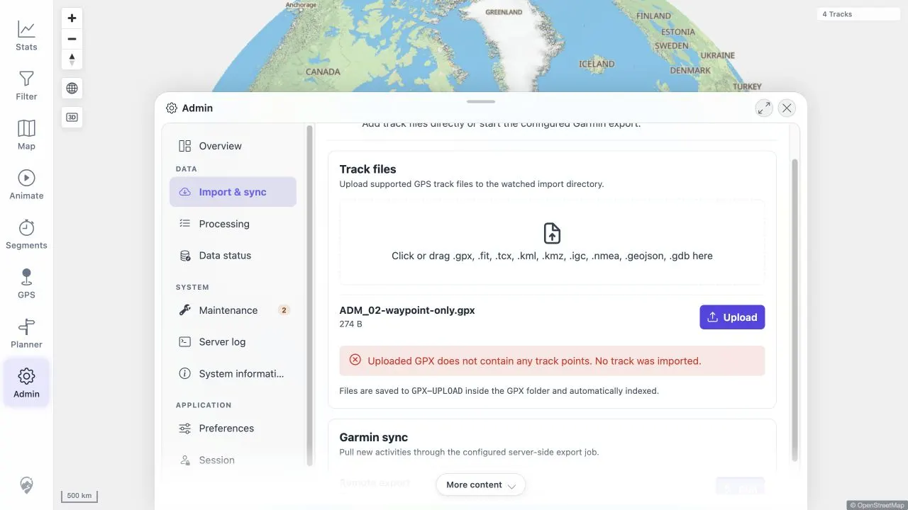
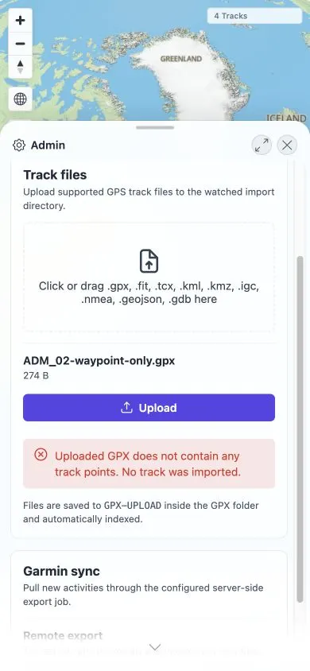

# Packet: ADM_02

## Scope

- Coverage source: [coverage-plan.md](../coverage-plan.md)
- Coverage ID or run packet: ADM_02
- In scope: Track-file upload availability, formats, progress/outcomes, and valid/unsupported/empty/waypoint-only behavior.

## Prerequisites

- Required previous coverage IDs or run packets: ADM_01 and staged DAT_06 negative fixture.
- Required app/data state: Empty GPX-UPLOAD directory; normal eight-track baseline.
- Required browser context: Admin Import & sync; authenticated production endpoint for attachment cases the browser tool cannot drive.

## Allowed Mutations

- Allowed: Upload two named temporary GPX files and test rejected multipart filenames; remove all accepted temporary files afterward.

## Actions And Results

| Coverage ID | Action | Expected result | Actual result | Status | Evidence |
|---|---|---|---|---|---|
| ADM_02 | Inspected visible upload availability/formats, exercised valid/unsupported/empty/waypoint-only outcomes, followed indexer/UI state, and removed temporary files. | Upload progress and every accepted/rejected outcome are clear. | Fixed locally: the visible Admin flow attached ADM_02-waypoint-only.gpx and rejected it before indexing with `Uploaded GPX does not contain any track points. No track was imported.` on desktop and mobile. No watched file was created. | FIXED | [original](../assets/ADM_02-upload.txt); [local retest](../assets/MTL-FR-005-021-fix-local.txt); [desktop](../assets/MTL-FR-020-fix-local-desktop.webp); [mobile](../assets/MTL-FR-020-fix-local-mobile.webp) |

## Issues

| ID | Severity | Summary | Reproduction | Expected | Actual | Evidence | Status | Release impact |
|---|---|---|---|---|---|---|---|---|
| MTL-FR-020 | P2 | Waypoint-only track upload reports success, then silently indexes as empty. | Upload a syntactically valid GPX containing a waypoint but no trackpoints from Admin Import & sync. | Upload validation clearly reports that no track was imported. | Fixed locally: native GPX validation returns HTTP 400 before any watched file exists, and Admin shows the clear per-file message. | [original](../assets/ADM_02-upload.txt); [local retest](../assets/MTL-FR-005-021-fix-local.txt) | FIXED | Resolved in the local worktree; remote beta still needs a later build. |

## Evidence Files

| File | Purpose |
|---|---|
| [assets/ADM_02-upload.txt](../assets/ADM_02-upload.txt) | Visible upload contract, exact outcomes, finding, and cleanup. |
| [assets/ADM_02-positive.gpx](../assets/ADM_02-positive.gpx) | Fully synthetic positive fixture definition. |
| [assets/ADM_02-waypoint-only.gpx](../assets/ADM_02-waypoint-only.gpx) | Fully synthetic negative fixture equivalent to DAT_06. |
| [assets/ADM_02-empty.gpx](../assets/ADM_02-empty.gpx) | Zero-byte error fixture. |
| [assets/ADM_02-unsupported.txt](../assets/ADM_02-unsupported.txt) | Unsupported-extension error fixture. |

## Screenshot Evidence

## Fix Record

- Root cause: upload copied extension-valid nonempty GPX before the later indexer checked for trackpoints.
- Implementation: JPX lenient parsing validates at least one trackpoint before target-file creation.
- Full server suite 516/516, client suite 757/757, and direct desktop/mobile Admin upload checks pass. See [local evidence](../assets/MTL-FR-005-021-fix-local.txt).

## Timings

| Step | Timing |
|---|---:|
| Valid GPX indexing | 324 ms ingest after watcher pickup |
| Waypoint-only outcome | 31 ms ingest after watcher pickup |
| Delete processing | About 8 s after watcher events |

## Handoff Notes

- Completed: Availability, formats, success/error outcomes, negative fixture, freshness, and exact cleanup.
- Remaining unfinished coverage: None for ADM_02; the attachment limitation does not mask the observed product failure.
- Blocked or not applicable: Native chooser attachment and durable screenshots.
- State left for the next packet: GPX-UPLOAD empty; 8 Tracks; server/client freshness in sync.
