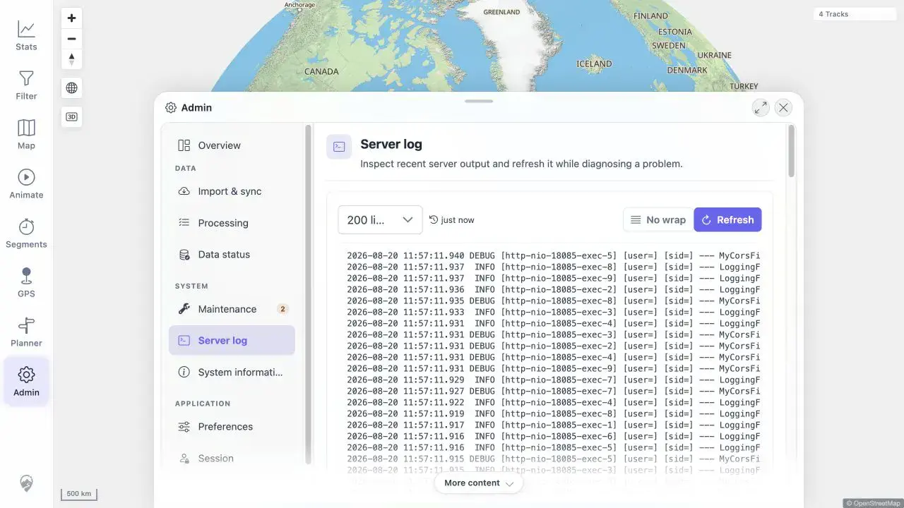
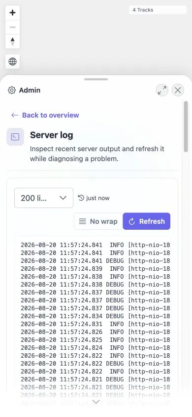

# Packet: ADM_12

## Scope

- Coverage source: [coverage-plan.md](../coverage-plan.md)
- Coverage ID or run packet: ADM_12
- In scope: Direct Admin URLs, Back/Forward, mobile Back, sheet close, and synchronized routes.

## Prerequisites

- Required previous coverage IDs or run packets: ADM_11.
- Required app/data state: Signed-in normal 8-track map.
- Required browser context: Desktop browser; no mobile viewport/touch emulation available.

## Allowed Mutations

- Allowed: Navigate between Admin routes and use browser/sheet controls.

## Actions And Results

| Coverage ID | Action | Expected result | Actual result | Status | Evidence |
|---|---|---|---|---|---|
| ADM_12 | Exercised direct Server log URL, Back/Forward, and Close from fresh direct navigation; repeated at desktop and mobile sizes. | Routes stay synchronized and one sheet close returns to map. | Readiness-gated replay waited for the 1,500 ms startup curtain to clear, then scoped the open Admin sheet. One Close returned `/mtl/admin/logs` to `/mtl/` and left zero open sheets at both viewports. | REJECTED | [original](../assets/ADM_12-route-sync.txt); [retest](../assets/MTL-FR-005-021-fix-local.txt); [desktop](../assets/MTL-FR-021-retest-desktop.webp); [mobile](../assets/MTL-FR-021-retest-mobile.webp) |

## Issues

| ID | Severity | Summary | Reproduction | Expected | Actual | Evidence | Status | Release impact |
|---|---|---|---|---|---|---|---|---|
| MTL-FR-021 | P2 | Direct Admin section routes require two Close activations. | Navigate directly to `/mtl/admin/logs`; wait for readiness; activate the open Admin sheet Close once. | First activation closes Admin and synchronizes route to `/mtl/`. | Not reproduced after readiness: one activation closes at desktop/mobile sizes. Original first clicks occurred at about 0.45 s while the startup curtain intercepted input. | [original](../assets/ADM_12-route-sync.txt); [retest](../assets/MTL-FR-005-021-fix-local.txt) | REJECTED | No product defect established. |

## Evidence Files

| File | Purpose |
|---|---|
| [assets/ADM_12-route-sync.txt](../assets/ADM_12-route-sync.txt) | Direct/history route matrix and reproduced close failure. |

## Screenshot Evidence

## Remediation Verification

- MTL-FR-021 is `REJECTED`; no source/test change was needed.
- The original first click occurred before the minimum startup curtain cleared; the second occurred after readiness.
- Existing Admin navigation and BottomSheet tests pass 25/25, and the exact readiness-gated desktop/mobile replay closes once. See [local evidence](../assets/MTL-FR-005-021-fix-local.txt).

## Timings

| Step | Timing |
|---|---:|
| Direct route render | About 0.45 s |
| Each failed first Close observation | At least 1.0 s |
| Recovery second Close | About 0.65 s |

## Handoff Notes

- Completed: Direct URL, Back/Forward, and two reproduced close sequences.
- Remaining unfinished coverage: None for ADM_12; mobile subcase is terminally blocked and desktop has a product failure.
- Blocked or not applicable: Mobile Back due browser capability; screenshots blocked.
- State left for the next packet: Signed-in 8-track map at `/mtl/`; Admin closed.
