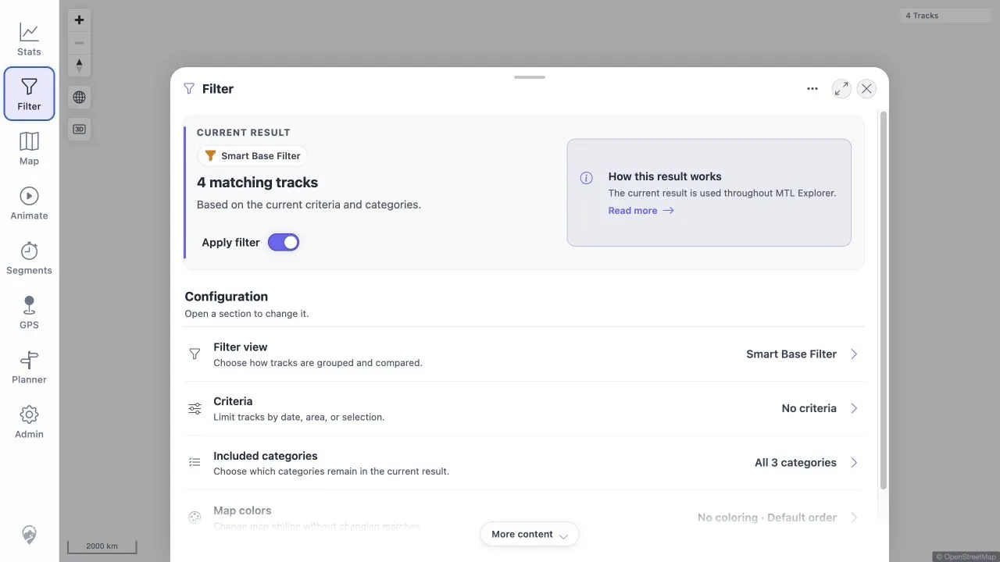
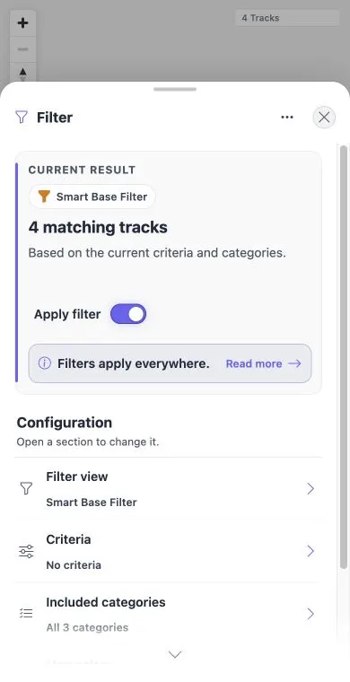

# Packet: FLT_01

## Scope

- Coverage source: [coverage-plan.md](../coverage-plan.md)
- Coverage ID or run packet: FLT_01
- In scope: Persisted active filter and its required chip indicator.
- Out of scope: Catalog search and parameter changes.

## Prerequisites

- Required previous coverage IDs or run packets: RUN_SETUP and MAP_02.
- Required app/data state: Saved Smart Base Filter with nine active tracks.
- Required browser context: Fresh main-map navigation, then Filter.

## Allowed Mutations

- Allowed: Open Filter and its view catalog.
- Not allowed: Change the selected filter.

## Actions And Results

| Coverage ID | Action | Expected result | Actual result | Status | Evidence |
|---|---|---|---|---|---|
| FLT_01 | Reopen Filter after a fresh map navigation and inspect the overview and catalog. | Previously saved filter is active and shown as a chip. | Original target omitted the chip. The fixed local worktree showed the persisted Smart Base Filter chip after reopening Filter at desktop and mobile sizes. | FIXED | [original](../assets/FLT_01-persisted-filter.txt); [local retest](../assets/MTL-FR-005-021-fix-local.txt); [desktop](../assets/MTL-FR-007-fix-local-desktop.webp); [mobile](../assets/MTL-FR-007-fix-local-mobile.webp) |

## Issues

| ID | Severity | Summary | Reproduction | Expected | Actual | Evidence | Release impact |
|---|---|---|---|---|---|---|---|
| MTL-FR-007 | P3 | Persisted active filter is not shown as a chip. | Reopen Filter with Smart Base Filter saved and inspect overview/catalog. | Active filter chip is visible. | Fixed locally: the enabled selected filter formats the visible identity directly; Smart Base Filter is shown at both viewports. | [original](../assets/FLT_01-persisted-filter.txt); [local retest](../assets/MTL-FR-005-021-fix-local.txt) | FIXED in the local worktree; remote beta still needs a later build. |

## Evidence Files

| File | Purpose |
|---|---|
| [assets/FLT_01-persisted-filter.txt](../assets/FLT_01-persisted-filter.txt) | Persisted result and missing-chip comparison. |

## Screenshot Evidence

## Fix Record

- Root cause: the overview used a store identity that is intentionally empty for an enabled persisted standard filter.
- Implementation: the chip identity is formatted from the selected filter configuration and parameters.
- Verification: full client suite 757/757 and direct desktop/mobile replay. See [local evidence](../assets/MTL-FR-005-021-fix-local.txt).

## Timings

| Step | Timing |
|---|---:|
| Persisted overview and catalog state | 2 min |

## Handoff Notes

- Completed: Persisted filter/result check and active-indicator inspection.
- Remaining unfinished coverage: None; this packet is terminal FAIL.
- Blocked or not applicable: None.
- State left for the next packet: Filter view catalog open; no selection changed.
