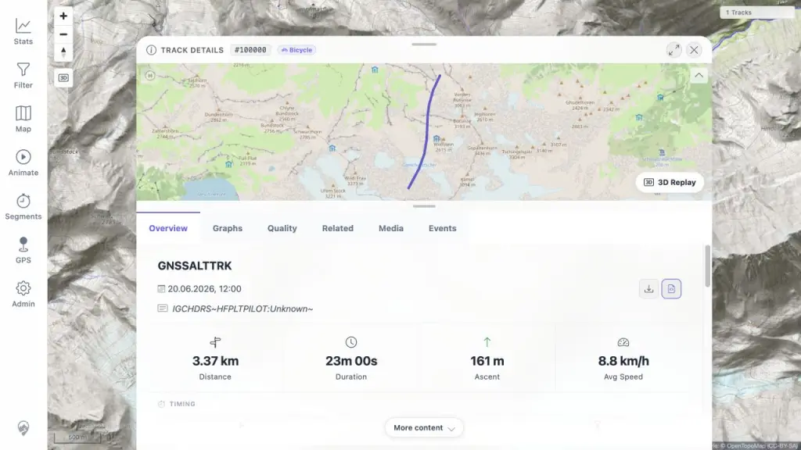

# Packet: FMT_02

## Scope

- Coverage source: [coverage-plan.md](../coverage-plan.md)
- Coverage ID or run packet: FMT_02
- In scope: For every tested non-GPX format, verify acceptance, conversion, map/detail/chart rendering, statistics, original download, and GPX download.
- Out of scope: GPX-only behavior already covered by IMP packets.

## Prerequisites

- Required previous coverage IDs or run packets: FMT_01 and FIT_02-FIT_05.
- Required app/data state: 13 indexed tracks; duplicate finder and exploration jobs settled.
- Required browser context: Signed-in desktop Statistics, Filter, and Track Details views.

## Allowed Mutations

- Allowed: Switch Smart Base/Duplicate filter views; search/open tracks; switch chart axes; use visible downloads.
- Not allowed: Change track data or call download APIs directly as pass evidence.

## Actions And Results

| Coverage ID | Action | Expected result | Actual result | Status | Evidence |
|---|---|---|---|---|---|---|
| FMT_02 | Exercise map, details/charts, statistics, original download, and GPX download for FIT, TCX, KML, KMZ, IGC, NMEA, GeoJSON, and GDB. | Every non-GPX format completes the full UI/export flow. | Original evidence passed seven formats and isolated IGC downloads as the only failure. The fixed current worktree kept both IGC controls enabled and UI activation produced successful source-file and GPX responses with no console errors. | FIXED | [assets/FMT_02-ui-downloads.txt](../assets/FMT_02-ui-downloads.txt); [assets/MTL-FR-002-fix-local.txt](../assets/MTL-FR-002-fix-local.txt); [assets/MTL-FR-002-fix-local.webp](../assets/MTL-FR-002-fix-local.webp) |

## Issues

| ID | Severity | Summary | Reproduction | Expected | Actual | Evidence | Finding status | Release impact |
|---|---|---|---|---|---|---|---|---|
| MTL-FR-002 | P2 | IGC detail download controls are inert. | Open track 100009 from `sample.igc`; activate Download original and Download GPX with mouse and keyboard. | Both controls request and download the matching payload. | Original target: no request. Fixed local worktree: synthetic IGC track 100000 kept both controls enabled; UI activation returned source-file and GPX `200` responses, including 3,704 GPX characters. | [assets/FMT_02-ui-downloads.txt](../assets/FMT_02-ui-downloads.txt); [assets/MTL-FR-002-fix-local.txt](../assets/MTL-FR-002-fix-local.txt); [assets/MTL-FR-002-fix-local.webp](../assets/MTL-FR-002-fix-local.webp) | FIXED | Resolved in the local worktree; the remote regression image still needs a later build/deployment. |

## Fix Record

- Root cause: `TrackDetailOverview` persists across track navigation, but its pending-download flag did not include the track ID. An unresolved request from the prior format therefore disabled both controls on the next track and the click guard returned without a request.
- Implementation: Pending state now records track ID, download kind, and request serial. Only the current track is disabled, and an older completion cannot clear newer state.
- Automated tests: The focused navigation regression failed before the fix. The completed file now passes 9/9 tests; TypeScript, focused ESLint, production build, and `git diff --check` also pass.
- Local retest: Current Vite client and Maven backend, isolated database and fully synthetic IGC fixture. Both visible UI controls returned to enabled state; source and converted-GPX requests returned `200`; no browser console warnings or errors.
- Evidence: [assets/MTL-FR-002-fix-local.txt](../assets/MTL-FR-002-fix-local.txt) and [assets/MTL-FR-002-fix-local.webp](../assets/MTL-FR-002-fix-local.webp).
- Boundary: The fix is uncommitted and not deployed to the active remote regression image.

## Evidence Files

| File | Purpose |
|---|---|
| [assets/FMT_02-ui-downloads.txt](../assets/FMT_02-ui-downloads.txt) | Per-format UI, map, chart, checksum, GPX point count, and IGC failure evidence. |
| [assets/FMT_01-formats.txt](../assets/FMT_01-formats.txt) | Acceptance/index identities and fixture checksums. |
| [assets/FIT_05-gpx-download.txt](../assets/FIT_05-gpx-download.txt) | Dedicated FIT converted-download validation. |
| [assets/MTL-FR-002-fix-local.txt](../assets/MTL-FR-002-fix-local.txt) | Root cause, automated checks, current local build, and direct UI/server retest. |
| [assets/MTL-FR-002-fix-local.webp](../assets/MTL-FR-002-fix-local.webp) | Fixed synthetic IGC Overview with both download controls available. |

## Screenshot Evidence

The original remote screenshot capture remained blocked in ACC_04. The local fix retest captured the repaired state:

## Timings

| Step | Timing |
|---|---:|
| Per-format search/map/detail/chart checks | 18 min |
| Original/GPX downloads and validation | 8 min |

## Handoff Notes

- Completed: Full per-format UI/export coverage and the local MTL-FR-002 fix retest.
- Remaining unfinished coverage: None for FMT_02.
- Blocked or not applicable: The active remote image does not contain the uncommitted local fix.
- State left for the next packet: Remote regression state was not changed; local disposable verification state was isolated.
