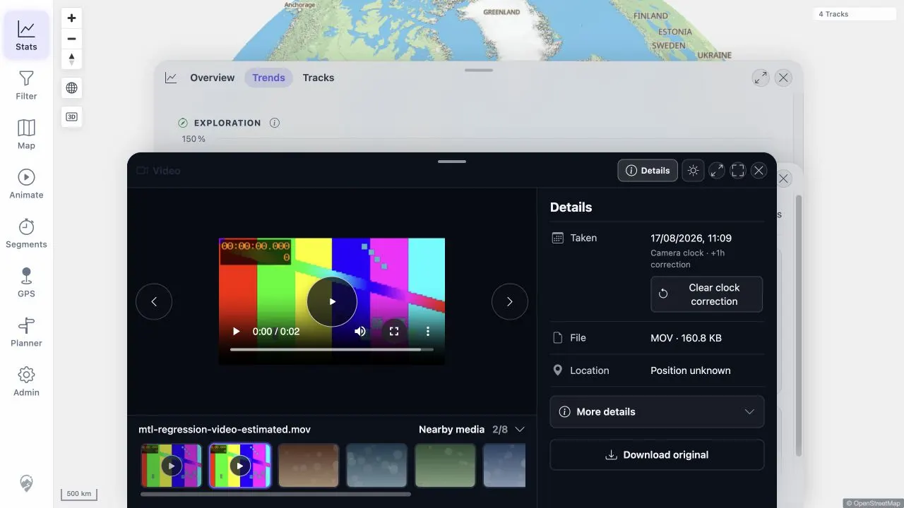
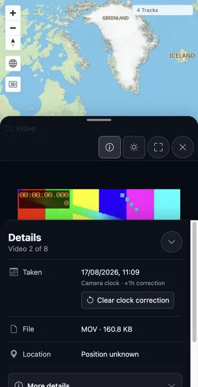

# Packet: MED_17

## Scope

- Coverage source: [coverage-plan.md](../coverage-plan.md)
- Coverage ID or run packet: MED_17
- In scope: Save a previewed correction, verify reload/restart persistence, clear it through the UI, preserve capture metadata, and restore baseline correlation.
- Out of scope: Manual location assignment, covered by MED_18.

## Prerequisites

- Required previous coverage IDs or run packets: MED_16.
- Required app/data state: Eight-item baseline and zero saved correction rows.
- Required browser context: Track 100013 Media tab, Media tools, Stats media mosaic, and media viewer.

## Allowed Mutations

- Allowed: Save and clear disposable camera-clock corrections; restart the disposable app; use the production API only to clean an unreachable correction after failure evidence is complete.
- Not allowed: Modify original EXIF capture metadata.

## Actions And Results

| Coverage ID | Action | Expected result | Actual result | Status | Evidence |
|---|---|---|---|---|---|
| MED_17 | Save +0.25h, verify page reload and app restart, use per-card Clear controls, inspect an out-of-window corrected item from the global media mosaic, and restore disposable baseline. | Correction persists; Clear remains reachable; original metadata stays unchanged; baseline correlation is restored through the end-user flow. | Fixed locally: the global viewer exposes Clear clock correction. Desktop/mobile showed the saved correction, and mobile activation cleared it and removed the action. | FIXED | [original](../assets/MED_17-save-clear.txt); [local retest](../assets/MTL-FR-005-021-fix-local.txt); [desktop](../assets/MTL-FR-012-013-fix-local-desktop.webp); [mobile](../assets/MTL-FR-012-013-fix-local-mobile.webp) |

## Issues

| ID | Severity | Summary | Reproduction | Expected | Actual | Evidence | Release impact |
|---|---|---|---|---|---|---|---|
| MTL-FR-012 | P2 | A saved camera correction can strand an item outside the only UI that exposes Clear clock correction. | Save a correction that moves an item outside the activity window; open it from Statistics Media. | Every saved correction remains clearable so the persisted baseline can be restored. | Fixed locally: the shared global viewer exposes and completes Clear clock correction, then refreshes its owning mosaic. | [original](../assets/MED_17-save-clear.txt); [local retest](../assets/MTL-FR-005-021-fix-local.txt) | FIXED in the local worktree; remote beta still needs a later build. |

## Evidence Files

| File | Purpose |
|---|---|
| [assets/MED_17-save-clear.txt](../assets/MED_17-save-clear.txt) | Metadata baseline, saved/reload/restart state, stranded-clear reproduction, issue, and cleanup verification. |

## Screenshot Evidence

## Fix Record

- The shared viewer now exposes the same persisted correction action as activity cards and refreshes the caller after clear.
- Full client suite 757/757, full server suite 516/516, and direct desktop/mobile checks pass.
- See [local evidence](../assets/MTL-FR-005-021-fix-local.txt).

## Timings

| Step | Timing |
|---|---:|
| Save and page-reload verification | 3 min |
| App restart and persistence verification | 2 min |
| Clear reproduction and alternate-view check | 5 min |
| Cleanup and exact baseline verification | 2 min |

## Handoff Notes

- Completed: Save/reload/restart persistence, visible per-item clear, capture-metadata comparison, stranded-clear finding, and disposable cleanup.
- Remaining unfinished coverage: None for MED_17; result is terminal FAIL.
- Blocked or not applicable: Screenshot evidence remains blocked by ACC_04.
- State left for the next packet: Zero saved corrections; eight selected baseline correlations; original capture metadata unchanged; Track 100013 Media tab open.
