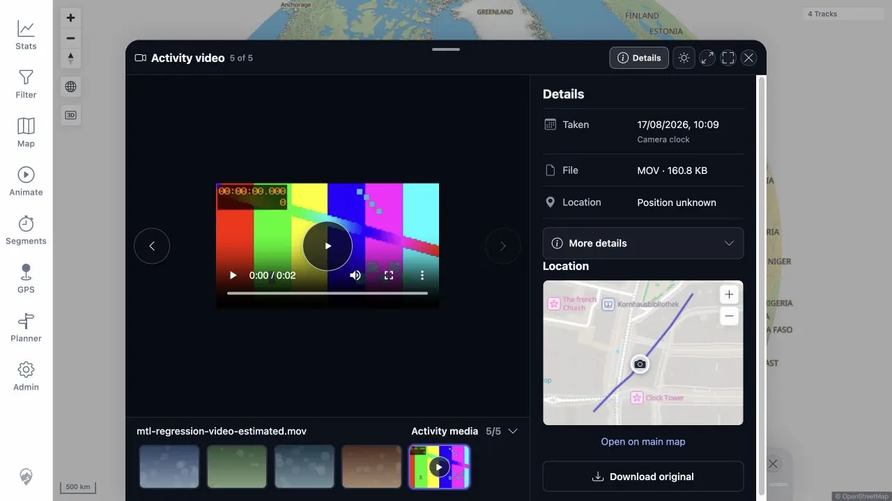
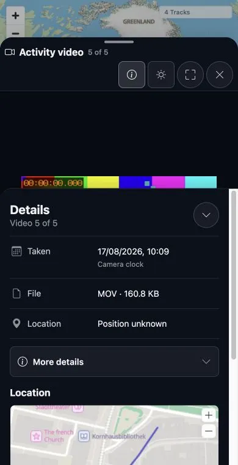

# Packet: MED_29

## Scope

- Coverage source: [coverage-plan.md](../coverage-plan.md)
- Coverage ID or run packet: MED_29
- In scope: Photo GPS, Estimated, Set by you, and unknown position symbols in the activity mini-map and viewer location map, plus manual-clear restoration.
- Out of scope: General viewer interaction and theme controls, covered by MED_30 and MED_34.

## Prerequisites

- Required previous coverage IDs or run packets: MED_28 cleanup.
- Required app/data state: Eight correlated regression media items; one bounded unknown-provenance fixture made by removing only its resolved projection.
- Required browser context: Authenticated Track Details Media tab and activity viewer.

## Allowed Mutations

- Allowed: One temporary unknown resolved-position deletion, one user-facing manual location assignment/clear, and exact projection restoration.
- Not allowed: Changing original EXIF data or retaining any manual/unknown state.

## Actions And Results

| Coverage ID | Action | Expected result | Actual result | Status | Evidence |
|---|---|---|---|---|---|
| MED_29 | Compared live mini-map/viewer symbols for GPS, estimated, manual, and unknown image positions; cleared the manual assignment; restored the unknown projection. | Every origin uses the same circular camera symbol with color/text-only provenance, and clearing manual restores the prior origin. | Fixed locally: an item with no resolved projection but a retained selected route coordinate showed Position unknown, its location map, and Open on main map on desktop/mobile. Original clear/origin checks remain valid. | FIXED | [original](../assets/MED_29-symbols.txt); [local retest](../assets/MTL-FR-005-021-fix-local.txt); [desktop](../assets/MTL-FR-015-fix-local-desktop.webp); [mobile](../assets/MTL-FR-015-fix-local-mobile.webp) |

## Issues

- MTL-FR-015 (P2, FIXED locally): the viewer uses the selected route coordinate when its resolved projection is unavailable and explicitly renders Position unknown.

## Evidence Files

| File | Purpose |
|---|---|
| [assets/MED_29-symbols.txt](../assets/MED_29-symbols.txt) | Exact icon classes, radii, colors, labels, viewer result, manual clear, and cleanup. |
| [assets/MED_29-unknown-fixture.sql](../assets/MED_29-unknown-fixture.sql) | Bounded unknown-provenance fixture. |
| [assets/MED_29-cleanup.sql](../assets/MED_29-cleanup.sql) | Exact resolved-projection restoration. |

## Screenshot Evidence

## Fix Record

- Track Details passes route coordinates as the unknown-state fallback and an explicit unknown-position flag.
- Full client suite 757/757 and direct desktop/mobile checks pass.
- See [local evidence](../assets/MTL-FR-005-021-fix-local.txt).

## Timings

| Step | Timing |
|---|---:|
| Provenance viewer transitions | Under 1 s each |
| Manual save and clear refresh | Under 1 s each |

## Handoff Notes

- Completed: Four-origin activity mini-map comparison, three available viewer symbols, manual clear restoration, finding capture, and exact cleanup.
- Remaining unfinished coverage: None for MED_29.
- Blocked or not applicable: The unknown viewer symbol is absent due to MTL-FR-015; durable screenshots remain blocked by ACC_04.
- State left for the next packet: Root map with 8 Tracks; 8/8/8 media baseline; no manual location, time correction, work-queue, or temporary unknown state.
