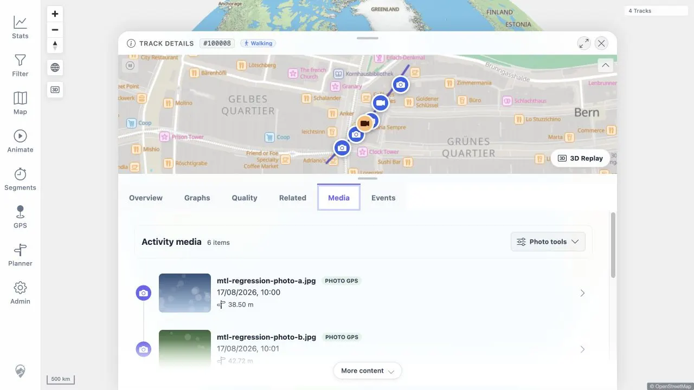
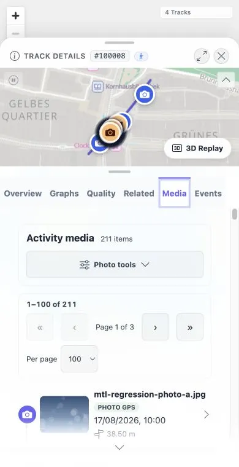

# Packet: MED_35

## Scope

- Coverage source: [coverage-plan.md](../coverage-plan.md)
- Coverage ID or run packet: MED_35
- In scope: Desktop and 390 × 760 activity Photos tab disclosure, camera preview, location-edit actions/editor cleanup, and 100,000-item first/next/last page limits.
- Out of scope: Viewer-level interactions covered by MED_30-34.

## Prerequisites

- Required previous coverage IDs or run packets: MED_34 browser-state cleanup.
- Required app/data state: Eight-item media baseline, followed by the exact disposable MED_33 100,000-item fixture.
- Required browser context: Authenticated desktop browser; required phone context is unavailable.

## Allowed Mutations

- Allowed: Unsaved camera preview, unsaved inline location editor, exact disposable paging fixture, and ephemeral page state.
- Not allowed: Saving correction/location changes or retaining synthetic data.

## Actions And Results

| Coverage ID | Action | Expected result | Actual result | Status | Evidence |
|---|---|---|---|---|---|
| MED_35 | Inspected the clean activity timeline, opened the single tools disclosure, previewed/reset camera offset, enabled/opened location editing, closed the disclosure, and checked the paging contract at desktop and 390 x 760. | One Photo tools disclosure gates all advanced controls/editors and closes editor state; first/next/last never exceed the selected limit on desktop/390 x 760. | Fixed locally: disclosure, region, and empty-state CTA all say Photo tools. Desktop and 390 x 760 show the same gate and 100/200 paging contract; original editor cleanup and bounded-row checks remain valid. | FIXED | [original](../assets/MED_35-photo-tools.txt); [local retest](../assets/MTL-FR-005-021-fix-local.txt); [desktop](../assets/MTL-FR-014-016-fix-local-desktop.webp); [mobile](../assets/MTL-FR-014-016-fix-local-mobile.webp) |

## Issues

- MTL-FR-016 (P3, FIXED locally): the disclosure, region label, and empty-state action now consistently say Photo tools.

## Evidence Files

| File | Purpose |
|---|---|
| [assets/MED_35-photo-tools.txt](../assets/MED_35-photo-tools.txt) | Exact collapsed/open/editor states, preview/reset result, paging limits/timings, phone constraint, and cleanup. |
| [assets/MED_33-seed.sql](../assets/MED_33-seed.sql) | Reused exact 99,992-item fixture definition. |
| [assets/MED_33-cleanup.sql](../assets/MED_33-cleanup.sql) | Reused exact fixture cleanup definition. |

## Screenshot Evidence

## Fix Record

- Updated all user-visible advanced-media labels to the frozen Photo tools copy.
- Full client suite 757/757 and direct desktop/mobile checks pass.
- See [local evidence](../assets/MTL-FR-005-021-fix-local.txt).

## Timings

| Step | Timing |
|---|---:|
| Camera preview/reset | Under 1 s each |
| 100,000-item first/next/last transitions | 682-902 ms each |

## Handoff Notes

- Completed: All desktop disclosure/preview/editor checks, both exposed page limits on exact 100,000 items, finding capture, and exact cleanup.
- Remaining unfinished coverage: None for MED_35.
- Blocked or not applicable: The 390 × 760 repeat cannot run in the fixed desktop browser.
- State left for the next packet: Authenticated root with 8 Tracks; 8/8/8 media baseline; empty work queues; no preview/editor/synthetic state.
