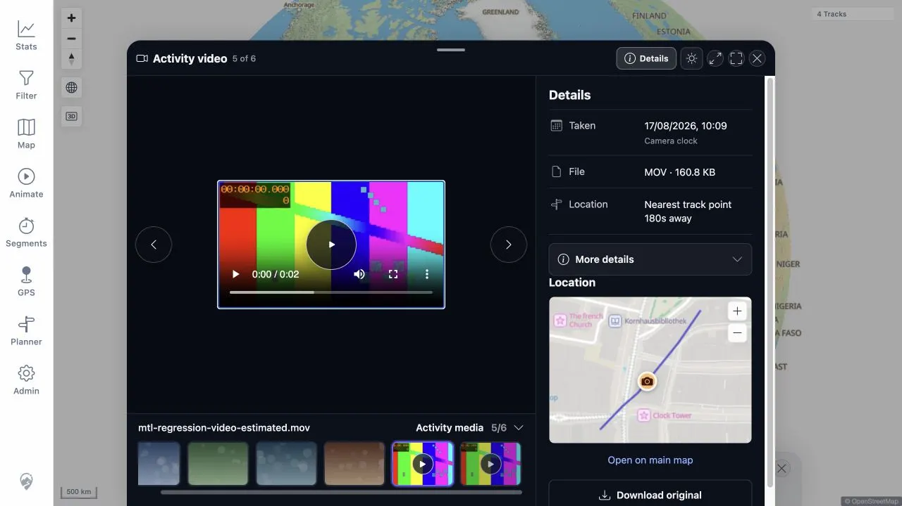
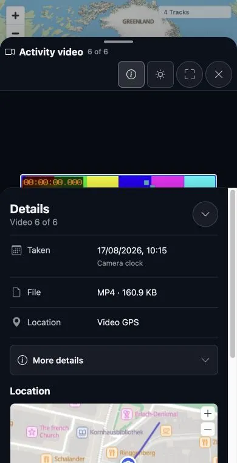

# Packet: MED_37

## Scope

- Coverage source: [coverage-plan.md](../coverage-plan.md)
- Coverage ID or run packet: MED_37
- In scope: Native MP4 metadata/play/pause/seek/resume, keyboard and swipe media navigation, poster, Details, Nearby, original download, and full/range/unsatisfiable serving behavior.
- Out of scope: MOV fallback/conversion behavior covered by MED_38.

## Prerequisites

- Required previous coverage IDs or run packets: MED_36 generated-video surface verification.
- Required app/data state: Indexed MP4 media 400001 and unchanged manifest/source file.
- Required browser context: Authenticated desktop browser.

## Allowed Mutations

- Allowed: Ephemeral playback position, viewer navigation, panel state, HTTP downloads, and temporary response files.
- Not allowed: Source media, metadata, database, or manifest mutation.

## Actions And Results

| Coverage ID | Action | Expected result | Actual result | Status | Evidence |
|---|---|---|---|---|---|
| MED_37 | Opened the MP4 viewer; exercised native metadata/play/pause/resume, keyboard and pointer-swipe navigation, Details/Nearby/poster/download, and retained the original authenticated range/checksum checks. | Native playback and all navigation/viewer controls work; serving headers and checksum exactly match the frozen contract. | Fixed locally: desktop swiped video 6 -> 5 and mobile swiped video 5 -> 6 from the upper playback area; the lower 56 px remained reserved for native controls. Original playback, keyboard, download, range, and checksum checks remain valid. | FIXED | [original](../assets/MED_37-mp4-playback.txt); [local retest](../assets/MTL-FR-005-021-fix-local.txt); [desktop](../assets/MTL-FR-017-018-fix-local-desktop.webp); [mobile](../assets/MTL-FR-017-018-fix-local-mobile.webp) |

## Issues

- MTL-FR-018 (P2, FIXED locally): video upper-area pointer swipes now use the shared viewer gesture path while native controls remain excluded.

## Evidence Files

| File | Purpose |
|---|---|
| [assets/MED_37-mp4-playback.txt](../assets/MED_37-mp4-playback.txt) | Native media state, control results, navigation behavior, exact HTTP headers/lengths/checksum, and temporary-file cleanup. |
| [assets/DAT_08-media-manifest.json](../assets/DAT_08-media-manifest.json) | Frozen source checksum and codec/duration expectation. |

## Screenshot Evidence

## Fix Record

- Gesture handling no longer requires an image element or excludes the whole video; only the native-control area is excluded.
- Full client suite 757/757 and direct desktop/mobile swipe checks pass.
- See [local evidence](../assets/MTL-FR-005-021-fix-local.txt).

## Timings

| Step | Timing |
|---|---:|
| Initial metadata availability | Immediate, readyState 4 |
| Play progression sample | 0.855 s after 700 ms |
| Viewer keyboard transitions | Under 300 ms each |

## Handoff Notes

- Completed: Native MP4 metadata/play/pause/resume, viewer controls, download, range, checksum, finding capture, and cleanup.
- Remaining unfinished coverage: None for MED_37.
- Blocked or not applicable: The native shadow-DOM seek slider is not addressable in the controlled browser; durable screenshot saving remains unavailable under ACC_04.
- State left for the next packet: MP4 viewer open with fixture unchanged; MOV 400000 available directly in Nearby for MED_38.
