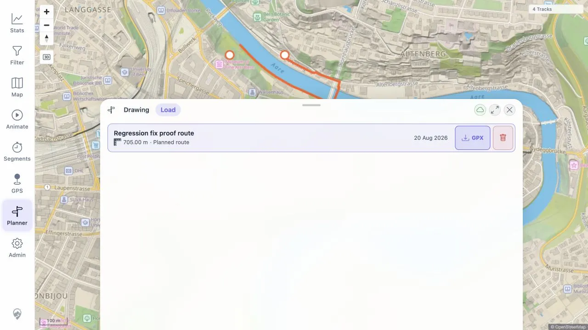
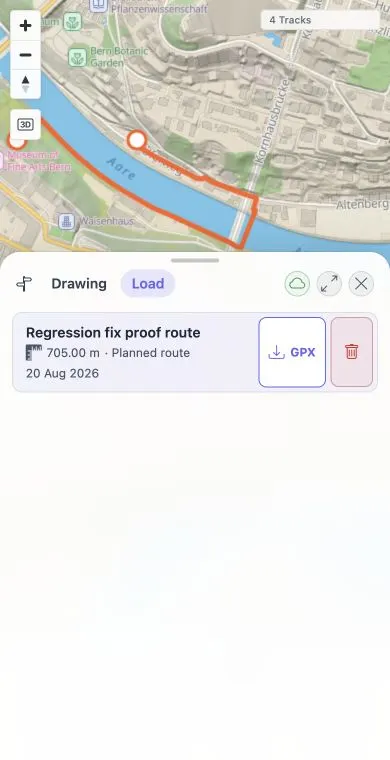

# Packet: PLN_08

## Scope

- Coverage source: [coverage-plan.md](../coverage-plan.md)
- Coverage ID or run packet: PLN_08
- In scope: Download a saved plan as GPX and validate its content against the plan.
- Out of scope: Other download formats.

## Prerequisites

- Required previous coverage IDs or run packets: PLN_07.
- Required app/data state: Loaded 5.13 km route, saved temporarily as Regression Export 0047.
- Required browser context: Planner Load list and browser download observation.

## Allowed Mutations

- Allowed: Save/export/delete one temporary plan.
- Not allowed: Leave test plans or downloaded artifacts behind.

## Actions And Results

| Coverage ID | Action | Expected result | Actual result | Status | Evidence |
|---|---|---|---|---|---|
| PLN_08 | Click the visible GPX export with semantic and pointer input; wait for a download and inspect the local download location. | A valid GPX downloads and matches the saved route. | Fixed locally: visible desktop and mobile GPX controls downloaded the saved route with the expected filename; both 2,845-byte XML payloads contained 38 trackpoints. | FIXED | [original](../assets/PLN_08-gpx-export.txt); [local retest](../assets/MTL-FR-005-021-fix-local.txt); [desktop](../assets/MTL-FR-011-fix-local-desktop.webp); [mobile](../assets/MTL-FR-011-fix-local-mobile.webp) |

## Issues

| ID | Severity | Summary | Reproduction | Expected | Actual | Evidence | Release impact |
|---|---|---|---|---|---|---|---|
| MTL-FR-011 | P2 | Saved-plan GPX export control is inert. | Save a computed plan, open Load, click its enabled GPX action. | Browser downloads a valid route GPX. | Fixed locally: immediate same-origin navigation downloads a valid 38-point GPX at both viewports. | [original](../assets/PLN_08-gpx-export.txt); [local retest](../assets/MTL-FR-005-021-fix-local.txt) | FIXED in the local worktree; remote beta still needs a later build. |

## Evidence Files

| File | Purpose |
|---|---|
| [assets/PLN_08-gpx-export.txt](../assets/PLN_08-gpx-export.txt) | Export attempts, timeouts, control state, and cleanup evidence. |

## Screenshot Evidence

## Fix Record

- Root cause: the asynchronous fetch/Blob/anchor path clicked after the original user gesture and could be blocked.
- Implementation: export uses immediate native same-origin anchor navigation with a sanitized filename.
- Verification: full client suite 757/757; desktop/mobile downloads and GPX payload checks pass. See [local evidence](../assets/MTL-FR-005-021-fix-local.txt).

## Timings

| Step | Timing |
|---|---:|
| Save export fixture | 1 min |
| Two export attempts | 1 min |
| Cleanup | 1 min |

## Handoff Notes

- Completed: End-user export attempts and negative download verification.
- Remaining unfinished coverage: None; missing file yields terminal FAIL.
- Blocked or not applicable: GPX validity/route-match checks could not run because no file was produced.
- State left for the next packet: Saved-plan list empty; loaded route remains in Drawing memory.
