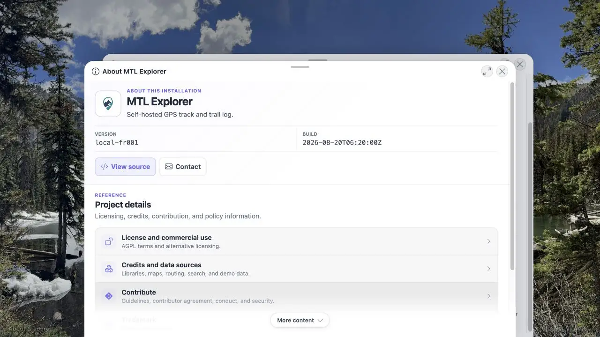

# Packet: RUN_SETUP

## Scope

- Coverage source: [coverage-plan.md](../coverage-plan.md)
- Coverage ID or run packet: RUN_SETUP
- In scope: GitHub `main` README quick install, missing Docker prerequisite setup, required app-image override, effective/running image identity, local and remote URL, initial browser load, and reported build.
- Out of scope: Product source inspection, source builds, product workarounds, and regression coverage IDs.

## Prerequisites

- Required previous coverage IDs or run packets: None.
- Required app/data state: Fresh Debian target and a fresh disposable install directory.
- Required browser context: Signed-out desktop browser.

## Allowed Mutations

- Allowed: Install missing Docker prerequisites; create the disposable Compose installation; start the stack with `MTL_APP_IMAGE=wauwau0977/mytraillog`.
- Not allowed: Change product source, use a different app image, touch unrelated containers or directories, or run cleanup.

## Actions And Results

| Coverage ID | Action | Expected result | Actual result | Status | Evidence |
|---|---|---|---|---|---|
| RUN_SETUP | Follow GitHub `main` README in a disposable parent; set the required image override before first start; inspect effective Compose and running container image; verify build/version and both URLs. | Missing Docker may be installed separately; quick install starts the required image; local and remote app URLs respond; login uses README facts. | Docker prerequisite and stack startup passed. Effective and running image identity, digest, startup timing, build, and local HTTP 200 are recorded. The remote URL reached the login route, README credentials opened the empty map, and About displayed MTL Explorer. About reported only `Version dev`; the precise server/image build is present in startup metadata. | PASS | [assets/RUN_SETUP-install.txt](../assets/RUN_SETUP-install.txt); [assets/RUN_SETUP-browser.txt](../assets/RUN_SETUP-browser.txt) |

## Issues

| ID | Severity | Summary | Reproduction | Expected | Actual | Evidence | Release impact | Finding status |
|---|---|---|---|---|---|---|---|---|
| MTL-FR-001 | P3 | Deployed About page reports `Version dev`. | Fresh quick install; sign in; open About. | About identifies the deployed application build/version. | The original image shows `Version dev`. A rebuilt local production bundle now shows the injected `local-fr001` image version in compact About and `local-fr001` plus `2026-08-20T06:20:00Z` in full About. | [assets/RUN_SETUP-browser.txt](../assets/RUN_SETUP-browser.txt); [assets/RUN_SETUP-install.txt](../assets/RUN_SETUP-install.txt); [assets/MTL-FR-001-fix-local.txt](../assets/MTL-FR-001-fix-local.txt); [assets/MTL-FR-001-fix-local.webp](../assets/MTL-FR-001-fix-local.webp) | Fixed locally; a new image build and deployment is still required. | FIXED |

## Evidence Files

| File | Purpose |
|---|---|
| [assets/RUN_SETUP-install.txt](../assets/RUN_SETUP-install.txt) | Host, prerequisite, Compose, running image, build, URL, and startup evidence. |
| [assets/RUN_SETUP-browser.txt](../assets/RUN_SETUP-browser.txt) | Signed-out redirect, successful README login, empty map, and About version evidence. |
| [assets/MTL-FR-001-fix-local.txt](../assets/MTL-FR-001-fix-local.txt) | Root cause, implementation, automated checks, production build, and integrated local UI retest. |
| [assets/MTL-FR-001-fix-local.webp](../assets/MTL-FR-001-fix-local.webp) | Rebuilt full About view with the injected local image version and build timestamp. |

## Screenshot Evidence

The in-app browser's screenshot command returned `Unable to capture screenshot` on two fresh tabs. Direct DOM evidence is saved in [assets/RUN_SETUP-browser.txt](../assets/RUN_SETUP-browser.txt). Screenshot coverage remains a separate frozen queue item (`ACC_04`) and is not collapsed into this packet.

The local fixed build produced a compact WebP showing the repaired build identity:

## Fix Record

- Verified root cause: the About views read `VITE_APP_VERSION` and `VITE_APP_BUILD`, but the app image build did not expose its existing `MTL_IMAGE_VERSION` and `MTL_IMAGE_BUILD_TIME` arguments to Vite. The views therefore reached their `dev` and `local build` fallbacks.
- Implementation: the Docker app-builder now passes the existing image identity into Vite. Both About views use that release identity and use Vite's injected client package version and build timestamp for local builds.
- Regression coverage: focused About tests now cover release values and local fallbacks. The focused suite passed 12 tests; type-check, ESLint, Prettier, and `git diff --check` passed.
- Local retest: a production app-builder image was rebuilt with synthetic identity `local-fr001` / `2026-08-20T06:20:00Z`, then its Spring Boot JAR was served with isolated PostGIS state and empty synthetic watch directories at `http://127.0.0.1:18105/mtl/`. Compact and full About displayed the expected values, and a fresh browser tab recorded no console warnings or errors.
- Evidence: [MTL-FR-001-fix-local.txt](../assets/MTL-FR-001-fix-local.txt) and [MTL-FR-001-fix-local.webp](../assets/MTL-FR-001-fix-local.webp).
- Release boundary: this local fix is not present in the original regression target image `1.404`; a later build and deployment must include it.

## Timings

| Step | Timing |
|---|---:|
| Docker prerequisite installation | Recorded separately in shell evidence; completed successfully |
| Compose pull/create/start | 48 s |
| Spring application startup | 13.187 s |

## Handoff Notes

- Completed: Fresh target validation, Docker prerequisite setup, Compose quick install, required image verification, build/version log evidence, local and remote HTTP verification, README login, empty map, and About page.
- Remaining unfinished coverage: None for RUN_SETUP.
- Blocked or not applicable: Screenshot capture is tracked by `ACC_04`; the setup action itself is terminal.
- State left for the next packet: Stack running with empty GPS and MEDIA datasets.
