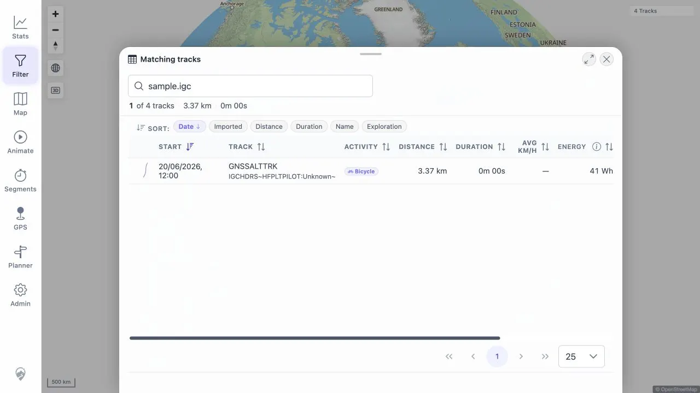
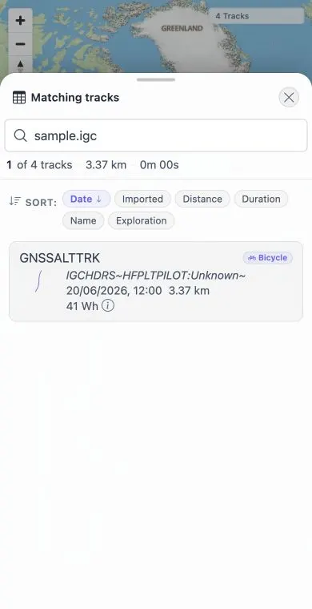

# Packet: TBS_02

## Scope

- Coverage source: [coverage-plan.md](../coverage-plan.md)
- Coverage ID or run packet: TBS_02
- In scope: Search across names, descriptions, dates, distances, durations, activities, and file paths.
- Out of scope: Sorting, covered by TBS_03.

## Prerequisites

- Required previous coverage IDs or run packets: TBS_01.
- Required app/data state: Eight active tracks with known same-run source filenames.
- Required browser context: Filter Review track browser.

## Allowed Mutations

- Allowed: Enter and clear search queries.
- Not allowed: Change files or tracks.

## Actions And Results

| Coverage ID | Action | Expected result | Actual result | Status | Evidence |
|---|---|---|---|---|---|
| TBS_02 | Search each required field with known exact values. | Every advertised field returns the matching row(s). | Original target omitted indexed-file response fields. The fixed local Review search for sample.igc returned the matching IGC row on desktop and mobile. | FIXED | [original](../assets/TBS_02-search-fields.txt); [local retest](../assets/MTL-FR-005-021-fix-local.txt); [desktop](../assets/MTL-FR-006-008-fix-local-desktop.webp); [mobile](../assets/MTL-FR-006-008-fix-local-mobile.webp) |

## Issues

| ID | Severity | Summary | Reproduction | Expected | Actual | Evidence | Release impact |
|---|---|---|---|---|---|---|---|
| MTL-FR-008 | P2 | Track-browser file search returns no results for exact indexed filenames/paths. | Open Review tracks; search `sample.igc`, `/app/gpx/sample.igc`, or another known active source filename. | Matching active track appears. | Fixed locally: full resolution includes indexed-file fields and sample.igc returns its row at both viewports. | [original](../assets/TBS_02-search-fields.txt); [local retest](../assets/MTL-FR-005-021-fix-local.txt) | FIXED in the local worktree; remote beta still needs a later build. |

## Evidence Files

| File | Purpose |
|---|---|
| [assets/TBS_02-search-fields.txt](../assets/TBS_02-search-fields.txt) | Full positive/negative search matrix. |

## Screenshot Evidence

## Fix Record

- Root cause: Review requested GPS tracks but not their indexed-file objects.
- Implementation: full filter resolution sends `includeGPSTrackFile=true` with `includeGPSTrack=true`.
- Verification: full client suite 757/757 and direct desktop/mobile sample.igc search. See [local evidence](../assets/MTL-FR-005-021-fix-local.txt).

## Timings

| Step | Timing |
|---|---:|
| Search matrix | 5 min |

## Handoff Notes

- Completed: Search matrix for every required field.
- Remaining unfinished coverage: None for TBS_02.
- Blocked or not applicable: None.
- State left for the next packet: Review tracks with empty search and eight rows.
