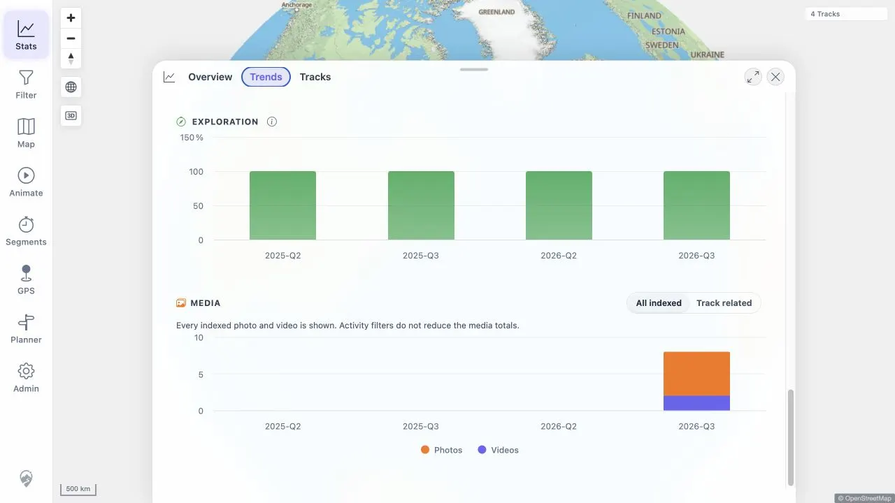
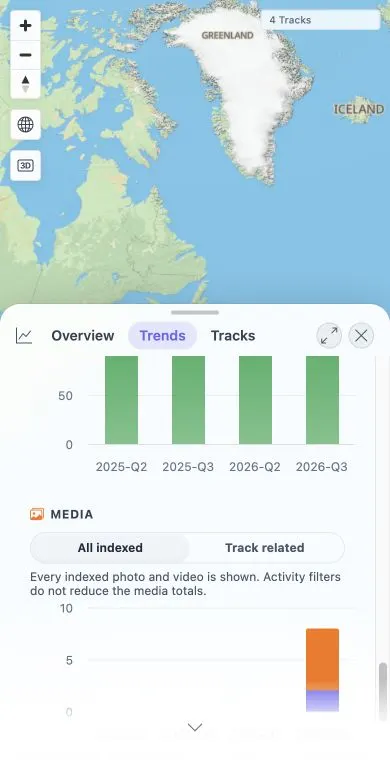

# Packet: TBS_14

## Scope

- Coverage source: [coverage-plan.md](../coverage-plan.md)
- Coverage ID or run packet: TBS_14
- In scope: Media final-chart position, All indexed default, Track related/All indexed help.
- Out of scope: Timeline/category switching, covered by TBS_15.

## Prerequisites

- Required previous coverage IDs or run packets: TBS_13.
- Required app/data state: Populated media index and active filter.
- Required browser context: Statistics Trends Charts.

## Allowed Mutations

- Allowed: Inspect and focus/click media scope controls.
- Not allowed: Substitute differently labeled controls for frozen expected controls.

## Actions And Results

| Coverage ID | Action | Expected result | Actual result | Status | Evidence |
|---|---|---|---|---|---|
| TBS_14 | Inspect chart order and required media scope/help controls. | Media is final; All indexed defaults; Track related/All indexed help exists. | Fixed locally: Media remains final; All indexed is selected by default and Track related switches the scope with matching help at desktop and mobile sizes. | FIXED | [original](../assets/TBS_14-media-chart-scope-controls.txt); [local retest](../assets/MTL-FR-005-021-fix-local.txt); [desktop](../assets/MTL-FR-009-fix-local-desktop.webp); [mobile](../assets/MTL-FR-009-fix-local-mobile.webp) |

## Issues

| ID | Severity | Summary | Reproduction | Expected | Actual | Evidence | Release impact |
|---|---|---|---|---|---|---|---|
| MTL-FR-009 | P2 | Trends media scope controls do not match the frozen Track related / All indexed contract. | Open Statistics -> Trends -> Charts and inspect the final Media chart. | All indexed is selected by default; Track related and All indexed expose help. | Fixed locally: the frozen two-scope contract is present and functional at both viewports. | [original](../assets/TBS_14-media-chart-scope-controls.txt); [local retest](../assets/MTL-FR-005-021-fix-local.txt) | FIXED in the local worktree; remote beta still needs a later build. |

## Evidence Files

| File | Purpose |
|---|---|
| [assets/TBS_14-media-chart-scope-controls.txt](../assets/TBS_14-media-chart-scope-controls.txt) | Chart order and exact expected/actual control counts. |

## Screenshot Evidence

## Fix Record

- Replaced the obsolete three-mode media timeline with `All indexed` and `Track related`.
- Updated the matching feature documentation and retained Media as the final chart.
- Full client suite 757/757 and direct desktop/mobile checks pass. See [local evidence](../assets/MTL-FR-005-021-fix-local.txt).

## Timings

| Step | Timing |
|---|---:|
| Chart order and scope-control inspection | 3 min |

## Handoff Notes

- Completed: Media chart position and exact scope-control audit.
- Remaining unfinished coverage: None for TBS_14.
- Blocked or not applicable: None.
- State left for the next packet: Trends Charts with Activity era selected and one-track geo filter active.
