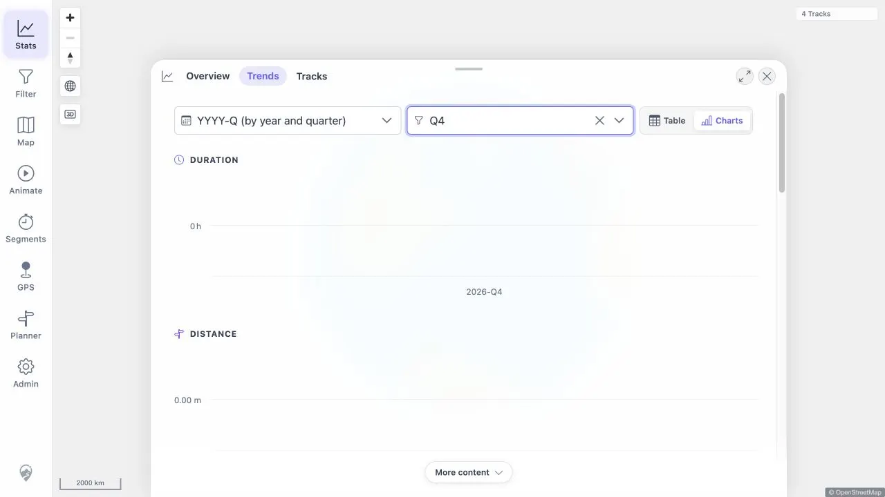
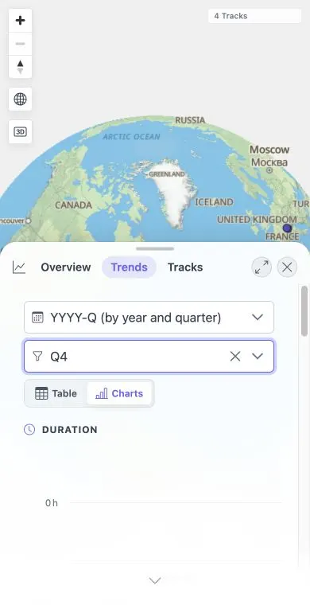

# Packet: TBS_15

## Scope

- Coverage source: [coverage-plan.md](../coverage-plan.md)
- Coverage ID or run packet: TBS_15
- In scope: Grouping/sub-unit alignment, zero slots, undated drilldown, and filtered/all media scopes.
- Out of scope: Media mosaic/viewer depth, covered by TBS_16.

## Prerequisites

- Required previous coverage IDs or run packets: TBS_14.
- Required app/data state: One-track geo filter plus indexed dated media.
- Required browser context: Trends Charts final Media card.

## Allowed Mutations

- Allowed: Change sub-unit and available media timeline modes.
- Not allowed: Treat renamed controls as satisfying frozen exact controls.

## Actions And Results

| Coverage ID | Action | Expected result | Actual result | Status | Evidence |
|---|---|---|---|---|---|
| TBS_15 | Compare all/sparse timelines and switch filtered/all media scopes. | Common timeline keeps zero slots; Track related/All indexed semantics work. | Fixed locally: a media-only 2026-Q4 sub-unit kept all seven activity cards with zero-value Q4 slots, plus Media; both frozen scopes worked at desktop and mobile sizes. | FIXED | [original](../assets/TBS_15-media-timeline-alignment.txt); [local retest](../assets/MTL-FR-005-021-fix-local.txt); [desktop](../assets/MTL-FR-010-fix-local-desktop.webp); [mobile](../assets/MTL-FR-010-fix-local-mobile.webp) |

## Issues

| ID | Severity | Summary | Reproduction | Expected | Actual | Evidence | Release impact |
|---|---|---|---|---|---|---|---|
| MTL-FR-009 | P2 | Required Track related / All indexed media scope controls are absent. | Open Trends Charts Media. | Frozen scope controls exist. | Fixed locally: both controls and help are present. | [original](../assets/TBS_15-media-timeline-alignment.txt); [local retest](../assets/MTL-FR-005-021-fix-local.txt) | FIXED locally. |
| MTL-FR-010 | P2 | Selecting a media-only sub-unit removes all activity chart cards. | Select a media-only sub-unit. | Activity charts retain zero-value slots on the common timeline. | Fixed locally: Duration, Distance, Activity, Energy, Intensity Index, Training Load, and Exploration remain with zero values beside Media. | [original](../assets/TBS_15-media-timeline-alignment.txt); [local retest](../assets/MTL-FR-005-021-fix-local.txt) | FIXED locally. |

## Evidence Files

| File | Purpose |
|---|---|
| [assets/TBS_15-media-timeline-alignment.txt](../assets/TBS_15-media-timeline-alignment.txt) | Axes/point counts, sparse sub-unit failure, and available scope semantics. |

## Screenshot Evidence

## Fix Record

- Scope controls now match the frozen two-scope contract.
- Chart cards use the common activity/media timeline, while capability gates derive from the complete activity dataset.
- Full client suite 757/757 and direct sparse-period desktop/mobile checks pass. See [local evidence](../assets/MTL-FR-005-021-fix-local.txt).

## Timings

| Step | Timing |
|---|---:|
| Common/sub-unit timeline comparison | 4 min |
| Available filtered/all media mode comparison | 3 min |

## Handoff Notes

- Completed: Timeline, zero-slot, sub-unit, and available scope-mode checks.
- Remaining unfinished coverage: None for TBS_15.
- Blocked or not applicable: No Undated action was present.
- State left for the next packet: Trends Charts, Media history selected, one-track geo filter active.
