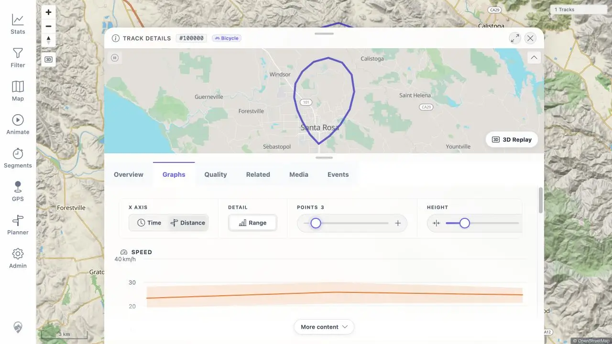

# Packet: TRD_05

## Scope

- Coverage source: [coverage-plan.md](../coverage-plan.md)
- Coverage ID or run packet: TRD_05
- In scope: Time/distance axis, range band, point-count slider, and graph-height slider.
- Out of scope: Chart-to-map hover synchronization.

## Prerequisites

- Required previous coverage IDs or run packets: TRD_04.
- Required app/data state: Populated FIT track 100005 charts.
- Required browser context: Authenticated Graphs tab.

## Allowed Mutations

- Allowed: Change all in-panel graph controls.
- Not allowed: Save track metadata.

## Actions And Results

| Coverage ID | Action | Expected result | Actual result | Status | Evidence |
|---|---|---|---|---|---|
| TRD_05 | Toggle Time/Distance and Range, move the point-count slider to both extremes, and increase graph height. | Every control updates the charts without layout breakage. | Original evidence confirmed the axis, Range, and height controls. A current-worktree local retest proved the Distance-axis point-count slider also refreshes: the API returned 3 versus 2,329 buckets, and the current Speed/Elevation series changed from 2,312/2,329 to 3/3 points. | FIXED | [assets/TRD_05-graph-controls.txt](../assets/TRD_05-graph-controls.txt); [assets/MTL-FR-004-fix-local.txt](../assets/MTL-FR-004-fix-local.txt); [assets/MTL-FR-004-fix-local.webp](../assets/MTL-FR-004-fix-local.webp) |

## Issues

| ID | Severity | Summary | Reproduction | Expected | Actual | Evidence | Finding status | Release impact |
|---|---|---|---|---|---|---|---|---|
| MTL-FR-004 | P2 | Point-count slider does not refresh displayed chart series. | On track 100005 Graphs, set Points to 3, wait, then set it to 3000 and wait. | Rendered series change to reflect each requested point limit. | Not reproduced on an isolated current-worktree dev stack: visible and current accessible series changed between 3/3 and 2,312/2,329 points. The old count remains only in stale Highcharts accessibility proxy nodes beside the refreshed nodes, which explains the original observation. | [assets/TRD_05-graph-controls.txt](../assets/TRD_05-graph-controls.txt); [assets/MTL-FR-004-fix-local.txt](../assets/MTL-FR-004-fix-local.txt); [assets/MTL-FR-004-fix-local.webp](../assets/MTL-FR-004-fix-local.webp) | NOT REPRODUCIBLE | No product release impact established; the recorded rendering defect did not reproduce. |

## Evidence Files

| File | Purpose |
|---|---|
| [assets/TRD_05-graph-controls.txt](../assets/TRD_05-graph-controls.txt) | Control outcomes and point-count mismatch. |
| [assets/MTL-FR-004-fix-local.txt](../assets/MTL-FR-004-fix-local.txt) | Current-worktree API, automated-check, and direct browser retest evidence. |
| [assets/MTL-FR-004-fix-local.webp](../assets/MTL-FR-004-fix-local.webp) | Distance-axis three-point chart after the slider refresh. |

## Screenshot Evidence

## Timings

| Step | Timing |
|---|---:|
| Four controls and settled chart states | 7 min |
| Local diagnosis, automated checks, and exact-path retest | 25 min |

## Fix Record

- Verified cause: The original observation read stale Highcharts accessibility proxy nodes retained after an options update. Current visible chart data and newly generated accessibility nodes refresh correctly.
- Implementation: No product change was required. The focused Track Details test now asserts that a committed slider reload replaces chart child data.
- Automated tests: The Track Details and TrackGraph suites passed 42 tests; lint, formatting, and client type-check passed.
- Local dev-server retest: On public synthetic track 100000 with Distance selected, the local API returned 2,329 versus 3 buckets and the current rendered series changed between 2,312/2,329 and 3/3 points. The clean browser tab logged no warnings or errors.
- Evidence: [assets/MTL-FR-004-fix-local.txt](../assets/MTL-FR-004-fix-local.txt) and [assets/MTL-FR-004-fix-local.webp](../assets/MTL-FR-004-fix-local.webp).
- Release boundary: The finding needs no product deployment because the recorded defect was not reproduced; the automated assertion accompanies this finding record.

## Handoff Notes

- Completed: All four graph-control paths exercised; MTL-FR-004 closed as NOT REPRODUCIBLE after an exact current-worktree retest.
- Remaining unfinished coverage: None for TRD_05.
- Blocked or not applicable: None.
- State left for the next packet: Isolated local retest ended on Distance axis with the three-point chart visible; the active remote regression target was not changed.
