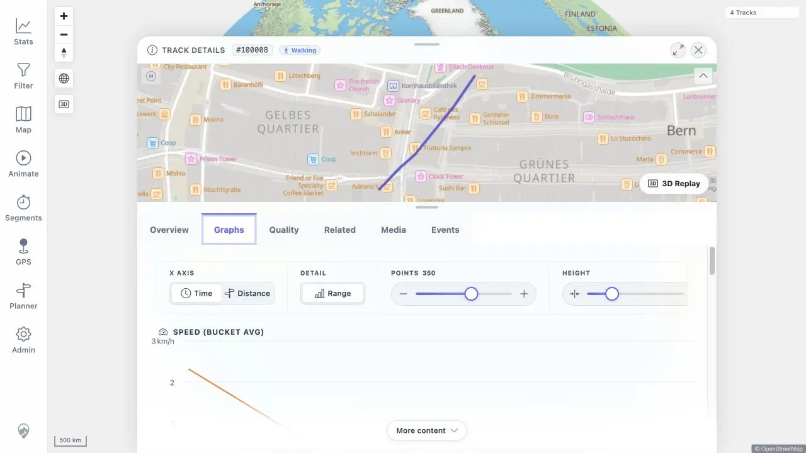
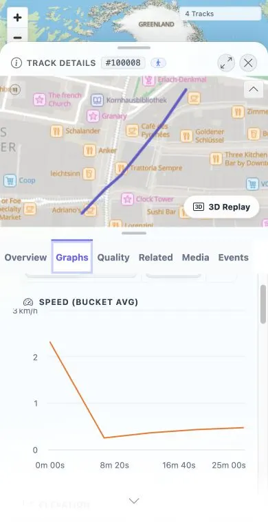

# Packet: TRD_06

## Scope

- Coverage source: [coverage-plan.md](../coverage-plan.md)
- Coverage ID or run packet: TRD_06
- In scope: Chart-to-mini-map and mini-map-to-chart pointer synchronization, including cleanup.
- Out of scope: General map point popup content, covered by MAP_11.

## Prerequisites

- Required previous coverage IDs or run packets: TRD_04 and TRD_05.
- Required app/data state: Populated FIT track 100005 charts and mini-map.
- Required browser context: Authenticated Graphs tab.

## Allowed Mutations

- Allowed: Pointer interaction with chart and mini-map surfaces; close transient popup.
- Not allowed: Save track data.

## Actions And Results

| Coverage ID | Action | Expected result | Actual result | Status | Evidence |
|---|---|---|---|---|---|
| TRD_06 | Point at the Speed chart, point at the detail mini-map, close the popup, and move away from both surfaces. | Each surface highlights the matching point on the other; no cursor remains after leaving. | Original target left a chart-created marker. The fixed local worktree created one marker on chart click and removed it on leave at desktop and mobile sizes. | FIXED | [original](../assets/TRD_06-hover-sync.txt); [local retest](../assets/MTL-FR-005-021-fix-local.txt); [desktop](../assets/MTL-FR-005-fix-local-desktop.webp); [mobile](../assets/MTL-FR-005-fix-local-mobile.webp) |

## Issues

| ID | Severity | Summary | Reproduction | Expected | Actual | Evidence | Release impact |
|---|---|---|---|---|---|---|---|
| MTL-FR-005 | P2 | Chart-created mini-map cursor remains after leaving the synchronized surfaces. | On track 100005 Graphs, point at Speed, then leave the chart and mini-map and close any map popup. | Cross-surface marker and tooltip clear. | Fixed locally: chart leave clears hover and chart-source pinned state; marker count changed 1 -> 0 at both viewports. | [original](../assets/TRD_06-hover-sync.txt); [local retest](../assets/MTL-FR-005-021-fix-local.txt) | FIXED in the local worktree; remote beta still needs a later build. |

## Evidence Files

| File | Purpose |
|---|---|
| [assets/TRD_06-hover-sync.txt](../assets/TRD_06-hover-sync.txt) | Bidirectional synchronization and stale-marker state. |

## Screenshot Evidence

## Fix Record

- Root cause: chart click created pinned chart-source state, while leave cleared only hover state.
- Implementation: chart leave now clears the chart-source pin; touch end/cancel share the same cleanup path.
- Verification: full client suite 757/757; direct desktop/mobile marker count 1 -> 0. See [local evidence](../assets/MTL-FR-005-021-fix-local.txt).

## Timings

| Step | Timing |
|---|---:|
| Bidirectional pointer and cleanup checks | 4 min |

## Handoff Notes

- Completed: Both synchronization directions and leave behavior.
- Remaining unfinished coverage: None for TRD_06.
- Blocked or not applicable: Stale marker recorded as MTL-FR-005.
- State left for the next packet: Graphs selected; one stale transient marker remains until detail reload.
