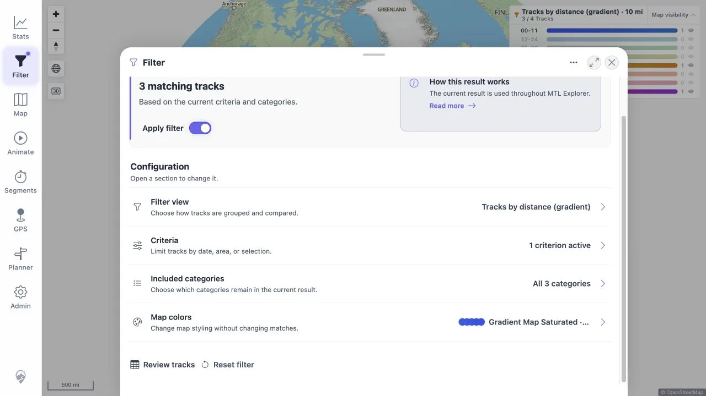

> **RESULT: FAIL - one required recovery row failed in the deployed image and 37 coverage rows are blocked.**

# MTL Explorer Quick-Install Full Regression

## Goal

Validate one fresh README quick install with the required image override, execute every ID in the frozen end-user plan, preserve packet evidence, enforce the finalization gate, assemble this report from the packets, and remove the disposable environment.

## Outcome

| Measure | Result |
|---|---:|
| Frozen coverage IDs | 235 |
| PASS | 165 |
| FIXED | 23 |
| REJECTED | 2 |
| FAIL | 1 |
| BLOCKED | 37 |
| NOT APPLICABLE | 7 |
| Distinct findings | 23: 20 FIXED, 2 REJECTED, 1 NOT REPRODUCIBLE |
| RUN_SETUP | PASS |
| Finalization gate | PASS - 235 terminal IDs |
| RUN_CLEANUP | PASS |

The required image installed and started correctly. All 235 frozen IDs have terminal packet results, and cleanup passed. The release result is still `FAIL`: [ERR_01](packets/ERR_01.md) failed because the deployed image exposed an empty zero-track map during a startup dependency failure, without an actionable error or Retry; its verified fix exists only in the local worktree. Thirty-seven other rows are blocked by explicit environment or instrumentation constraints.

All 23 findings are terminal. No finding is `OPEN` or `FIX_IN_WORK`. The 20 fixed findings have direct local retest evidence, but the tested remote image stayed unchanged. A new image build and a focused deployment retest are required before treating those fixes as part of the target release.

## Scope And Environment

| Field | Value |
|---|---|
| Target | `62.238.106.141`, Debian 13.2, amd64 |
| Install source | README and Compose from public GitHub `main` |
| Required/effective image | `wauwau0977/mytraillog` |
| Image ID/digest | `sha256:1cd50ffb86f830ce3e9241a73577d60a619e19dc29ef9fe299d2d059a69a8e2a` |
| Reported server build | `0.0.1-SNAPSHOT`; `2026-08-19T22:39:23.274Z` |
| Reported image build | `1.404`; `2026-08-19T22:39:08Z` |
| Docker / Compose | 29.7.2 / 5.5.0 |
| Remote browser | Codex in-app browser, fixed 1049 x 942 desktop viewport, pointer/keyboard only |
| Local fix retests | 1280 x 720 desktop and 390 x 760/844 mobile sizes, as recorded by each packet |
| Origin | Remote plain HTTP, normal browser display mode |
| Frozen plan | [coverage-plan.md](coverage-plan.md), SHA-256 `122bd1ecf4a8cccf6285630a9801dd91bac35cb21cd0fdc3ae17907b7221c5b1` |
| Durable state | [run-state.md](run-state.md) |

The run used five public real-track GPX files, Garmin's public GPS-bearing FIT example, GPS-bearing samples for all other supported formats, and fully synthetic route, upload, stress, photo, and video fixtures. No private local GPX track or private media was used.

## README Quick-Install Facts And Result

- Docker Engine and the Docker Compose plugin are required.
- The README flow uses `docker compose up -d`, opens `http://localhost:18080/mtl/`, and watches `data/gpx/` for track imports.
- Docker was absent. Docker Engine 29.7.2 and Compose 5.5.0 were installed from Docker's stable Debian repository.
- `MTL_APP_IMAGE=wauwau0977/mytraillog` was set before the first start.
- Effective Compose configuration and the running app matched the required reference and digest.
- Local HTTP returned 200. The remote login route loaded, and the README credentials reached the fresh empty map. Credential values are not repeated.
- The app reported MTL Explorer and About `Version dev`; precise server/image identity was present in startup metadata and is fixed locally by MTL-FR-001.

See [RUN_SETUP](packets/RUN_SETUP.md), [install evidence](assets/RUN_SETUP-install.txt), and [browser evidence](assets/RUN_SETUP-browser.txt).

## Timings

| Phase or action | Timing | Source packet |
|---|---:|---|
| Compose pull/create/start | 48 s | [RUN_SETUP](packets/RUN_SETUP.md) |
| Spring application startup | 13.187 s | [RUN_SETUP](packets/RUN_SETUP.md) |
| Five-GPX automatic ingest | About 13 s in logs; 55 s to recorded browser observation | [IMP_03](packets/IMP_03.md) |
| Post-import background-job settlement | Under 2 min | [IMP_04](packets/IMP_04.md) |
| Two-track delete watcher/indexer flow | 2 min | [DEL_02](packets/DEL_02.md) |
| Matching media GPX ingest | 73 ms | [MED_06](packets/MED_06.md) |
| Eight-file media rescan / correlation | 228 ms / 28 ms; 4 min full UI flow | [MED_06](packets/MED_06.md) |
| Two-media recoverable removal | Under 1 s | [MED_08](packets/MED_08.md) |
| Media rescan / notification / apply settlement | 82 ms / about 5.6 s / about 1.7 s | [MED_09](packets/MED_09.md) |
| Remote mobile capability recheck | Under 1 min; blocked | [MOB_01](packets/MOB_01.md) |
| Fixed Statistics connection-recovery retest | Error about 6.2 s; service return about 14 s; recovered reload about 2.8 s | [NET_02](packets/NET_02.md) |
| Final UX capture window / slowest API | 4m 16s / 353 ms | [UXP_01](packets/UXP_01.md) |
| Full run start to cleanup verification | About 11h 46m |
| Compose down / full cleanup verification | About 10 s / about 35 s | [RUN_CLEANUP](packets/RUN_CLEANUP.md) |

During UXP_01, all three journeys completed, 123/123 active-session first-party API requests returned expected statuses, the slowest completed in 353 ms, and console errors were zero. Required UI-only feedback latency, main-thread stall, and pending-request instrumentation were unavailable, so the row is `BLOCKED`.

## Coverage-ID Matrix

This matrix is assembled from the single terminal `Actions And Results` row in each coverage packet, in frozen-plan order.

| Coverage ID | Status | Packet |
|---|---|---|
| ACC_01 | PASS | [packet](packets/ACC_01.md) |
| ACC_02 | PASS | [packet](packets/ACC_02.md) |
| ACC_03 | PASS | [packet](packets/ACC_03.md) |
| ACC_04 | BLOCKED | [packet](packets/ACC_04.md) |
| ACC_05 | PASS | [packet](packets/ACC_05.md) |
| DAT_01 | PASS | [packet](packets/DAT_01.md) |
| DAT_02 | PASS | [packet](packets/DAT_02.md) |
| DAT_03 | PASS | [packet](packets/DAT_03.md) |
| DAT_04 | PASS | [packet](packets/DAT_04.md) |
| DAT_05 | PASS | [packet](packets/DAT_05.md) |
| DAT_06 | FIXED | [packet](packets/DAT_06.md) |
| DAT_07 | PASS | [packet](packets/DAT_07.md) |
| DAT_08 | PASS | [packet](packets/DAT_08.md) |
| IMP_01 | PASS | [packet](packets/IMP_01.md) |
| IMP_02 | PASS | [packet](packets/IMP_02.md) |
| IMP_03 | PASS | [packet](packets/IMP_03.md) |
| IMP_04 | PASS | [packet](packets/IMP_04.md) |
| IMP_05 | PASS | [packet](packets/IMP_05.md) |
| IMP_06 | PASS | [packet](packets/IMP_06.md) |
| IMP_07 | PASS | [packet](packets/IMP_07.md) |
| IMP_08 | PASS | [packet](packets/IMP_08.md) |
| IMP_09 | PASS | [packet](packets/IMP_09.md) |
| DEL_01 | PASS | [packet](packets/DEL_01.md) |
| DEL_02 | PASS | [packet](packets/DEL_02.md) |
| DEL_03 | BLOCKED | [packet](packets/DEL_03.md) |
| DEL_04 | PASS | [packet](packets/DEL_04.md) |
| DEL_05 | BLOCKED | [packet](packets/DEL_05.md) |
| FIT_01 | PASS | [packet](packets/FIT_01.md) |
| FIT_02 | PASS | [packet](packets/FIT_02.md) |
| FIT_03 | PASS | [packet](packets/FIT_03.md) |
| FIT_04 | PASS | [packet](packets/FIT_04.md) |
| FIT_05 | PASS | [packet](packets/FIT_05.md) |
| FIT_06 | NOT APPLICABLE | [packet](packets/FIT_06.md) |
| FMT_01 | PASS | [packet](packets/FMT_01.md) |
| FMT_02 | FIXED | [packet](packets/FMT_02.md) |
| MED_06 | PASS | [packet](packets/MED_06.md) |
| SGN_01 | PASS | [packet](packets/SGN_01.md) |
| SGN_02 | PASS | [packet](packets/SGN_02.md) |
| SGN_03 | PASS | [packet](packets/SGN_03.md) |
| SGN_04 | NOT APPLICABLE | [packet](packets/SGN_04.md) |
| SGN_05 | PASS | [packet](packets/SGN_05.md) |
| SGN_06 | PASS | [packet](packets/SGN_06.md) |
| SGN_07 | FIXED | [packet](packets/SGN_07.md) |
| SGN_08 | PASS | [packet](packets/SGN_08.md) |
| SGN_09 | PASS | [packet](packets/SGN_09.md) |
| MAP_01 | PASS | [packet](packets/MAP_01.md) |
| MAP_02 | PASS | [packet](packets/MAP_02.md) |
| MAP_03 | PASS | [packet](packets/MAP_03.md) |
| MAP_04 | PASS | [packet](packets/MAP_04.md) |
| MAP_05 | BLOCKED | [packet](packets/MAP_05.md) |
| MAP_06 | BLOCKED | [packet](packets/MAP_06.md) |
| MAP_07 | BLOCKED | [packet](packets/MAP_07.md) |
| MAP_08 | PASS | [packet](packets/MAP_08.md) |
| MAP_09 | PASS | [packet](packets/MAP_09.md) |
| MAP_10 | PASS | [packet](packets/MAP_10.md) |
| MAP_11 | PASS | [packet](packets/MAP_11.md) |
| MAP_12 | PASS | [packet](packets/MAP_12.md) |
| MAP_13 | PASS | [packet](packets/MAP_13.md) |
| MAP_14 | PASS | [packet](packets/MAP_14.md) |
| MAP_15 | PASS | [packet](packets/MAP_15.md) |
| TRD_01 | PASS | [packet](packets/TRD_01.md) |
| TRD_02 | PASS | [packet](packets/TRD_02.md) |
| TRD_03 | PASS | [packet](packets/TRD_03.md) |
| TRD_04 | PASS | [packet](packets/TRD_04.md) |
| TRD_05 | FIXED | [packet](packets/TRD_05.md) |
| TRD_06 | FIXED | [packet](packets/TRD_06.md) |
| TRD_07 | PASS | [packet](packets/TRD_07.md) |
| TRD_08 | PASS | [packet](packets/TRD_08.md) |
| TRD_09 | PASS | [packet](packets/TRD_09.md) |
| TRD_10 | PASS | [packet](packets/TRD_10.md) |
| TRD_11 | PASS | [packet](packets/TRD_11.md) |
| TRD_12 | PASS | [packet](packets/TRD_12.md) |
| TRD_13 | PASS | [packet](packets/TRD_13.md) |
| TRD_14 | BLOCKED | [packet](packets/TRD_14.md) |
| TRD_15 | REJECTED | [packet](packets/TRD_15.md) |
| FLT_01 | FIXED | [packet](packets/FLT_01.md) |
| FLT_02 | PASS | [packet](packets/FLT_02.md) |
| FLT_03 | PASS | [packet](packets/FLT_03.md) |
| FLT_04 | PASS | [packet](packets/FLT_04.md) |
| FLT_05 | PASS | [packet](packets/FLT_05.md) |
| FLT_06 | PASS | [packet](packets/FLT_06.md) |
| FLT_07 | PASS | [packet](packets/FLT_07.md) |
| FLT_08 | PASS | [packet](packets/FLT_08.md) |
| FLT_09 | PASS | [packet](packets/FLT_09.md) |
| FLT_10 | PASS | [packet](packets/FLT_10.md) |
| FLT_11 | PASS | [packet](packets/FLT_11.md) |
| FLT_12 | PASS | [packet](packets/FLT_12.md) |
| FLT_13 | PASS | [packet](packets/FLT_13.md) |
| FLT_14 | PASS | [packet](packets/FLT_14.md) |
| FLT_15 | PASS | [packet](packets/FLT_15.md) |
| FLT_16 | PASS | [packet](packets/FLT_16.md) |
| FLT_17 | PASS | [packet](packets/FLT_17.md) |
| FLT_18 | BLOCKED | [packet](packets/FLT_18.md) |
| FLT_19 | BLOCKED | [packet](packets/FLT_19.md) |
| FLT_20 | BLOCKED | [packet](packets/FLT_20.md) |
| FLT_21 | BLOCKED | [packet](packets/FLT_21.md) |
| TBS_01 | PASS | [packet](packets/TBS_01.md) |
| TBS_02 | FIXED | [packet](packets/TBS_02.md) |
| TBS_03 | PASS | [packet](packets/TBS_03.md) |
| TBS_04 | PASS | [packet](packets/TBS_04.md) |
| TBS_05 | PASS | [packet](packets/TBS_05.md) |
| TBS_06 | PASS | [packet](packets/TBS_06.md) |
| TBS_07 | PASS | [packet](packets/TBS_07.md) |
| TBS_08 | PASS | [packet](packets/TBS_08.md) |
| TBS_09 | PASS | [packet](packets/TBS_09.md) |
| TBS_10 | PASS | [packet](packets/TBS_10.md) |
| TBS_11 | PASS | [packet](packets/TBS_11.md) |
| TBS_12 | PASS | [packet](packets/TBS_12.md) |
| TBS_13 | BLOCKED | [packet](packets/TBS_13.md) |
| TBS_14 | FIXED | [packet](packets/TBS_14.md) |
| TBS_15 | FIXED | [packet](packets/TBS_15.md) |
| TBS_16 | FIXED | [packet](packets/TBS_16.md) |
| PLN_01 | PASS | [packet](packets/PLN_01.md) |
| PLN_02 | BLOCKED | [packet](packets/PLN_02.md) |
| PLN_03 | PASS | [packet](packets/PLN_03.md) |
| PLN_04 | PASS | [packet](packets/PLN_04.md) |
| PLN_05 | PASS | [packet](packets/PLN_05.md) |
| PLN_06 | PASS | [packet](packets/PLN_06.md) |
| PLN_07 | PASS | [packet](packets/PLN_07.md) |
| PLN_08 | FIXED | [packet](packets/PLN_08.md) |
| PLN_09 | PASS | [packet](packets/PLN_09.md) |
| PLN_10 | PASS | [packet](packets/PLN_10.md) |
| PLN_11 | BLOCKED | [packet](packets/PLN_11.md) |
| MCT_01 | PASS | [packet](packets/MCT_01.md) |
| MCT_02 | PASS | [packet](packets/MCT_02.md) |
| MCT_03 | PASS | [packet](packets/MCT_03.md) |
| MCT_04 | PASS | [packet](packets/MCT_04.md) |
| MCT_05 | PASS | [packet](packets/MCT_05.md) |
| MCT_06 | PASS | [packet](packets/MCT_06.md) |
| AVR_01 | BLOCKED | [packet](packets/AVR_01.md) |
| AVR_02 | PASS | [packet](packets/AVR_02.md) |
| AVR_03 | PASS | [packet](packets/AVR_03.md) |
| AVR_04 | PASS | [packet](packets/AVR_04.md) |
| MED_01 | PASS | [packet](packets/MED_01.md) |
| MED_02 | PASS | [packet](packets/MED_02.md) |
| MED_03 | PASS | [packet](packets/MED_03.md) |
| MED_04 | PASS | [packet](packets/MED_04.md) |
| MED_05 | PASS | [packet](packets/MED_05.md) |
| MED_13 | PASS | [packet](packets/MED_13.md) |
| MED_14 | PASS | [packet](packets/MED_14.md) |
| MED_15 | PASS | [packet](packets/MED_15.md) |
| MED_16 | PASS | [packet](packets/MED_16.md) |
| MED_17 | FIXED | [packet](packets/MED_17.md) |
| MED_18 | PASS | [packet](packets/MED_18.md) |
| MED_19 | PASS | [packet](packets/MED_19.md) |
| MED_20 | PASS | [packet](packets/MED_20.md) |
| MED_21 | PASS | [packet](packets/MED_21.md) |
| MED_22 | PASS | [packet](packets/MED_22.md) |
| MED_23 | FIXED | [packet](packets/MED_23.md) |
| MED_24 | PASS | [packet](packets/MED_24.md) |
| MED_25 | PASS | [packet](packets/MED_25.md) |
| MED_26 | PASS | [packet](packets/MED_26.md) |
| MED_27 | BLOCKED | [packet](packets/MED_27.md) |
| MED_28 | FIXED | [packet](packets/MED_28.md) |
| MED_29 | FIXED | [packet](packets/MED_29.md) |
| MED_30 | PASS | [packet](packets/MED_30.md) |
| MED_31 | BLOCKED | [packet](packets/MED_31.md) |
| MED_32 | BLOCKED | [packet](packets/MED_32.md) |
| MED_33 | FIXED | [packet](packets/MED_33.md) |
| MED_34 | BLOCKED | [packet](packets/MED_34.md) |
| MED_35 | FIXED | [packet](packets/MED_35.md) |
| MED_36 | FIXED | [packet](packets/MED_36.md) |
| MED_37 | FIXED | [packet](packets/MED_37.md) |
| MED_38 | BLOCKED | [packet](packets/MED_38.md) |
| MED_39 | PASS | [packet](packets/MED_39.md) |
| MED_40 | PASS | [packet](packets/MED_40.md) |
| MED_41 | FIXED | [packet](packets/MED_41.md) |
| MED_42 | PASS | [packet](packets/MED_42.md) |
| MED_07 | BLOCKED | [packet](packets/MED_07.md) |
| MED_08 | PASS | [packet](packets/MED_08.md) |
| MED_09 | PASS | [packet](packets/MED_09.md) |
| MED_10 | PASS | [packet](packets/MED_10.md) |
| MED_11 | PASS | [packet](packets/MED_11.md) |
| MED_12 | PASS | [packet](packets/MED_12.md) |
| HMO_01 | BLOCKED | [packet](packets/HMO_01.md) |
| HMO_02 | BLOCKED | [packet](packets/HMO_02.md) |
| HMO_03 | BLOCKED | [packet](packets/HMO_03.md) |
| GPS_01 | PASS | [packet](packets/GPS_01.md) |
| GPS_02 | NOT APPLICABLE | [packet](packets/GPS_02.md) |
| GPS_03 | NOT APPLICABLE | [packet](packets/GPS_03.md) |
| GPS_04 | PASS | [packet](packets/GPS_04.md) |
| GPS_05 | NOT APPLICABLE | [packet](packets/GPS_05.md) |
| SRC_01 | PASS | [packet](packets/SRC_01.md) |
| SRC_02 | PASS | [packet](packets/SRC_02.md) |
| SRC_03 | PASS | [packet](packets/SRC_03.md) |
| SRC_04 | PASS | [packet](packets/SRC_04.md) |
| GLB_01 | PASS | [packet](packets/GLB_01.md) |
| GLB_02 | PASS | [packet](packets/GLB_02.md) |
| GLB_03 | PASS | [packet](packets/GLB_03.md) |
| GLB_04 | PASS | [packet](packets/GLB_04.md) |
| ADM_01 | BLOCKED | [packet](packets/ADM_01.md) |
| ADM_02 | FIXED | [packet](packets/ADM_02.md) |
| ADM_03 | PASS | [packet](packets/ADM_03.md) |
| ADM_04 | PASS | [packet](packets/ADM_04.md) |
| ADM_05 | PASS | [packet](packets/ADM_05.md) |
| ADM_06 | PASS | [packet](packets/ADM_06.md) |
| ADM_07 | PASS | [packet](packets/ADM_07.md) |
| ADM_08 | PASS | [packet](packets/ADM_08.md) |
| ADM_09 | PASS | [packet](packets/ADM_09.md) |
| ADM_10 | PASS | [packet](packets/ADM_10.md) |
| ADM_11 | PASS | [packet](packets/ADM_11.md) |
| ADM_12 | REJECTED | [packet](packets/ADM_12.md) |
| SYN_01 | PASS | [packet](packets/SYN_01.md) |
| SYN_02 | PASS | [packet](packets/SYN_02.md) |
| SYN_03 | BLOCKED | [packet](packets/SYN_03.md) |
| SYN_04 | PASS | [packet](packets/SYN_04.md) |
| SYN_05 | PASS | [packet](packets/SYN_05.md) |
| SYN_06 | PASS | [packet](packets/SYN_06.md) |
| SYN_07 | PASS | [packet](packets/SYN_07.md) |
| APP_01 | PASS | [packet](packets/APP_01.md) |
| APP_02 | BLOCKED | [packet](packets/APP_02.md) |
| APP_03 | PASS | [packet](packets/APP_03.md) |
| APP_04 | PASS | [packet](packets/APP_04.md) |
| APP_05 | BLOCKED | [packet](packets/APP_05.md) |
| APP_06 | PASS | [packet](packets/APP_06.md) |
| APP_07 | PASS | [packet](packets/APP_07.md) |
| APP_08 | PASS | [packet](packets/APP_08.md) |
| LOC_01 | PASS | [packet](packets/LOC_01.md) |
| LOC_02 | PASS | [packet](packets/LOC_02.md) |
| LOC_03 | PASS | [packet](packets/LOC_03.md) |
| LOC_04 | PASS | [packet](packets/LOC_04.md) |
| LOC_05 | FIXED | [packet](packets/LOC_05.md) |
| MOB_01 | BLOCKED | [packet](packets/MOB_01.md) |
| MOB_02 | BLOCKED | [packet](packets/MOB_02.md) |
| MOB_03 | BLOCKED | [packet](packets/MOB_03.md) |
| MOB_04 | BLOCKED | [packet](packets/MOB_04.md) |
| MOB_05 | BLOCKED | [packet](packets/MOB_05.md) |
| MOB_06 | BLOCKED | [packet](packets/MOB_06.md) |
| NET_01 | NOT APPLICABLE | [packet](packets/NET_01.md) |
| NET_02 | FIXED | [packet](packets/NET_02.md) |
| NET_03 | BLOCKED | [packet](packets/NET_03.md) |
| NET_04 | NOT APPLICABLE | [packet](packets/NET_04.md) |
| ERR_01 | FAIL | [packet](packets/ERR_01.md) |
| ERR_02 | BLOCKED | [packet](packets/ERR_02.md) |
| UXP_01 | BLOCKED | [packet](packets/UXP_01.md) |

## Findings

This table deduplicates packet finding records and packet fix/retest notes. `FIXED` means directly verified in the current local worktree; it does not mean the unchanged remote image contains the fix.

| ID | Severity | Finding status | Summary | Packet evidence |
|---|---|---|---|---|
| MTL-FR-001 | P3 | FIXED | About reports `Version dev` instead of the deployed build identity. | [RUN_SETUP](packets/RUN_SETUP.md) |
| MTL-FR-002 | P2 | FIXED | IGC original and GPX download controls were inert. | [FMT_02](packets/FMT_02.md) |
| MTL-FR-003 | P2 | FIXED | A startup dependency failure exposed an empty map without error or Retry. | [SGN_07](packets/SGN_07.md) |
| MTL-FR-004 | P2 | NOT REPRODUCIBLE | The graph point-count slider was reported not to refresh the series. | [TRD_05](packets/TRD_05.md) |
| MTL-FR-005 | P2 | FIXED | A chart-created mini-map cursor remained after pointer leave. | [TRD_06](packets/TRD_06.md) |
| MTL-FR-006 | P2 | REJECTED | Track Details Close was reported not to restore Filter Review. | [TRD_15](packets/TRD_15.md) |
| MTL-FR-007 | P3 | FIXED | The persisted active filter chip was absent. | [FLT_01](packets/FLT_01.md) |
| MTL-FR-008 | P2 | FIXED | Exact indexed filename/path search returned no tracks. | [TBS_02](packets/TBS_02.md) |
| MTL-FR-009 | P2 | FIXED | Trends Media lacked the required All indexed / Track related scopes. | [TBS_14](packets/TBS_14.md) |
| MTL-FR-010 | P2 | FIXED | A media-only period removed activity chart cards instead of retaining zero slots. | [TBS_15](packets/TBS_15.md) |
| MTL-FR-011 | P2 | FIXED | Saved-plan GPX export did not download. | [PLN_08](packets/PLN_08.md) |
| MTL-FR-012 | P2 | FIXED | A saved camera correction could become unreachable for clearing. | [MED_17](packets/MED_17.md) |
| MTL-FR-013 | P2 | FIXED | The global viewer omitted correction and unknown-position labels. | [MED_23](packets/MED_23.md) |
| MTL-FR-014 | P2 | FIXED | Activity Photos used a 25-item default instead of the 100/200 contract. | [MED_28](packets/MED_28.md) |
| MTL-FR-015 | P2 | FIXED | Unknown-provenance media lacked its viewer location map and marker. | [MED_29](packets/MED_29.md) |
| MTL-FR-016 | P3 | FIXED | The advanced activity-media disclosure used `Media tools` instead of `Photo tools`. | [MED_35](packets/MED_35.md) |
| MTL-FR-017 | P2 | FIXED | Video filmstrip thumbnails lacked video/play identity. | [MED_36](packets/MED_36.md) |
| MTL-FR-018 | P2 | FIXED | Pointer swipe did not navigate while video was current. | [MED_37](packets/MED_37.md) |
| MTL-FR-019 | P2 | FIXED | Generated 720p compatible HLS reached ready metadata but failed playback. | [MED_41](packets/MED_41.md) |
| MTL-FR-020 | P2 | FIXED | Waypoint-only GPX upload reported success before indexing as empty. | [ADM_02](packets/ADM_02.md) |
| MTL-FR-021 | P2 | REJECTED | Direct Admin routes were reported to require two Close activations. | [ADM_12](packets/ADM_12.md) |
| MTL-FR-022 | P2 | FIXED | The distance-filter summary leaked a raw metric value without a unit. | [LOC_05](packets/LOC_05.md) |
| MTL-FR-023 | P2 | FIXED | Statistics Retry did not recover after connectivity returned. | [NET_02](packets/NET_02.md) |

No P0 or P1 finding was recorded. MTL-FR-004 did not reproduce under its exact current-worktree path. MTL-FR-006 and MTL-FR-021 were rejected after readiness- and foreground-scoped desktop/mobile replays passed without a product change.

## Blocked And Untested Areas

All required IDs are terminal; no row is `NOT STARTED`, `IN PROGRESS`, `PARTIAL`, or `NOT COVERED`. The blocked rows remain explicit:

| Area | BLOCKED coverage IDs |
|---|---|
| ACC | [ACC_04](packets/ACC_04.md) |
| DEL | [DEL_03](packets/DEL_03.md), [DEL_05](packets/DEL_05.md) |
| MAP | [MAP_05](packets/MAP_05.md), [MAP_06](packets/MAP_06.md), [MAP_07](packets/MAP_07.md) |
| TRD | [TRD_14](packets/TRD_14.md) |
| FLT | [FLT_18](packets/FLT_18.md), [FLT_19](packets/FLT_19.md), [FLT_20](packets/FLT_20.md), [FLT_21](packets/FLT_21.md) |
| TBS | [TBS_13](packets/TBS_13.md) |
| PLN | [PLN_02](packets/PLN_02.md), [PLN_11](packets/PLN_11.md) |
| AVR | [AVR_01](packets/AVR_01.md) |
| MED | [MED_27](packets/MED_27.md), [MED_31](packets/MED_31.md), [MED_32](packets/MED_32.md), [MED_34](packets/MED_34.md), [MED_38](packets/MED_38.md), [MED_07](packets/MED_07.md) |
| HMO | [HMO_01](packets/HMO_01.md), [HMO_02](packets/HMO_02.md), [HMO_03](packets/HMO_03.md) |
| ADM | [ADM_01](packets/ADM_01.md) |
| SYN | [SYN_03](packets/SYN_03.md) |
| APP | [APP_02](packets/APP_02.md), [APP_05](packets/APP_05.md) |
| MOB | [MOB_01](packets/MOB_01.md), [MOB_02](packets/MOB_02.md), [MOB_03](packets/MOB_03.md), [MOB_04](packets/MOB_04.md), [MOB_05](packets/MOB_05.md), [MOB_06](packets/MOB_06.md) |
| NET | [NET_03](packets/NET_03.md) |
| ERR | [ERR_02](packets/ERR_02.md) |
| UXP | [UXP_01](packets/UXP_01.md) |

The main blockers were:

- Remote screenshot capture failed, which blocked required durable visual evidence and several canvas/pixel/transient checks.
- The connected remote browser could not change viewport or inject touch, blocking the six mobile/touch rows and dependent narrow-layout checks.
- The configured target exposed no reachable 403 role path; installed-PWA and conditional GPS branches did not apply.
- The browser did not expose canvas listener inventories, UI-only feedback latency, main-thread stalls, or pending-request instrumentation.

The seven conditionally inapplicable rows are [FIT_06](packets/FIT_06.md), [SGN_04](packets/SGN_04.md), [GPS_02](packets/GPS_02.md), [GPS_03](packets/GPS_03.md), [GPS_05](packets/GPS_05.md), [NET_01](packets/NET_01.md), [NET_04](packets/NET_04.md). Their packet files record the exact conditions.

## Evidence Overview

Core records:

- [Frozen coverage plan](coverage-plan.md)
- [Resumable run state](run-state.md)
- [RUN_SETUP packet](packets/RUN_SETUP.md) and [installation identity](assets/RUN_SETUP-install.txt)
- [Public GPX manifest](assets/DAT_03-source-manifest.txt) and [synthetic media manifest](assets/DAT_08-media-manifest.json)
- [Screenshot capability failure](assets/ACC_04-screenshot-block.txt)
- [UX journey actions](assets/UXP_01-actions.txt) and [API timing capture](assets/UXP_01-api.txt)
- [RUN_CLEANUP packet](packets/RUN_CLEANUP.md) and [cleanup verification](assets/RUN_CLEANUP-verification.txt)

The remote browser could not save screenshots. Local fix retests did produce compact representative WebP evidence:

Each coverage packet links its own text and visual evidence. All packet-linked text snippets are at most 5 KB and all WebP files are at most 85,000 bytes after the final evidence audit.

## Cleanup

[RUN_CLEANUP](packets/RUN_CLEANUP.md) is `PASS`.

- The finalization gate passed before cleanup with all 235 frozen IDs terminal.
- `docker compose down --volumes --remove-orphans` removed the app, database, BRouter, location-search containers, and the disposable Compose network.
- No matching project containers, volumes, or networks remain.
- The exact disposable server directory and run-specific temporary capture are absent.
- Both server-local and public app URLs refuse connections.
- Run browser tabs were closed, the remaining neutral tab is `about:blank`, and SSH closed normally.
- No global Docker prune, image removal, or unrelated server cleanup ran.
- The local run folder and all packet evidence remain intact.

## Conclusion

The fresh quick install, required image verification, frozen queue execution, packet finalization, and cleanup all completed. The finalization gate is `PASS`, but the regression result is `FAIL` because the deployed target failed ERR_01 and 37 coverage rows could not be fully executed with the available browser, touch, screenshot, role, and performance instrumentation.

All reported findings are terminal in the shared local worktree. Before release, build and deploy an image containing the 20 verified fixes, rerun ERR_01 against that image, and repeat the blocked mobile, screenshot/canvas, 403-role, and performance-instrumentation coverage in a capable environment.
