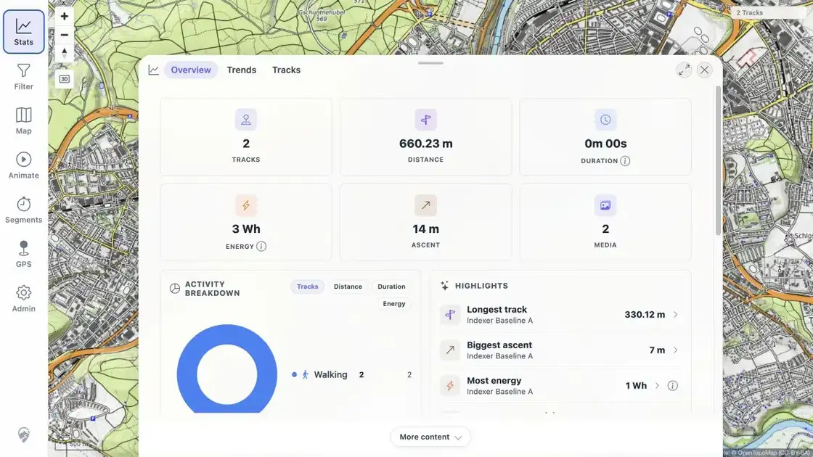
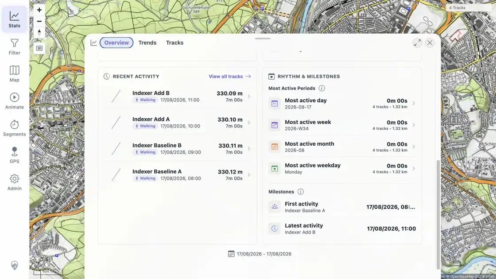
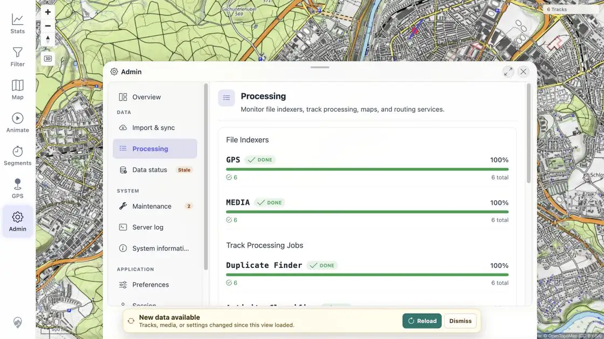

> **RESULT: PASS - Initial scan, live add/delete, same-path restore, active-path replacement, GUI refresh, targeted tests, and cleanup all passed.**

# MTL Explorer Focused Indexer Regression

## Scope

Test the file indexer at commit `64e7751302dd24f125d2418d0d0d0acb6b1bac9c` with isolated synthetic GPX and media watch roots. Verify initial indexing, live additions, live deletion, same-path restoration, active-path atomic replacement, browser freshness handling, and final GUI state.

No private GPX or media files were used. The synthetic source checksums are recorded in [fixture-manifest.json](assets/fixture-manifest.json) and [ATOMIC.txt](assets/ATOMIC.txt).

## Environment

| Item | Value |
|---|---|
| App | MTL Explorer local production build |
| Commit | `64e7751302dd24f125d2418d0d0d0acb6b1bac9c` |
| Server | Java 21, Spring Boot JAR, HTTP `127.0.0.1:18084` |
| Database | Disposable PostGIS 18 / PostgreSQL 18 container |
| GPX watch | Isolated temporary directory, live watch enabled |
| Media watch | Isolated temporary directory, live watch enabled |
| Browser | Codex in-app browser |
| Map | Remote raster mode; local map and search sidecars disabled |

The repository default has media live watch disabled for very large media trees. This focused run enabled it because automatic media add/delete detection was required.

## Result Ledger

| Phase | Expected | Actual | Status | Evidence |
|---|---|---|---|---|
| Build and startup | Current source builds; clean database starts; both initial scans finish | Build succeeded in 18.666 s; GPS and MEDIA initial scans completed; both watchers started | PASS | [RUN_SETUP.txt](assets/RUN_SETUP.txt) |
| Initial scan | 2 GPX and 2 media items indexed and visible | 2 successful GPS rows, 2 successful MEDIA rows; GUI showed 2 Tracks and 2 Media | PASS | [BASELINE.txt](assets/BASELINE.txt), [screenshot](assets/BASELINE-ui.webp) |
| Add | 3 new GPX and 3 new media files detected without rescan | Six CREATE events; server reached 5 tracks and 5 media in 11.954 s; browser detected freshness and Reload succeeded | PASS | [ADD.txt](assets/ADD.txt), [screenshot](assets/ADD-ui.webp) |
| Delete | One GPX and one media file removed automatically | Both domain rows removed in 11.751 s; index rows became REMOVED; GUI changed to 4 Tracks and 4 Media | PASS | [DELETE.txt](assets/DELETE.txt), [screenshot](assets/DELETE-ui.webp) |
| Same-path restore and new files | Deleted paths restore cleanly and new paths index | Restored rows reached invocation 3; new rows reached invocation 1; GUI showed 6 Tracks and 6 Media | PASS | [RESTORE.txt](assets/RESTORE.txt), [screenshot](assets/RESTORE-ui.webp) |
| Active-path atomic replacement | Existing content is removed before replacement import; no duplicate rows | GPX replacement removed the old track and imported `Indexer Atomic Replace`; media refreshed in place; counts stayed 6/6 | PASS | [ATOMIC.txt](assets/ATOMIC.txt), [screenshot](assets/ATOMIC-ui.webp) |
| Final indexer state | Indexers and dependent jobs settle | GPS 6/6 done, MEDIA 6/6 done, all four processing jobs 6/6 done | PASS | [final status](assets/FINAL-status.webp) |
| Automated checks | Relevant server and client tests pass | Server 8/8; client 6/6; no failures or errors | PASS | [TESTS.txt](assets/TESTS.txt) |
| Cleanup | Test process, database, ports, and temp data cleaned up | Server stopped; database container removed; ports free; temp data moved to Trash | PASS | [CLEANUP.txt](assets/CLEANUP.txt) |

## Timings

| Operation | Time |
|---|---:|
| Production build | 18.666 s |
| GPS initial scan | 70 ms |
| MEDIA initial scan | 95 ms |
| Add 3 GPX + 3 media to settled database state | 11.954 s |
| Delete 1 GPX + 1 media to settled database state | 11.751 s |
| Restore 2 same paths + add 2 new paths | 11.845 s |
| Replace active GPX + media paths | 10.564 s |

The live watcher uses event stabilization, so file mutations settled after about 10 to 12 seconds. Browser freshness was observed on the next polling cycle. No manual indexer rescan or page reload was used; the in-app Reload action applied each detected change.

## Findings

No indexer failure was found.

The browser console contained unauthenticated polling errors before sign-in and two `ResizeObserver` loop errors while map settings were open. No console error occurred during the mutation phases, and these entries did not affect the result. See [BROWSER-CONSOLE.txt](assets/BROWSER-CONSOLE.txt).

The server log audit found no `ERROR`, exception, or caused-by entry after all phases.

## Visual Evidence

Initial state:

After additions:

After deletion:

After same-path restore and new files:

After active-path atomic replacement:

Final processing state:

## Conclusion

The focused regression passed. The changed indexer behavior handled removed-path recreation and active-path atomic replacement without stale or duplicate domain rows. GPX and media changes propagated to the GUI through automatic freshness detection and the supported in-app Reload flow.
