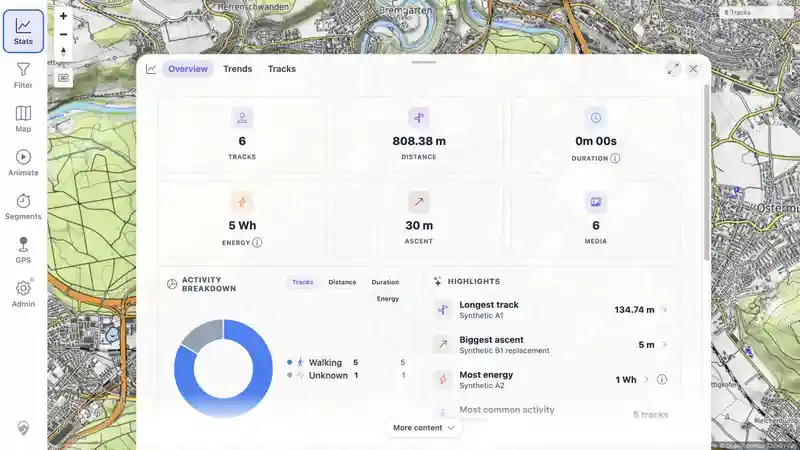

> **RESULT: PASS - startup scans, live changes, offline catch-up, same-path restoration, replacement, GUI refresh, hard memory limits, and cleanup all passed.**

# MTL Explorer focused indexer regression

## Scope

Verify the current memory changes against both file indexers. Each pass covered a fresh initial scan, additions, deletion, creation at a new path, restoration at the deleted path, and replacement of active content at the same path. The first pass used live filesystem watching. The second performed every mutation while the app was stopped and relied on startup catch-up.

The run used only generated GPX and JPEG files. No private GPX or media content was used. Fixture roles and checksums are recorded in [fixture-manifest.txt](fixture-manifest.txt).

## Environment

| Item | Value |
|---|---|
| Source | Commit `630ba122` plus the uncommitted memory work in this report |
| App image | Local production image `mtl-explorer:memory-optimized-current` |
| App limit | 640 MiB, swap disabled, G1, 200 MiB maximum heap |
| Database | Disposable PostGIS 18 container, 384 MiB, swap disabled |
| Browser | Codex in-app browser |
| Map and sidecars | Hosted map; local map, location search, and route planner disabled |
| Watchers | GPX and media live watchers enabled |

No manual index rescan was used.

## Live-watch pass

| Phase | Result | Evidence |
|---|---|---|
| Initial scan | 2 GPX and 2 media rows indexed | [details](assets/LIVE-BASELINE.txt), [GUI](assets/LIVE-BASELINE-ui.webp) |
| Add three pairs | Counts reached 5/5 from watcher events | [details](assets/LIVE-ADD.txt), [GUI](assets/LIVE-ADD-ui.webp) |
| Delete A2 pair | Counts fell to 4/4; removed rows disappeared | [details](assets/LIVE-DELETE.txt), [GUI](assets/LIVE-DELETE-ui.webp) |
| Add N1 pair | Counts reached 5/5 | [details](assets/LIVE-NEW.txt), [GUI](assets/LIVE-NEW-ui.webp) |
| Restore A2 pair | Counts reached 6/6 without duplicate paths | [details](assets/LIVE-RESTORE.txt), [GUI](assets/LIVE-RESTORE-ui.webp) |
| Replace B1 in place | Counts remained 6/6; old domain data disappeared and replacement appeared once | [details](assets/LIVE-REPLACE.txt), [GUI](assets/LIVE-REPLACE-ui.webp) |
| Final state | 12 successful index rows, 6 tracks, 6 media, 36 track-data rows, no pending correlation or duplicate paths | [details](assets/LIVE-FINAL.txt), [GUI](assets/LIVE-FINAL-stats.webp) |

Peak cgroup use was 635,154,432 bytes for the app and 362,778,624 bytes for PostgreSQL. Neither container swapped or recorded an OOM.

## Offline catch-up pass

Before each filesystem mutation, the app container was stopped and port 18092 was verified closed. Database state was checked before restart to prove that the stopped app had not processed the change.

| Phase | Result | Evidence |
|---|---|---|
| Initial scan | Fresh database reached 2 GPX and 2 media rows | [details](assets/OFFLINE-BASELINE.txt), [GUI](assets/OFFLINE-BASELINE-ui.webp) |
| Add three pairs | Startup catch-up reached 5/5 | [details](assets/OFFLINE-ADD.txt), [GUI](assets/OFFLINE-ADD-ui.webp) |
| Delete A2 pair | Startup catch-up removed both domain rows and reached 4/4 | [details](assets/OFFLINE-DELETE.txt), [GUI](assets/OFFLINE-DELETE-ui.webp) |
| Add N1 pair | Startup catch-up reached 5/5 | [details](assets/OFFLINE-NEW.txt), [GUI](assets/OFFLINE-NEW-ui.webp) |
| Restore A2 pair | Startup catch-up reached 6/6 without duplicate paths | [details](assets/OFFLINE-RESTORE.txt), [GUI](assets/OFFLINE-RESTORE-ui.webp) |
| Replace B1 in place | Counts remained 6/6; replacement content appeared once | [details](assets/OFFLINE-REPLACE.txt), [GUI](assets/OFFLINE-REPLACE-ui.webp) |
| Final state | 12 successful index rows, 6 tracks, 6 media, 36 track-data rows, no pending correlation or duplicate paths | [details](assets/OFFLINE-FINAL.txt), [GUI](assets/OFFLINE-FINAL-stats.webp) |

Peak cgroup use was 656,834,560 bytes for the app and 353,406,976 bytes for PostgreSQL. Neither container swapped or recorded an OOM.

## Automated and error checks

- The production Docker reactor build passed, including backend and frontend tests.
- The focused GPX, indexer, image, and video server set passed 87 tests with no failure, error, or skip.
- The full video service class passed 13 tests with no failure or error and one intentional skip.
- Five client freshness suites passed all 24 tests.
- One combined server test attempt saw a transient synthetic `ffprobe` process failure under a Docker Desktop bind mount. The affected test passed immediately in isolation and the complete video class then passed. It had also passed in the production build.
- The online browser audit had no warning or error. The offline audit contained only expected polling warnings during the four planned shutdowns and no browser error.
- Server logs had no unexplained error, exception, or OOM.

## Final GUI state

## Cleanup

The browser tab, disposable containers, networks, and volumes were removed after evidence capture. The test ports are closed, and the temporary synthetic fixture directory was moved to Trash.
