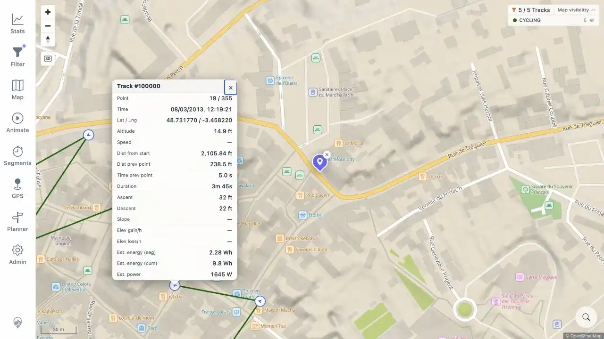
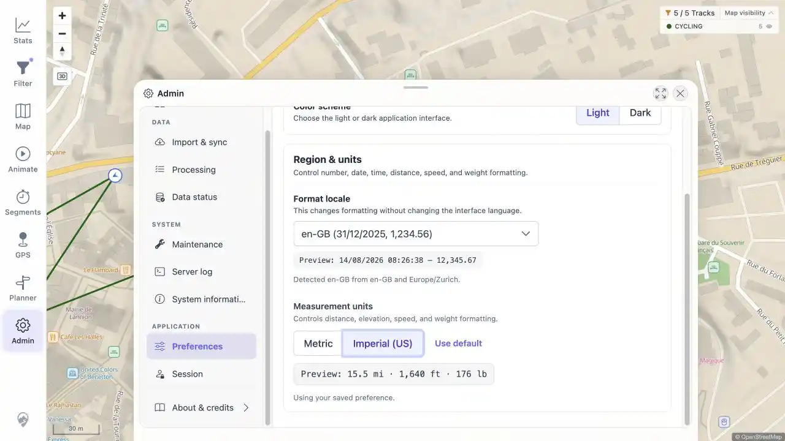
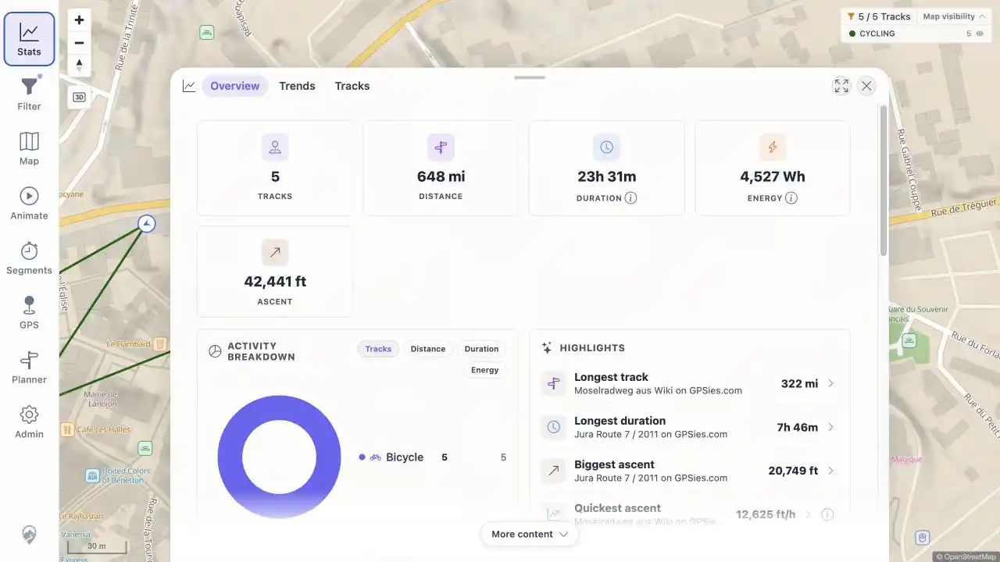

# Beta Verification: GitHub Issues 4 and 5

Verified 2026-08-14 on the Hetzner beta instance.

## Result

| Issue                                                                                             | Beta result                                                                                                                  | Evidence                                                                                                                                                   |
| ------------------------------------------------------------------------------------------------- | ---------------------------------------------------------------------------------------------------------------------------- | ---------------------------------------------------------------------------------------------------------------------------------------------------------- |
| [#4 Track point popup values are clipped](https://github.com/mindalyze-com/mtl-explorer/issues/4) | **RESOLVED ON TESTED BETA.** All 17 popup values were visible. The live layout had no horizontal overflow.                   | [Popup](assets/issue-4-track-point-popup.webp), [measurements](assets/live-measurements.txt)                                                               |
| [#5 Imperial unit option](https://github.com/mindalyze-com/mtl-explorer/issues/5)                 | **RESOLVED ON TESTED BETA.** Imperial units were selectable, applied across Statistics, and persisted through a full reload. | [Preference](assets/issue-5-imperial-preference.webp), [Statistics](assets/issue-5-imperial-statistics.webp), [measurements](assets/live-measurements.txt) |

Both GitHub issues were still open when this verification started. This report does not change their GitHub state.

## Environment

| Item          | Value                                                                     |
| ------------- | ------------------------------------------------------------------------- |
| Target        | `http://91.99.12.14:18080/mtl/`                                           |
| Image         | `wauwau0977/mytraillog:beta`                                              |
| Image version | `1.332`                                                                   |
| Image build   | `2026-08-13T19:56:35Z`                                                    |
| Image digest  | `sha256:516f0cabd548e41e7bf59e228c80baf70c247b2200a41995611d3f15494e0bad` |
| Browser       | Codex In-app Browser, desktop viewport `1280 × 720`                       |
| Data          | Five public regression GPX tracks                                         |

The current beta image was pulled immediately before testing. No private local GPX data was used.

## Issue 4

The map's **Track points and direction** layer was enabled, the public Lannion track was opened at the 30 m map scale, and point 19 of track `100000` was selected. Imperial units were active to exercise longer formatted values.

The popup rendered all 17 rows. Full values were visible for the timestamp, latitude/longitude, distances, duration, elevation, energy, and power. Live layout measurements reported:

- popup maximum width: `min(360px, calc(100vw - 16px))`;
- content width and scroll width: `263 px`;
- table width and scroll width: `263 px`;
- value wrapping: `white-space: normal` and `overflow-wrap: anywhere`;
- overflowing value cells: `0 of 17`.

The available live browser was the Codex In-app Browser. Native Firefox/Gecko and Safari/WebKit sessions were not available for this run. The beta layout no longer depends on the reported fixed 280 px, no-wrap value column, but a native engine matrix remains useful before closing the browser-specific issue.

## Issue 5

**Admin → Preferences → Region & units** exposed **Metric**, **Imperial (US)**, and **Use default** controls. Selecting Imperial changed the preview to `15.5 mi · 1,640 ft · 176 lb`.

Statistics then displayed `648 mi` distance, `42,441 ft` ascent, `322 mi` longest track, and imperial speed/elevation values. A full navigation reload of `/mtl/stats` retained `mi`, `ft`, `ft/h`, and `mph`, confirming persistence.

## Evidence Size

| File                               |         Size |
| ---------------------------------- | -----------: |
| `issue-4-track-point-popup.webp`   | 45,562 bytes |
| `issue-5-imperial-preference.webp` | 37,992 bytes |
| `issue-5-imperial-statistics.webp` | 32,806 bytes |

All screenshots are WebP and below 85 KB.

## Cleanup

The measurement preference was restored to the browser default metric setting. The track-point layer was restored to its original disabled state. The beta image remains running on the Hetzner instance.
