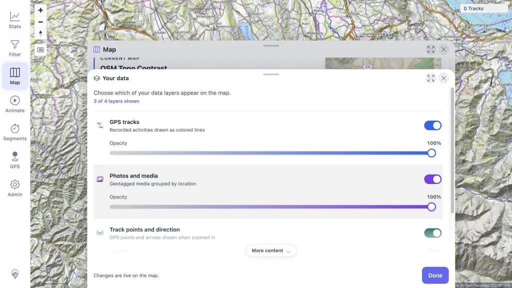
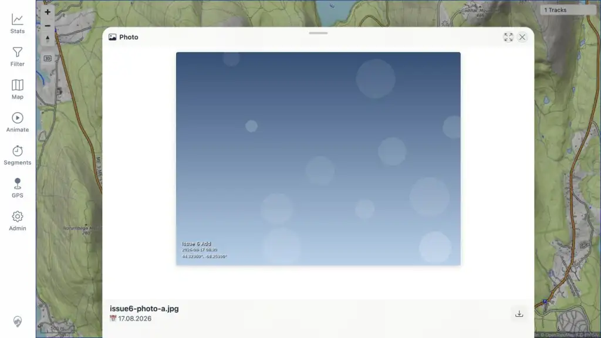
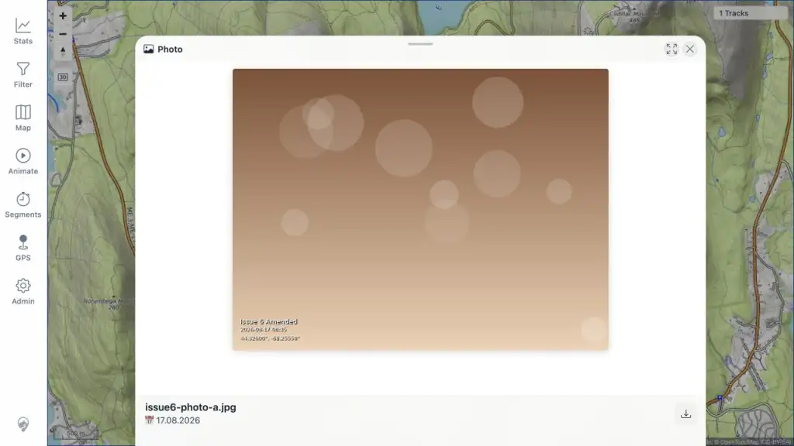
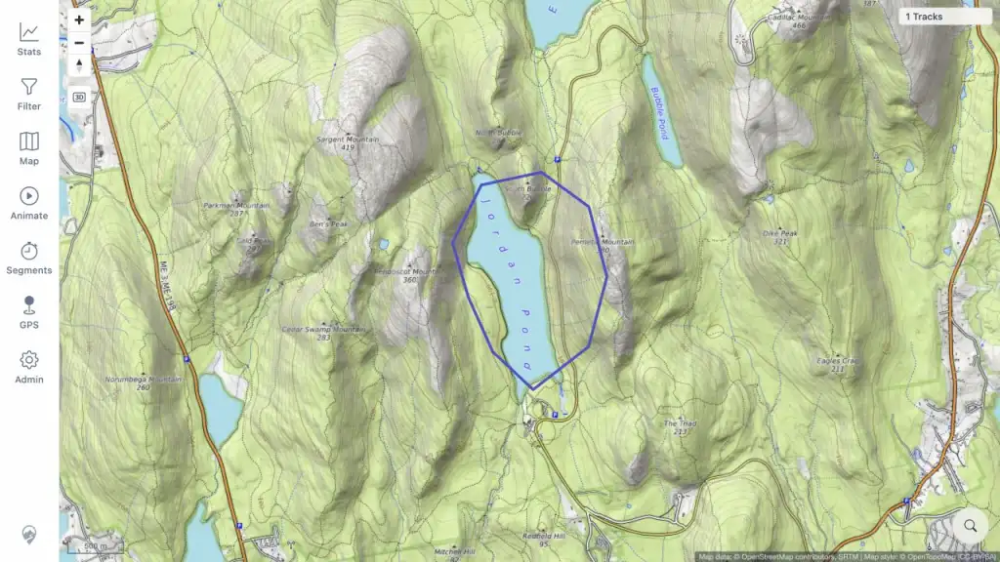
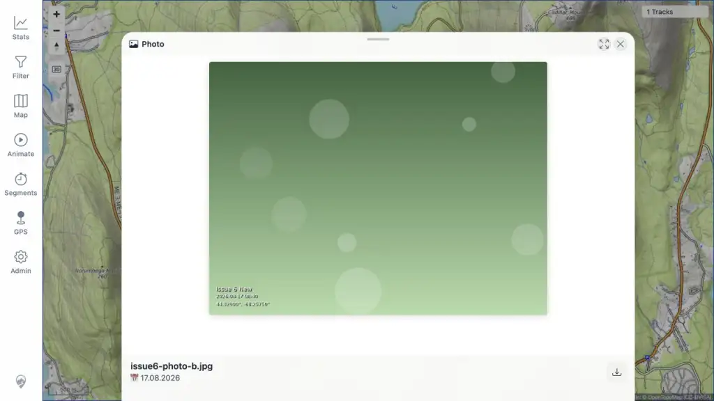
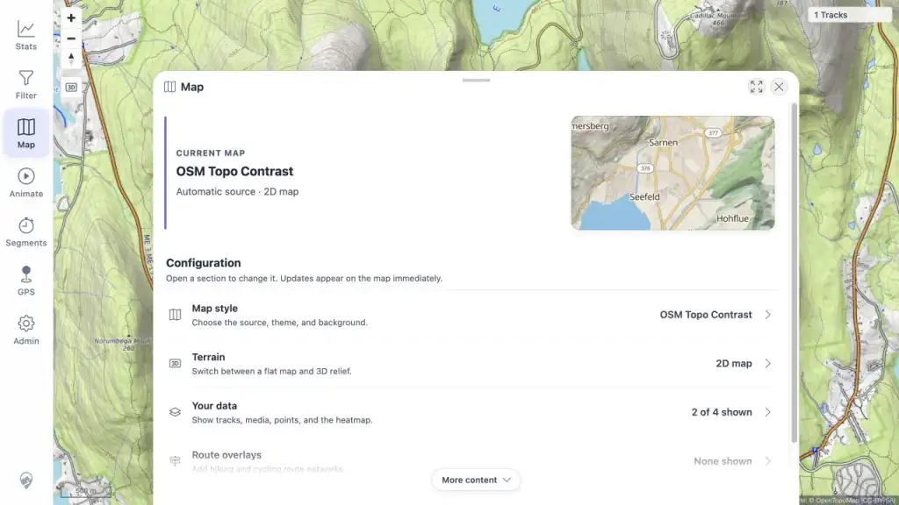
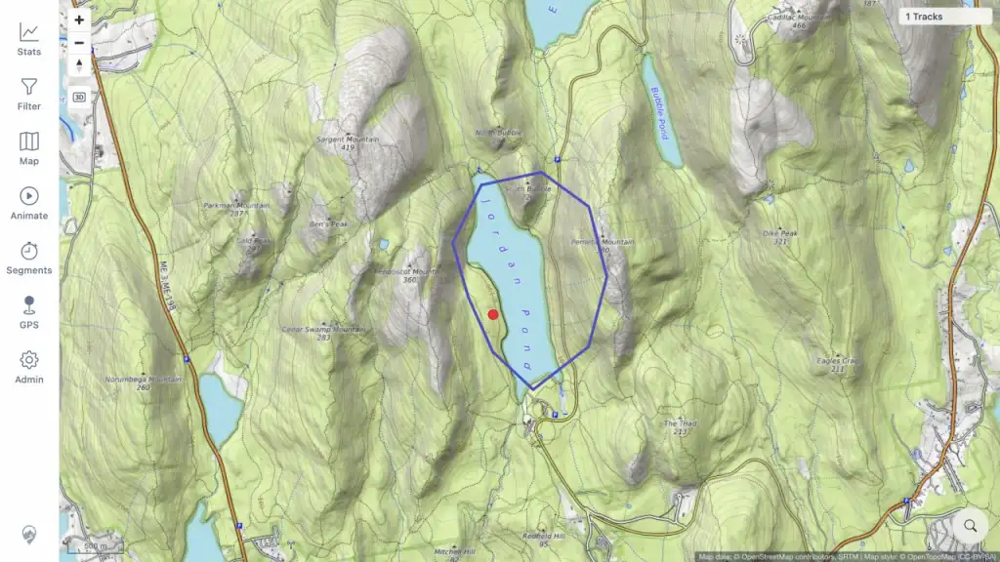
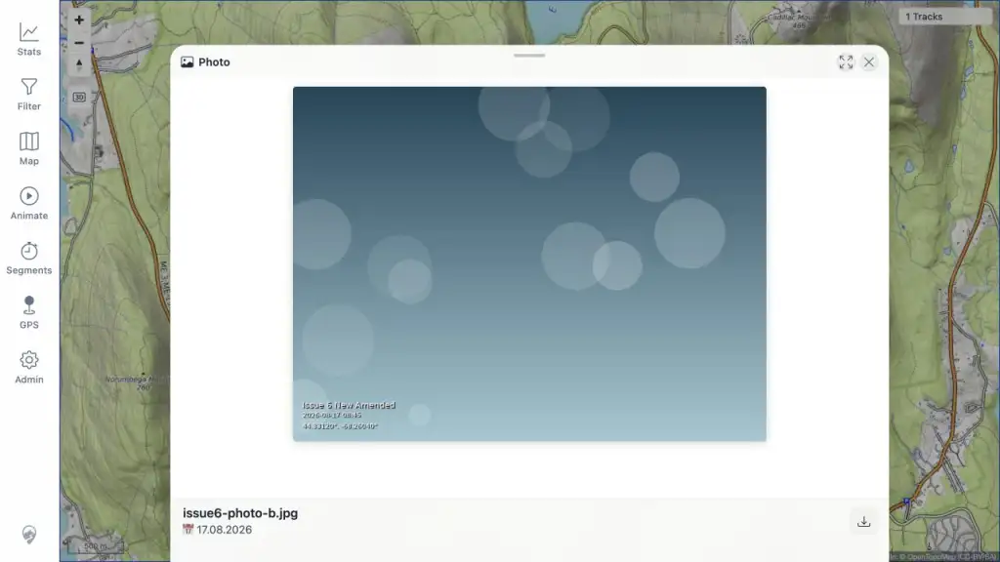
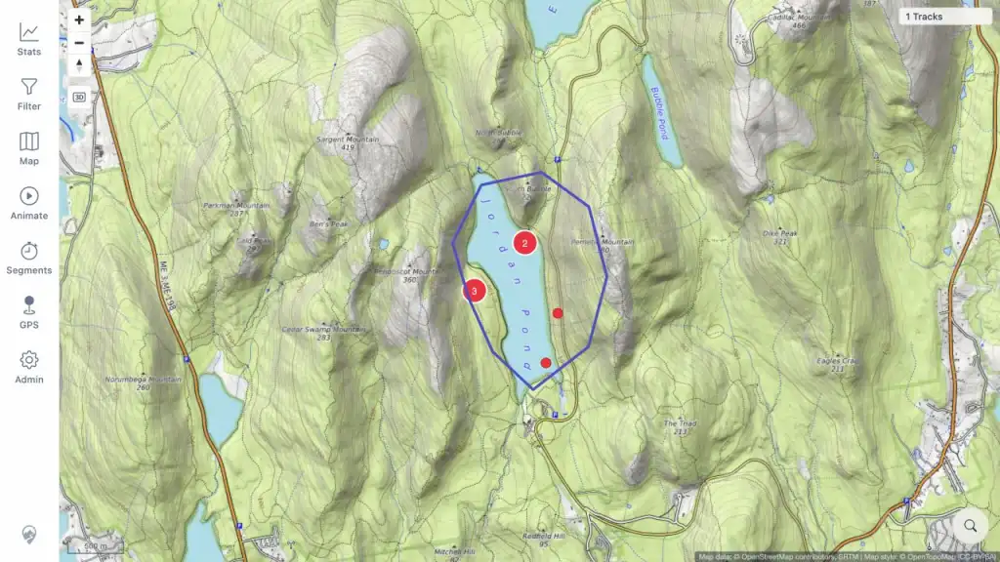

# Local Verification: GitHub Issue 6

Verified 2026-08-17 on branch `codex/issue-6-media-cleanup`.

## Result

**PASS on the tested local branch.** Changed and deleted media no longer leave
active derived rows or stale map pins. The source `indexed_file` history remains,
and `media_file_audit` keeps insert and delete snapshots for every derived media
row exercised by the flow.

This is a focused Issue 6 verification with one disposable photo at a time. It
does not replace the four-photo full-regression flow in the main test plan.

| Check | Result | Evidence |
|---|---|---|
| Default photo visibility and persisted off/on preference (`MED_01`) | PASS | [Default on](assets/01-default-media-on.webp), [persisted off](assets/10-media-preference-off-after-reload.webp), [persisted on](assets/11-media-preference-on-after-reload.webp) |
| Add and open a geotagged JPEG (`MED_02`, `MED_03`, targeted `MED_06`) | PASS | [Initial preview](assets/04-photo-preview-after-add.webp) |
| Replace the same watched filename | PASS | [Amended preview](assets/06-photo-preview-after-amend.webp), [database transcript](assets/database-evidence.txt) |
| Delete, rescan, reload, and expire the media cache (single-file `MED_07`–`MED_12` variant) | PASS | [Marker absent](assets/07-photo-absent-after-delete.webp), [database transcript](assets/database-evidence.txt) |
| Add a new filename and amend it | PASS | [New preview](assets/09-new-photo-preview.webp), [final amended preview](assets/12-new-photo-preview-after-amend.webp) |
| Refresh visible photos after a freshness change without reloading the browser | PASS | [Seven active photos after the in-app reload](assets/13-freshness-media-refresh.webp), [request and database evidence](assets/freshness-evidence.txt) |

## Privacy And Isolation

No personal GPX track or photo was mounted, copied, read into a fixture, or used
as report evidence. The normal development paths containing personal data were
not used.

- GPX source: repository CC0 public-regression copy of the ViewMyGPX short hike,
  documented at `mtl-server/src/test/resources/gpx/public-regression/README.md`.
- Public source page: <https://www.viewmygpx.com/sample-gpx-files/>.
- GPX SHA-256: `e22cf5c93ea1297ae062827595ee6336f9d401ea8eb43b52c0e0ab1158a12c11`.
- Indexed public track: `Jordan Pond Loop — Acadia`, track ID `100000`.
- Photos: fully synthetic JPEGs generated with the shared
  `photo_placeholder.py` renderer. No test JPEG is committed.
- Disposable watched paths: `/tmp/mtl-issue6-20260817/gpx` and
  `/tmp/mtl-issue6-20260817/media`.

## Environment

| Item | Value |
|---|---|
| GUI | `http://127.0.0.1:5173/mtl/` |
| Backend | Local Spring Boot server on port `8080`, `dev` profile |
| Database | Dedicated container `mtl-issue6-db-20260817`, port `55436` |
| Database image | `postgis/postgis:18-3.6`, digest `sha256:ec2a962561debfd465158384a9ac7d748d81a33a66e2d87bacbe277f212a1717` |
| Browser | Codex In-app Browser, desktop viewport `1280 × 720` |
| Media setting | Remote map tiles; Garmin sync and planner disabled for this run |

Liquibase applied all 93 changesets to the empty disposable database, including
`062.xml`, before the flow started.

## Synthetic Photo Manifest

| State | Label | Coordinates | Captured | Bytes | SHA-256 |
|---|---|---:|---|---:|---|
| First add | Issue 6 Add | `44.32360, -68.25390` | `2026-08-17 08:30` | 29,003 | `fe4f73250a9ab4a1d9ac2a670be074222debcb4004377e1661353fa2f6fece28` |
| First amend | Issue 6 Amended | `44.32600, -68.25550` | `2026-08-17 08:35` | 30,594 | `bb21d82ccac4dd4df8d1f1792b339891eb76095670847b06d5ba98b40f95989c` |
| New add | Issue 6 New | `44.32900, -68.25750` | `2026-08-17 08:40` | 27,029 | `c2a48c70ed4ab98f5daeec58eb249f63b7c3629a62b5d9a73924e62879a3142b` |
| New amend | Issue 6 New Amended | `44.33120, -68.26040` | `2026-08-17 08:45` | 32,356 | `7dafac7845db3841025682811f843c685a95b99c2d4699df7e76cd2d57ac67d0` |
| Freshness follow-up | Issue 6 Photo H | `44.32840, -68.25910` | `2026-08-17 08:52` | 30,211 | `40930f3ee269bfb5f34abeb719eaba8ec4d1b4ab66e015611f6f200b64d37a2b` |

## Flow And Database Result

1. Added `issue6-photo-a.jpg`. The GUI opened media ID `400000`; the audit
   table recorded its `INSERT`.
2. Replaced the same filename with changed EXIF and content. Indexed file
   `300001` remained stable, active media changed to `400001`, and audit rows
   recorded `DELETE 400000` plus `INSERT 400001`.
3. Removed the watched source and used **Admin → Maintenance → Rescan Media**.
   Indexed file `300001` became `REMOVED`, active media rows for it became zero,
   and the audit table recorded `DELETE 400001`.
4. Reloaded the browser. The deleted marker was absent. After more than the
   three-minute media cache lifetime, three zoom-out/zoom-in cycles and another
   hard reload, the deleted coordinates remained empty.
5. Added `issue6-photo-b.jpg`, opened media ID `400002`, then replaced the same
   filename twice. The final active row is media ID `400004` for indexed file
   `300002`; superseded rows have matching delete snapshots.
6. Disabled photos and reloaded: the setting remained off. Enabled photos and
   reloaded: the setting remained on and the current marker returned.
7. Added `issue6-photo-h.jpg` beside the six active synthetic photos and queued
   **Rescan Media**. The client detected media revision 15, displayed **New data
   available**, and the in-app **Reload** action requested
   `/media/get-media-in-bounds`. Without a page reload, the map rendered seven
   active photos and Admin reported **Data Current**. See the
   [request and database evidence](assets/freshness-evidence.txt).

Final database state after the follow-up: one `REMOVED` indexed-file history
row, seven successful current indexed files, seven active `media_file` rows,
and 15 audit snapshots. See the original focused-flow details in the
[database transcript](assets/database-evidence.txt).

## Visual Evidence

## Automated Checks

- Backend focused media/audit suite: 8 tests passed.
- Frontend Vitest suite: 107 files, 529 tests passed.
- Frontend type check, ESLint, and production build passed.

## Evidence Size

All screenshots are WebP, `1024 × 576`, and below 85 KB. The nine screenshots
total 338,302 bytes.

## Runtime State

The local frontend, backend, and disposable database remain running for review.
The watched media folder contains only synthetic `issue6-photo-b.jpg` through
`issue6-photo-h.jpg`. The watched GPX folder contains only the public CC0 test
track.
