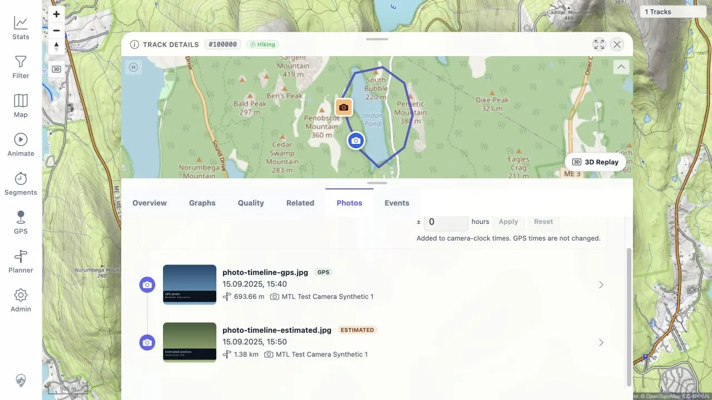
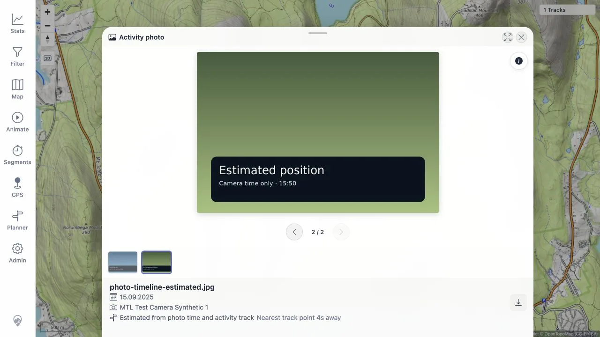
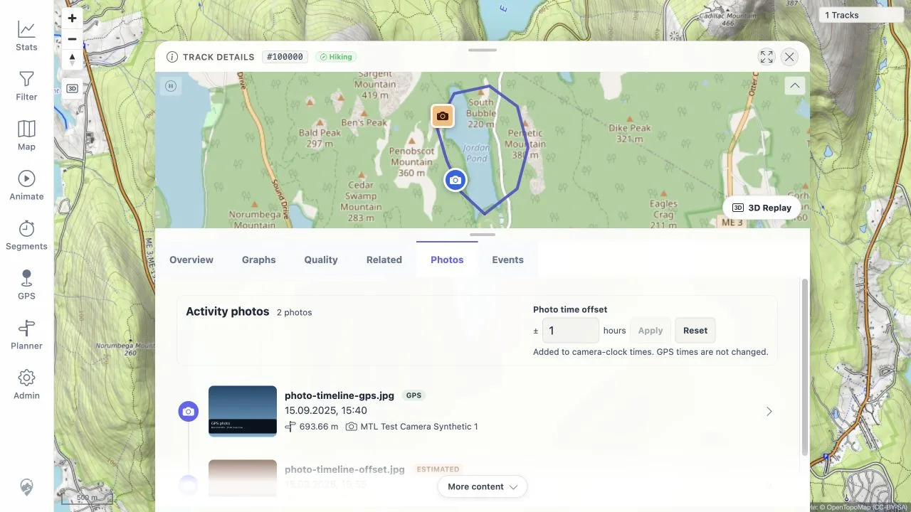
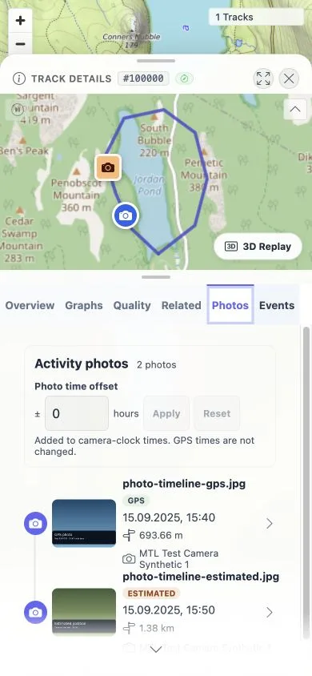
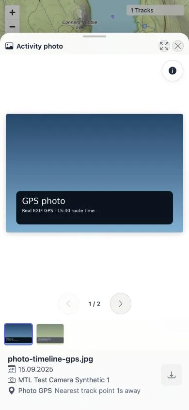
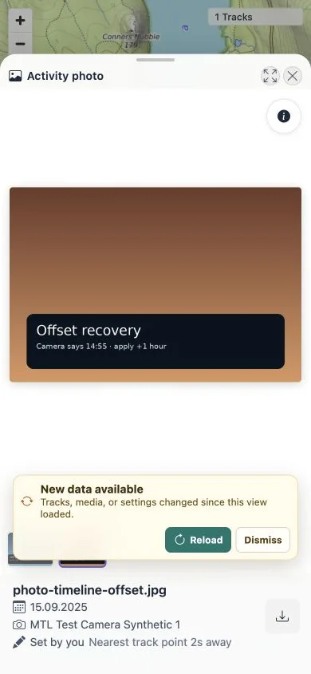

> **RESULT: PASS - automated checks and desktop/mobile browser verification passed**

# Photo Handling Improvement: Local End-to-End Verification

## Goal

Verify the Track Details Photos timeline, server-side time matching and route
interpolation, camera offset behavior, mini-map markers, and enhanced media
viewer against a disposable local MTL Explorer environment.

## Environment

| Item | Value |
|---|---|
| Date | 2026-08-17 |
| App | MTL Explorer local development build |
| Frontend | `http://127.0.0.1:5173/mtl/` |
| Backend | `http://localhost:8080/mtl/` |
| Browser | Codex In-app Browser |
| Data | Disposable PostGIS database, public GPX track, and fully synthetic media |

No private GPX track or photo is used as a fixture or report artifact.

## Automated verification

| Check | Result | Notes |
|---|---|---|
| Frontend Vitest suite | PASS | 110 files and 552 tests passed, including persisted correction and manual-position flows. |
| Generated API contract spec | PASS | The repository uses generated timeline, time-correction, and manual-location methods. |
| Frontend type check | PASS | Generated media API types and UI code compiled. |
| Frontend production build | PASS | Production bundle completed. |
| Frontend lint | PASS | 0 errors and 2 unrelated warnings. |
| Backend test suite | PASS | 385 passed, 0 failed, 0 errors, and 1 skipped on disposable PostGIS. |

Covered automated behavior includes capture-time precedence, preview and saved
camera corrections, reversible user locations, evidence precedence, durable
work queues, activity matching, overlapping-track selection, interpolation,
location provenance, response order and validation, generated-client use,
timeline states, mini-map photo markers, viewer metadata, filmstrip, keyboard
navigation, zoom, pan, pinch, swipe, and cleanup.

## Performance verification

The performance probe used 100,018 synthetic/disposable media rows, 300
activities, and 100,016 resolved positions inside a rolled-back transaction.

| Check | Result |
|---|---|
| Persisted activity timeline SQL | 2 rows in 0.154 ms using the partial timeline index |
| Warm activity timeline HTTP | 2 rows, 1,387 bytes, 15.7 ms, `Cache-Control: no-store` |
| Resolved map bounds SQL | 20,100 rows in 77.341 ms using the GiST projection index |
| Initial local correlation batch | 18 media rows in 181 ms; no remaining work |
| Canonical track-data invalidation | A three-point bulk update queued one work row for track `100000` through the statement-level transition-table trigger; transaction rolled back |

Normal activity and map requests perform no interpolation. The activity
endpoint is a selected-correlation lookup. The map layer requests a padded
viewport and reads the spatially indexed resolved projection. Correlation runs
in bounded background batches only after relevant media, correction, manual
position, activity, or canonical track-data changes.

## Browser end-to-end verification

| Area | Expected result | Status | Evidence |
|---|---|---|---|
| Desktop timeline | Photos tab loads matched items in time order with GPS/Estimated badges and mini-map markers. | PASS | At 1280 x 720, the timeline showed GPS at 15:40 and Estimated at 15:50, with distinct blue round and orange square markers. |
| Selection and position | Selecting each item pins the correct original EXIF or track-interpolated position and opens the same item. | PASS | Timeline-card and mini-map marker selection opened the matching viewer item. The estimated item showed the route correlation and a 4-second nearest-point delta. |
| Camera offset | A signed offset is previewed before saving; GPS-time items remain unchanged; saved and cleared state is durable. | PASS | Applying +1 hour showed an explicit unsaved preview. Saving updated both baseline and preview camera-time sets, so the persisted two-item result exactly matched the preview. Reload used the no-store baseline request. |
| Persisted provenance | Original EXIF, track correlation, user assignment, and resolved position remain separate. | PASS | Photo GPS and Estimated labels matched the stored origins. Setting a synthetic manual point changed the card, marker, and viewer to **Set by you** while the route delta remained available. Cleanup restored zero correction/manual rows. |
| Viewer navigation | Buttons, arrow keys, filmstrip, swipe, and boundary states select the expected item. | PASS | Buttons, left/right keys, filmstrip selection, disabled boundaries, and a 250 px mobile swipe selected the expected item. |
| Viewer inspection | Zoom, pan, reset, metadata toggle, fullscreen, and original download remain usable. | PASS | Double-click reached scale 2; drag changed the clamped transform; navigation reset scale to 1. Metadata, fullscreen, and download controls remained available. Wheel and pinch paths also passed component tests. |
| Mobile layout | Timeline and viewer remain readable and usable at the tested narrow viewport. | PASS | At 390 x 844, all six tab labels, both timeline items, controls, filmstrip, metadata, and provenance remained readable. |
| Recovery | Empty, loading, and failed preview/timeline states are clear and recoverable. | PASS | With the server deliberately stopped, the timeline showed its error and Retry action. After restart, Retry restored the offset results without reloading the app. Automated tests cover empty/loading and failed-preview states. |
| Console and network | No new unexpected errors, warnings, or failed application requests occur during the flow. | PASS | No unexpected diagnostics occurred. Three warnings were expected during the deliberate outage: timeline loading and two background status polls. Normal requests recovered afterward. |

## Browser evidence

### Desktop timeline and provenance

### Estimated-position viewer

### Camera offset

### Mobile timeline and viewer

### User-assigned position provenance

## Finding fixed during the run

The persisted-correction pass first saved only media visible in the preview.
That left a baseline item behind after saving. The save set now includes both
baseline and preview camera-time media, and the real browser flow was repeated:
the saved result exactly matched the two-item preview. The earlier 390 px tab
padding finding remains fixed; the updated manual-position viewer was also
verified at 390 x 844.

## Completion gate

All browser rows passed, the mobile finding was fixed and retested, WebP
evidence is linked above, and final frontend checks passed. The backend suite
passed earlier in the same disposable environment.
