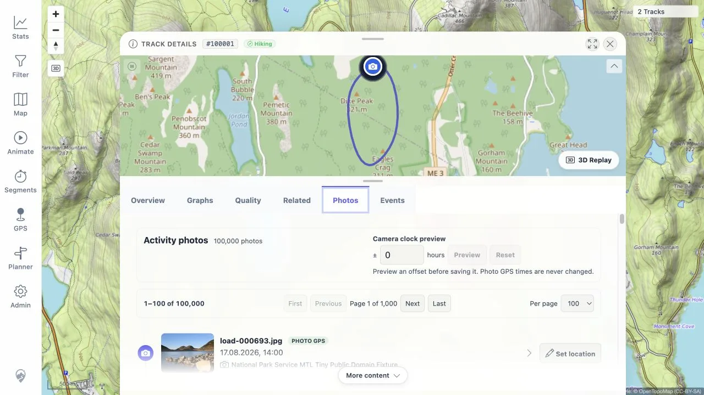
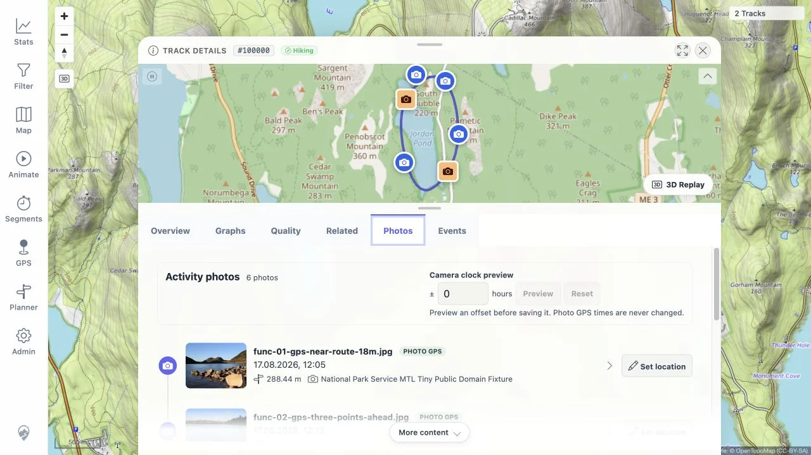

> **RESULT: PASS - the 100,000-photo activity remains responsive with bounded pages**

# Activity photo pagination follow-up

## Scope

This run repeated the failed 100,000-photo browser case after adding
server-backed pagination to the activity timeline. It also repeated the
six-photo functional case to check the normal flow and position markers.

The environment used a disposable PostGIS database, two fully synthetic GPX
loops, and small public-domain National Park Service JPEGs. No private track or
photo was used.

## Results

| Check | Result |
|---|---|
| Page API, first page | PASS - 100 of 100,000 items, 69,773 bytes, 0.389 s |
| Page API, last page | PASS - 100 items on page 1,000, 68,375 bytes, 0.323 s |
| Page-size limit | PASS - `pageSize=201` returned `400` |
| Browser, first page | PASS - visible in 0.489 s with 100 cards and 100 mini-map markers |
| Browser, next page | PASS - items 101-200 visible in 0.527 s; card and marker counts remained 100 |
| Functional activity | PASS - all six expected photos and six markers visible in 0.581 s |
| Focused frontend tests | PASS - 35 tests across repository, Photos tab, and Track Details |
| Focused backend tests | PASS - 11 service and SQL-contract tests |
| Frontend type check | PASS |

The earlier unpaged endpoint returned 70,804,001 bytes and the browser did not
finish rendering within 120 seconds. The default page response is about 0.1%
of that payload and bounds both timeline rows and DOM mini-map markers.

## Browser evidence

