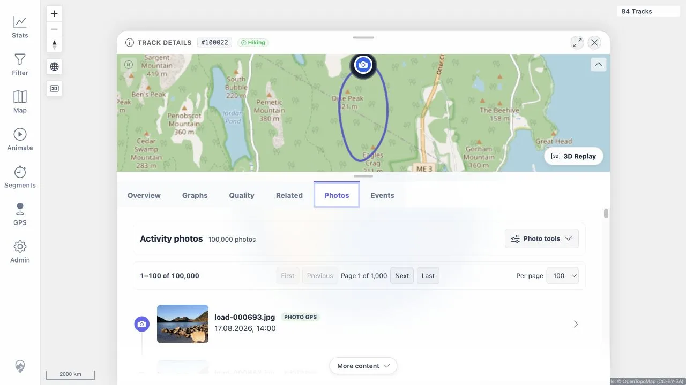
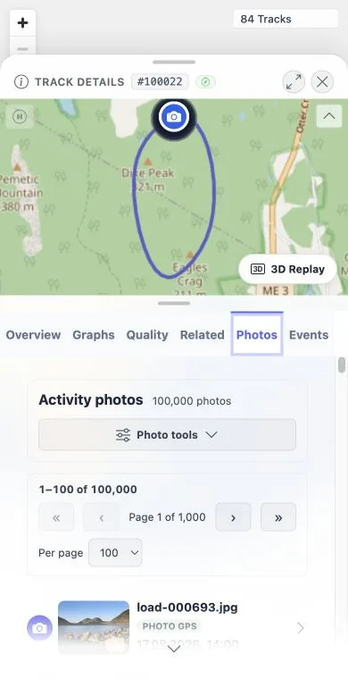
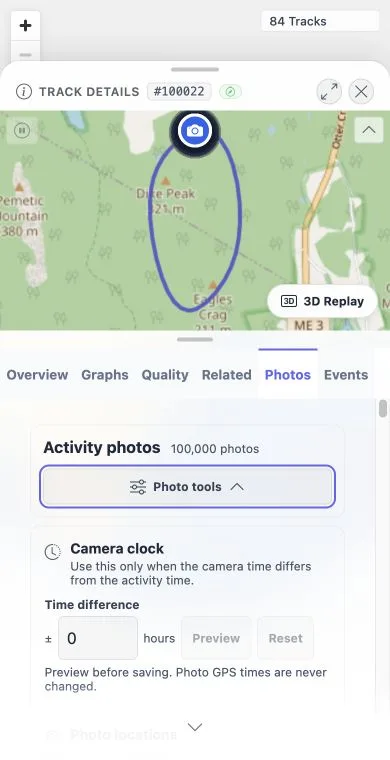
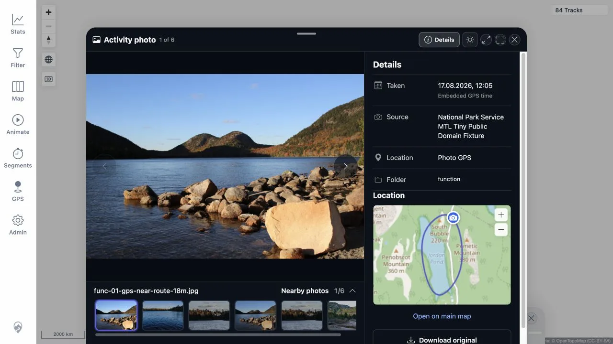

> **RESULT: PASS — the photo timeline stays content-first with 100,000 photos**

# Photo tools UX and 100k regression

Date: 2026-08-17

This run used the synthetic GPX tracks and small public-domain NPS JPEGs in
/Users/pheusser/Downloads/mtl-photo-load-test. No private activity or photo
was used.

## Results

| Check | Result |
|---|---|
| Desktop, 1280 × 720 | PASS — the first page showed 1–100 of 100,000, 100 cards, Photo tools closed, and no location edit actions. |
| Mobile, 390 × 760 | PASS — the same bounded page remained usable; paging changed to compact, accessible arrow controls. |
| Progressive disclosure | PASS — Camera clock and Adjust locations appeared only after opening Photo tools. Location actions appeared only after enabling Adjust locations. Closing Photo tools also closed the editor and removed all edit actions. |
| 100k paging | PASS — first, next, and last pages showed 1–100, 101–200, and 99,901–100,000; every page rendered exactly 100 cards. |
| Functional camera preview | PASS — the +1h preview changed six photos to five, added func-04-camera-clock-one-hour-slow.jpg, retained the GPS photo, and Reset restored six without saving. |
| Viewer location map | PASS — it auto-fit the activity and exposed only Zoom in and Zoom out. The misleading custom fit/maximize icon is gone. |
| Open on main map | PASS — the viewer and Track Details closed, the route returned to /mtl/, and the main-map Zoom in control responded immediately. |
| Focused frontend checks | PASS — 63 tests across seven photo/map suites. |
| Full frontend checks | PASS — 114 files and 588 tests. |
| Type check and production build | PASS. |

Read-only database checks found exactly 100,000 selected correlations for the
load activity: 50,000 GPS-time photos and 50,000 camera-time photos. The
functional activity had six selected photos, including GPS points 18.80 m,
39.67 m, and 137.93 m from the route. Pending media, pending tracks, and failed
media correlation work were all zero.

## Evidence

Desktop 100k timeline, collapsed by default:

Mobile 100k timeline:

Mobile Photo tools disclosure:

Desktop viewer details and location map:

