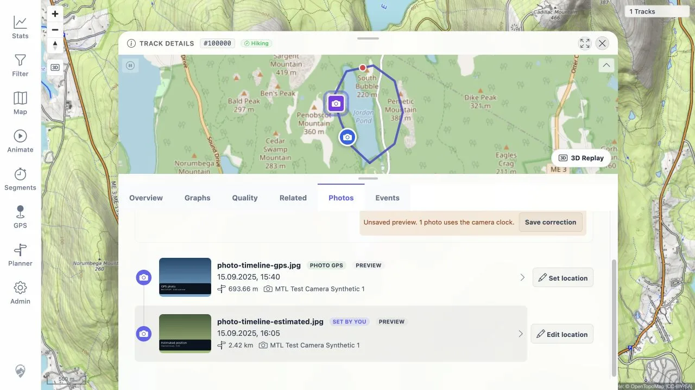

# Persisted Photo Positions: Independent Review Follow-up

> **RESULT: PASS — every review claim was checked; accepted findings were fixed and retested**

## Scope and outcome

Three independent agents divided the 16 numbered claims, testing gap, and demo
note. Each agent inspected the implementation and tests. Database and browser
checks used disposable PostGIS data, a public activity, and fully synthetic
photos. No private activity or photo is used as a fixture or report artifact.

| Verdict | Count |
|---|---:|
| Accepted | 7 |
| Partially accepted | 4 |
| Rejected | 5 |

The database testing gap was accepted and fixed. The demo-mode note is accurate
but is not a regression introduced by this feature.

## Claim verdicts

| # | Verdict | Finding, evidence, and action |
|---:|---|---|
| 1 | Accepted, fixed | Preview SQL omitted `media_manual_location`, and preview mapping could only return EXIF or route coordinates. Preview rows now carry manual coordinates and notes, with `USER_ASSIGNED` precedence. A browser preview confirmed the assignment, badge, edit action, and manual marker remain while capture time and route distance change. |
| 2 | Partially accepted, fixed | A null origin did fall through to **Photo GPS**, but ordinary pending work omits the timeline row and an atomic rebuild cannot expose a half-written row. Null is a defensive state for inconsistent data or the intentionally nullable DTO. Cards, the mini-map, and the viewer now use **Position unknown** and a neutral style unless EXIF provenance is explicit. |
| 3 | Accepted, fixed | The mutable bounds endpoint returned a three-minute private cache lifetime. It now returns `Cache-Control: no-store`; a live authenticated HTTP probe confirmed the header. |
| 4 | Accepted, fixed | Trimming only zeroes from `1.00` produced `1.`. The formatter now removes an optional trailing decimal point and tests cover `3603` seconds. |
| 5 | Rejected | The proposed lost-update race does not occur. `claimMediaWork` locks the queue row with `FOR UPDATE`; a concurrent `INSERT ... ON CONFLICT DO UPDATE` waits for that transaction and then creates or updates the row after the worker delete commits. A two-session PostgreSQL reproduction held the requeue for about three seconds and the final queue row remained. A `claimedAt` delete condition would add complexity without fixing a reachable loss. |
| 6 | Accepted, fixed | Direct rebuild could overlap a scheduled rebuild after a no-op mutation. Rebuilds now lock the affected `media_file` rows in stable order, no-op correction/manual clears do not rebuild, and same-offset correction writes do not update. |
| 7 | Accepted, fixed | A deterministic item could roll back and retry the oldest 500-row batch forever. Failed batches are now retried as separate transactions. Only failing items are deferred with attempt count, error summary, and retry time, so healthy work proceeds. Candidate track-data selection is also deterministic when duplicate canonical/shape rows exist. |
| 8 | Partially accepted, fixed | Raw size and null validation did happen after copying into a set. The claimed write risk was overstated: a null caused the existence count to fail and returned `404` before a write. Raw length and nulls are now rejected as `400` before deduplication; distinct-ID limits remain bounded. |
| 9 | Rejected | Corrections are keyed by `media_id` and the API accepts any bounded media-ID set; only the current UI gathers IDs from an activity. Camera make/model are display metadata, not a stable physical-device identity, and clock offsets can change after resets, travel, or daylight-saving changes. A camera/window model would be a separate product feature with identity and conflict rules, not a correctness repair. |
| 10 | Accepted, documentation fixed | The implementation intentionally saves the union of preview camera-time media and the current persisted activity timeline. This ensures items shifted out of the activity are also updated and the reloaded timeline matches the preview. The feature documentation now describes that behavior. |
| 11 | Rejected | `estimatedPosition` and `positionOrigin` are derived together from one mapping source; they are not independently mutable. The boolean remains a compatibility and coordinate-fallback signal, while origin drives provenance text and style. Removing it would break existing API consumers without fixing current inconsistency. |
| 12 | Accepted, fixed | `positionOrigin` was selected and serialized by the high-volume bounds endpoint but never used by the main map. It was removed from the query, DTO, OpenAPI schema, and generated TypeScript point type. Activity timeline provenance is unchanged. |
| 13 | Partially accepted, fixed | GPS-time media omission is intentional and documented, but the returned “changed IDs” contract was inaccurate for repeated nonzero upserts. The endpoint now returns `204 No Content`; equal offsets do not update `updated_at` or trigger a rebuild. A repeated live request returned `204` with unchanged `updated_at`. |
| 14 | Rejected; comment corrected | EXIF fallback is not only an upgrade path. It also preserves newly indexed GPS photos during normal asynchronous queue delay and when correlation is deferred. Both branches are spatially indexed. Existing stress evidence returned 20,100 points from 100,018 media in 77.341 ms, so removing this resilience has no supporting performance case. The repository comment now states the actual purpose. |
| 15 | Rejected | Last-known-good reads during durable recalculation are intentional. Algorithm state queues stale work at startup, relevant activity/geometry changes enqueue work, and Admin job status exposes pending correlation work. Filtering on the general track version would incorrectly hide photos after unrelated metadata edits because that version changes on every track update. Documentation now states the consistency behavior. |
| 16 | Partially accepted, fixed | Carrying route geometry in the materialized candidate CTE was avoidable. A 500-candidate PostGIS probe reduced estimated CTE storage from 227 kB to 36 kB, while warm runtime improved only from 5.713 ms to 5.457 ms. Distance is now computed in the candidate CTE and only the scalar is carried forward. The claimed singleton skip was rejected because route distance is persisted evidence; skipping it would change stored results. |

## Testing gap and demo note

The previous changelog and repository tests mostly checked XML or SQL strings.
`MediaCorrelationDatabaseIntegrationTest` now seeds a synthetic correlated
activity and photo, deletes the activity through the production
`GPXStoreService` path, verifies the media work row survives, rebuilds, and
verifies the photo falls back to embedded EXIF evidence. The test is rolled back.
Poison-item isolation, no-op writes, validation order, response headers, manual
preview precedence, unknown provenance, and generated API behavior have focused
tests. Queue concurrency and retry behavior remain separate tests because one
normal deletion test cannot cover those races.

The public demo credentials can reach these write endpoints and mutations are
durable. Existing upload, rescan, and save operations were already writable in
the same mode, so this is not a feature regression. If a read-only public demo
is required, it should use one central demo-mode guard for all mutating APIs,
not a media-only exception.

## Verification

| Check | Result |
|---|---|
| Fresh PostGIS migration and deletion integration test | PASS — 1 test, 0 failures |
| Full backend suite on disposable PostGIS | PASS — 395 tests, 0 failures, 0 errors, 1 skipped |
| Full frontend Vitest suite | PASS — 110 files and 555 tests |
| Frontend type check | PASS |
| Frontend production build | PASS |
| Frontend lint | PASS — 0 errors, 2 unrelated existing warnings |
| Repository-wide frontend format check | PRE-EXISTING — unmodified `src/assets/bootstrap-icons-inline.css` is not Prettier-formatted; all touched frontend files pass formatting |
| Live OpenAPI and generated TypeScript client | PASS — correction API is `void`/204 and bounds point is `id/lat/lng` |
| Authenticated bounds probe | PASS — HTTP 200 with `Cache-Control: no-store` |
| Repeated equal correction probe | PASS — HTTP 204 and `updated_at` unchanged |
| Browser flow in Codex In-app Browser | PASS — manual position survived preview, save/clear worked, cleanup left zero manual/correction rows |

## Browser evidence

The screenshot shows a `+0.25h` unsaved preview. The estimated photo remains
**Set by you**, keeps its **Preview** badge, retains **Edit location**, and uses
the manual purple marker while its preview time and route distance change.

## Documentation changes

- `documentation/photo-handling-improvement.md` now describes batch failure
  isolation, last-completed reads, Admin pending status, save-scope union, and
  the `204` correction response.
- `documentation/testing/frontend-regression-test-plan.md` adds stable checks
  `MED_22` through `MED_26` and updates the bounds-cache check to require an
  immediate no-store refresh.
- The live OpenAPI schema was saved from `/mtl/v3/api-docs`, kept its normal
  local server URL, and regenerated into the TypeScript client.
