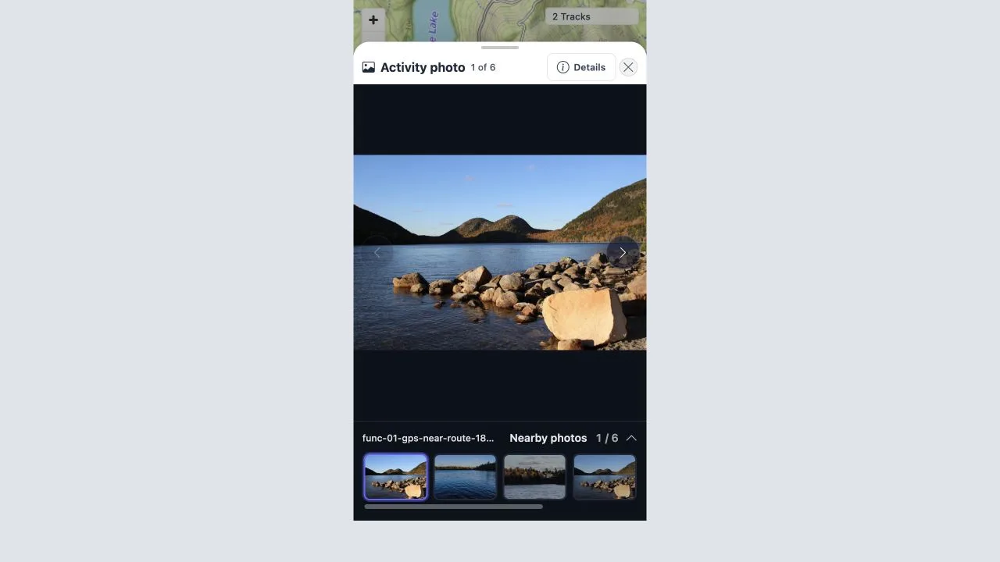
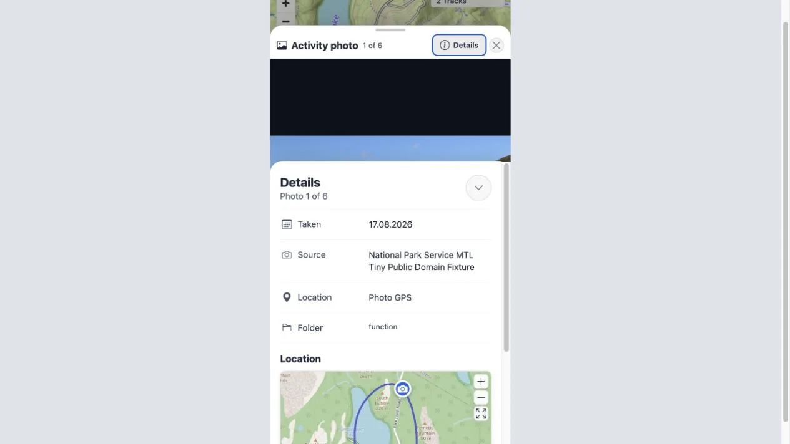
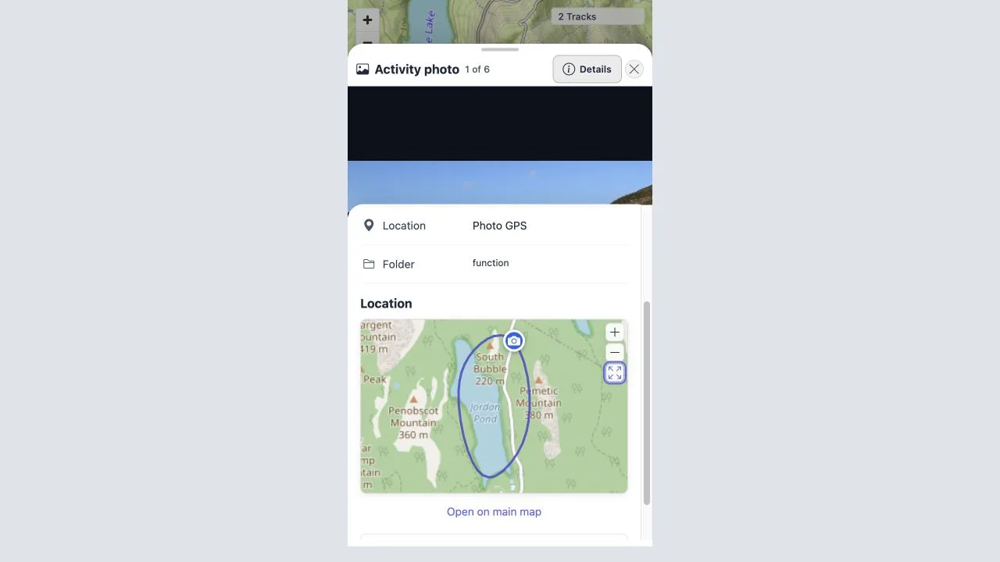
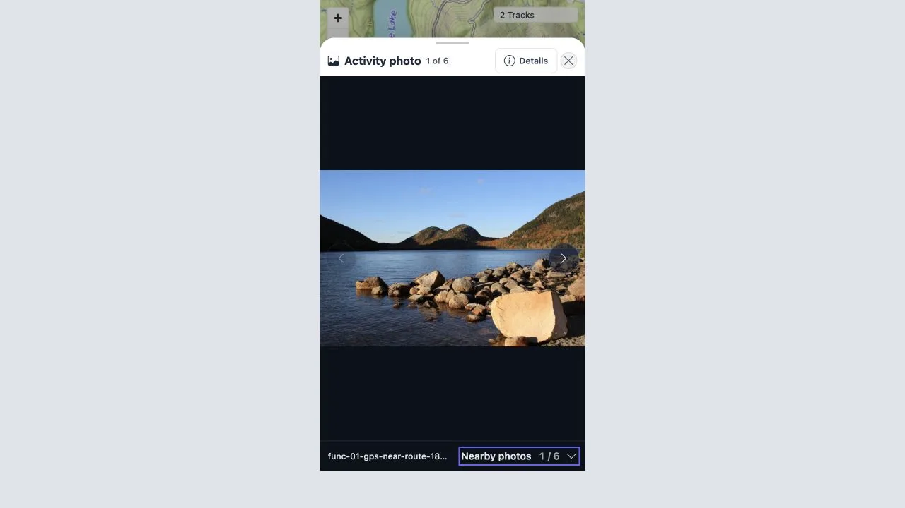

# Viewer navigation follow-up

Date: 2026-08-17

## Scope

Verified the activity photo viewer on synthetic public-domain fixtures at
`/mtl/track/100000` after changing navigation, marker styling, the photo
location map, and the responsive viewer layout.

## Automated checks

- `npm run type-check`: passed.
- `npm run build`: passed.
- `bottomSheet.spec.ts`, `mediaPreviewInteractions.spec.ts`,
  `trackDetailMiniMapEvents.spec.ts`, `trackDetailsTabs.spec.ts`,
  `mediaLocationMiniMap.spec.ts`, `mediaOverlay.spec.ts`, and
  `mediaVisibilityPreference.spec.ts`: 74 tests passed.
- Navigation controls do not enter the zoom or swipe gesture path.
- Base-zoom horizontal swipes still select previous and next photos.
- The Details control hides and restores the details surface.
- The Nearby photos heading collapses and restores the filmstrip while keeping
  the filename and current count visible.
- Nearby photos select the requested media and Open on main map emits the
  expected navigation action.
- The location mini-map draws the selected activity, fits its bounds together
  with the photo, and exposes zoom in, zoom out, and fit controls.
- GPS, estimated, manual, and unknown positions use the same circular camera
  symbol with different colors.
- A map media cluster resolves all of its member IDs and opens that exact set;
  an unclustered click opens only the photo or overlapping photos returned at
  the clicked point. Neither path requests a map zoom.
- A 100,000-ID viewer selection rendered only the bounded 49-thumbnail
  neighborhood and retained direct selection, preventing an unbounded DOM.

## Browser checks

Desktop viewport: 1280 × 720.

- Clicking an actual six-photo map cluster opened the viewer at 1 of 6 without
  changing the map's 100 m scale. Next moved to 2 of 6 while the map scale
  remained unchanged.
- The viewer opened as a single surface with the photo and Nearby photos on the
  left and structured details on the right.
- Filename, Nearby photos, and thumbnails formed one dark dock attached to the
  photo instead of a separate light panel.
- Next changed photo 1 of 6 to 2 of 6 without triggering image zoom.
- The Details action hid and restored the right panel.
- The location map rendered the selected activity and photo and exposed zoom
  in, zoom out, fit, and Open on main map controls.
- The viewer header and Details panel remained dark in normal and maximized
  modes.
- The sheet maximize action covered the app viewport while retaining the
  header, Details panel, and Nearby photos filmstrip.
- The separate photo fullscreen action used native browser fullscreen and hid
  the sheet header, Details panel, and filmstrip. Only the photo, navigation,
  zoom reset when needed, and a labeled top-right exit control remained; a
  complete-viewport CSS fallback remains available.
- The normal fullscreen, zoom-reset, and fullscreen-exit controls used the same
  dark translucent treatment, keeping the image visible beneath the controls.
- A single click on the photo did not exit fullscreen. The photo retained its
  zoom and pan behavior, while side controls retained previous/next behavior.
- Next selected the following image while photo fullscreen remained active.
- Both the visible exit control and Escape restored the still-open complete
  viewer.

Mobile viewport: 390 × 760.

- The viewer opened in photo-first mode with Details closed.
- The photo, filename, and horizontally scrollable Nearby photos remained in
  one continuous dark primary view. The horizontal scrollbar used a subtle
  translucent treatment instead of the browser's light default.
- Details opened as a scrollable bottom sheet with Taken, Source, Location,
  Folder, the location map, Open on main map, and Download original.
- The details surface uses native vertical touch scrolling and momentum
  scrolling. Browser scrolling reached the map and actions below the metadata.
- Tapping the Nearby photos heading collapsed the thumbnails to one compact
  dark row that retained the filename and count; tapping it again restored the
  thumbnails.
- Open on main map closed the viewer and kept the main map open.

iPhone SE viewport: 375 × 667.

- The dark media dock reached the bottom edge in both expanded and collapsed
  states; no light sheet-padding strip remained.
- Safe-area spacing was owned by the dark dock and details content instead of
  the sheet background.
- The phone label shortened from **Nearby photos** to **Nearby**, and the count
  used the compact `251/1000` form while the accessible control name stayed
  explicit.

The activity mini-map rendered every fixture photo as a 34 × 34 px circle
with a `999px` border radius and the same camera icon. GPS markers were blue
and estimated markers were orange.

## Screenshots

Desktop screenshots from the final dark/fullscreen check were not retained
because the available local activity contained private media.

Mobile:

Mobile details:

Mobile details after scrolling:

Collapsed Nearby photos:

