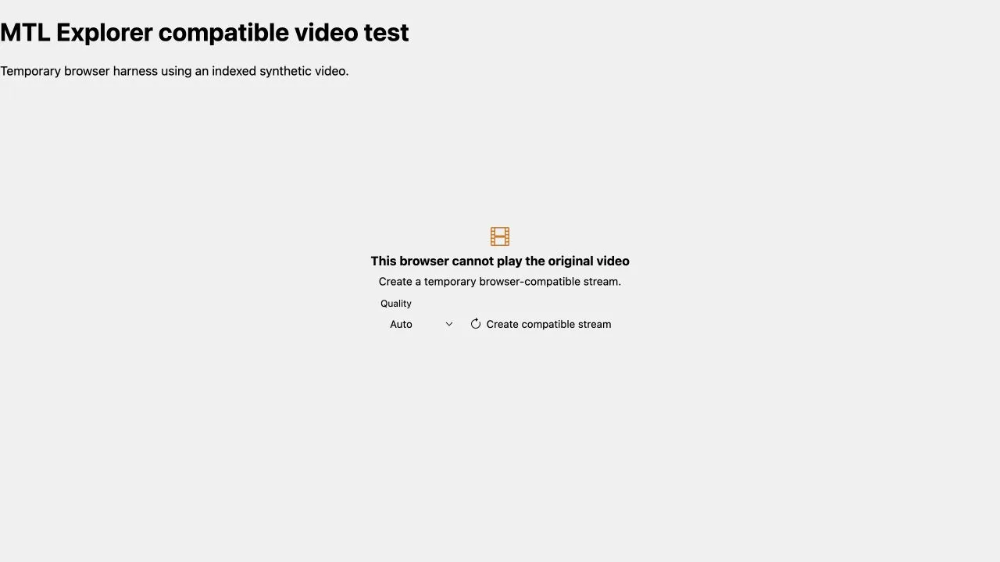
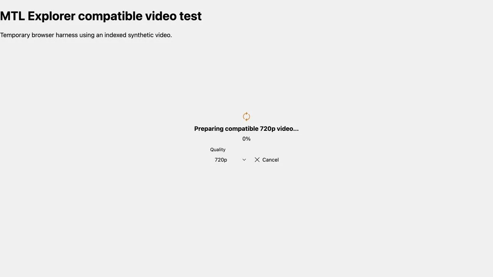
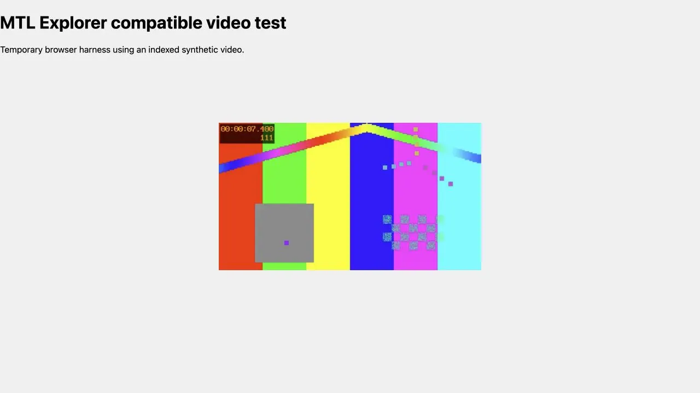

> **RESULT: PASS - browser fallback, full playback, reuse, and bounded temporary storage verified**

# Compatible video fallback

## Goal

Verify that MTL Explorer first uses browser-native playback, then offers an
explicit temporary HLS conversion only after a decode or unsupported-source
error. Confirm that the user can choose quality, see preparation state, finish
playback, reconnect to prepared work, and avoid unbounded disk use.

## Environment

- Local Spring Boot server and Vite frontend
- In-app Chromium browser
- ffmpeg 7.1.1 and synthetic 8-second FFV1/PCM MOV source
- Disposable database, watch tree, browser harness, and transcode directory
- No private GPX data and no video fixture stored in the repository

The browser build could play the tested ProRes, FFV1, JPEG 2000, QuickTime
Animation, and Hap files directly. This confirms that the component honors
actual browser capability, including broader codec support, without requesting
a conversion. To exercise the fallback deterministically, a temporary harness
gave the production component a naturally unsupported source URL while its
server request still referenced the real indexed synthetic FFV1 video. The
harness did not dispatch or replace media error events.

## Automated verification

See [automated-checks.txt](assets/automated-checks.txt). The focused backend
suite passed 23 tests. The frontend media suite passed 187 tests, including 14
tests for the reusable compatible-video component. Type checking, the generated
API build, and the production frontend build also passed.

## Browser E2E

| Check | Result | Evidence |
| --- | --- | --- |
| Native playback is preferred | PASS | Archival trial files played without a transcode POST |
| Unsupported source offers fallback | PASS | Auto, 480p, 720p, and 1080p were available after the natural media error |
| Preparation is understandable | PASS | Selected quality, progress, and Cancel were visible |
| HLS output plays fully | PASS | The compatible stream played to the 8-second end and restored the play overlay |
| Reopen reuses work | PASS | Same P480 session and playlist returned with `reused=true`; see [session-reuse.txt](assets/session-reuse.txt) |
| HLS resources are safe | PASS | Playlist/init/segments loaded with correct media types, `no-store`, and `nosniff` |
| Original remains unchanged | PASS | Source and watched copy retained the same SHA-256 |
| Temporary storage is bounded | PASS | Only one completed output remained; see [bounded-storage.txt](assets/bounded-storage.txt) |

## Screenshots

Fallback choice:

Preparation with selected quality and cancellation:

Compatible playback near the end of the synthetic video:

## Findings

- Native controls painted over the fallback panel on a small preview during the
  first run. The component now hides native controls only while the blocking
  panel is open. The focused player suite and browser screenshot passed after
  the fix.
- Conversion of the small synthetic source was much faster than real time. The
  progress state was still visible immediately, and slower conversions retain a
  compact progress and quality control while HLS playback continues.
- Browser codec support was broader than expected. Triggering fallback from
  `MediaError` codes 3 and 4, rather than a hard-coded codec list, preserved that
  support.

## Completion gate

- [x] Browser-native formats do not transcode
- [x] Decode/source errors offer user-triggered quality selection
- [x] Network errors remain in the normal media retry path
- [x] Full HLS playback, status, cancel, retry, and reconnect are covered
- [x] OpenAPI schema and generated TypeScript client match the server API
- [x] Quotas, eviction, expiry, cancel, and startup cleanup are tested
- [x] Screenshots and compact text evidence are recorded
- [x] Temporary harness and generated media are removed after the run
